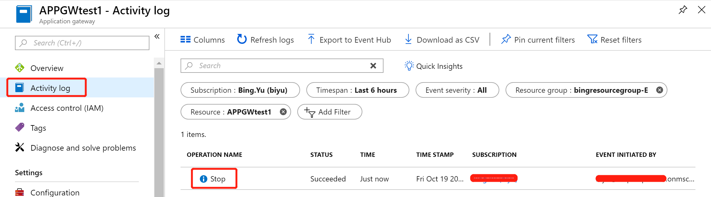

# 应用程序网关动态前端公网 IP 在什么情况下会改变

使用 PowerShell 登录 Azure 账号，选择指定订阅；

```powershell
$AppGw = Get-AzureRmApplicationGateway -Name APPGWname -ResourceGroupName bingresourcegroup-E
Stop-AzureRmApplicationGateway -ApplicationGateway $AppGw
```

等待此命令运行成功后，可以通过如下日志再次确认是否已经停止:



应用程序网关停止前，前端 IP 是：`139.217.xxx.xx`

再次启动后，前端 IP 变为：`42.159.xxx.xx`

此种情况动态前端公网 IP 改变了。

此外，针对各种其他场景测试，得出如下结论：

1. WAF 从关闭到切换未开启状态后，前端动态公网 IP 不会改变。
2. 调整 SKU size，前端动态公网 IP 不会改变。
3. 增加实例，前端动态公网 IP 不会改变。
4. 改变规则，例如更改后端池与 http settings 映射关系，新增后端池再关联等，前端动态公网 IP 不会改变。