# 使用 Azure Automation 实现自动开关虚拟机的操作

**本文包含以下内容**
- [如何创建自动化账号和 Runbook](#create)
- [如何创建凭据](#certification)
- [如何添加作业及执行计划](#scheduler)
- [更多参考资料](#resource)

## <a id="create"></a>如何创建自动化账号和 Runbook

首先，我们需要创建一个自动化账号（Automation Account），登录 [Azure 门户](https://portal.azure.cn) ，点击更多服务进入自动化账户：

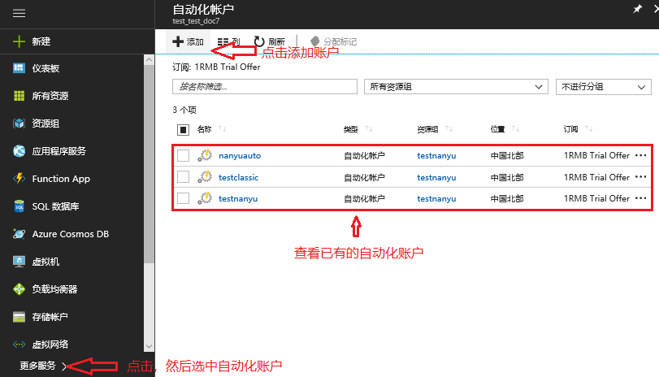 

在弹出的界面中填写自动化账号名称（用户随便定义一个即可），选择订阅、资源组以及位置：

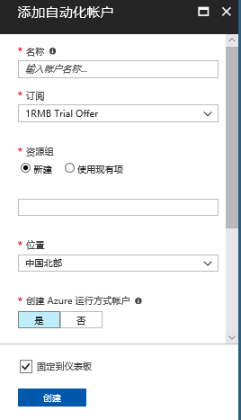 

创建完成后点击进入这个账号：

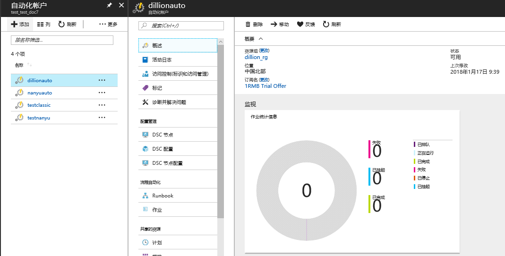 

## <a id="certification"></a>如何创建凭据

接着我们在共享的资源中选中 “**凭据**”，点击 “**添加凭据**” 按钮添加一个凭据：

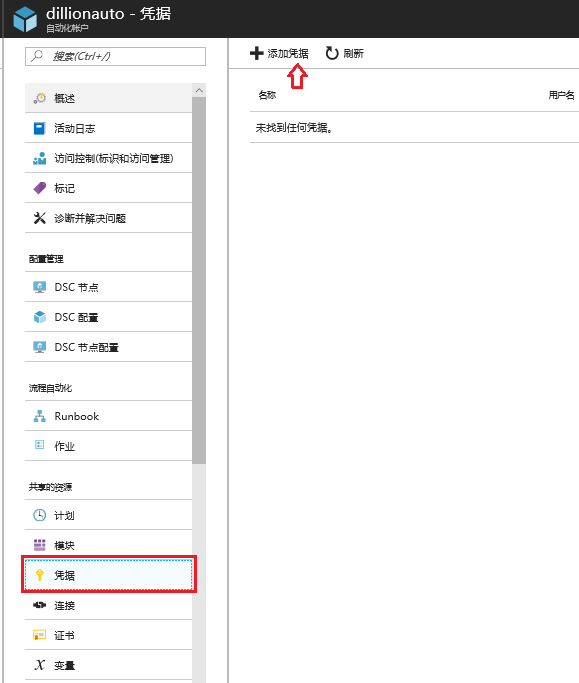 

在弹出的界面中填写凭据名称、用户名和密码（这里是管理 Azure 的用户名和密码）：

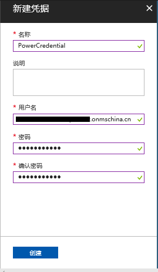  

> [!Note]
> 这个步骤中的用户是通过 AAD 创建出来的，我们可以参考[这个链接](https://docs.azure.cn/active-directory/active-directory-create-users)来了解如何创建 AAD 用户。本例子是使用管理账号来做的。

完成后保存。

## <a id="scheduler"></a>如何添加作业及执行计划

接着在自动化账户中选中 Runbook ，点击添加 Runbook ：

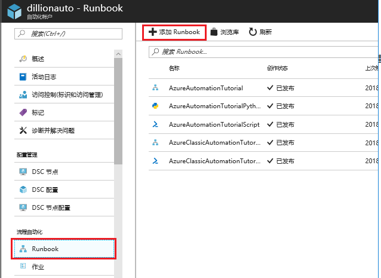

在弹出界面中填写 Runbook 名称，选择 Runbook 类型：

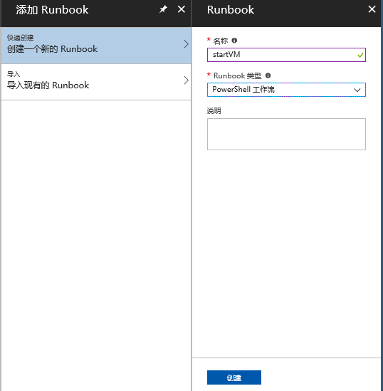

默认情况下，创建完 Runbook 之后会直接进入编辑草稿界面，如果未进入可以选中 Runbook ，然后点击 “**编辑**” 按钮，进入编辑界面：

在弹出的编辑界面中输入下面的代码：

```PowerShell
workflow startVM
{
    $Cred = Get-AutomationPSCredential -Name "PowerCredential"; 
    Add-AzureRmAccount -Credential $Cred -EnvironmentName AzureChinaCloud;
    Select-AzureRmSubscription -SubscriptionName "<订阅名称>";
    Start-AzureRmVM -ResourceGroupName "<资源组名称>" -Name "<虚拟机名称>" 
}
```

workflow 后面的 startVM 需要与你的 Runbook 的名称一致，请按照实际情况修改。<br>
此处 `PowerCredential` 就是我们前面创建的凭据的名称，需要根据实际创建进行替换。

> [!Note]
> 编辑完之后，可以打开测试窗格，点击开始按钮，测试脚本的执行情况

创建完成后我们点击 “**发布**” 按钮，将这段脚本发布为正式版本。

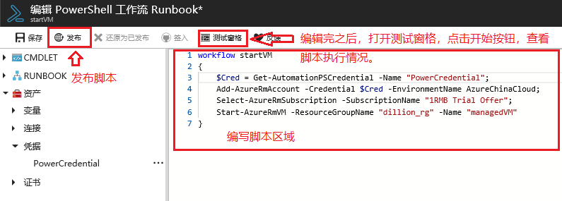


发布完成后，我们在 Runbook 中看到发布的正式脚本：

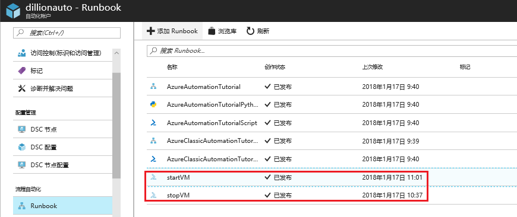

选中并进入执行的 Runbook ，可以点击 “**开始**”，执行这个脚本：

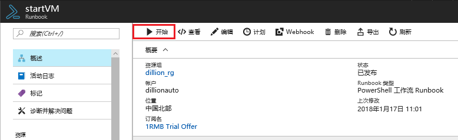

执行完成后，会对应的生成一个作业，点击 “**输出**” 和 “**全部日志**” 可以查看具体的执行情况和输出结果：

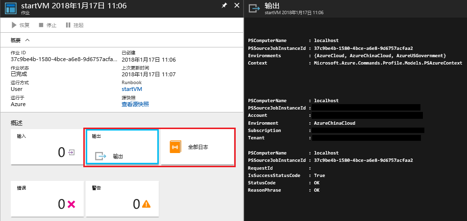

作业执行结束后，可以看到我们的虚拟机已经成功启动了。

接着我们为 RUNBOOK 添加一个执行计划，选择要执行的 Runbook，点击 “**计划**”：

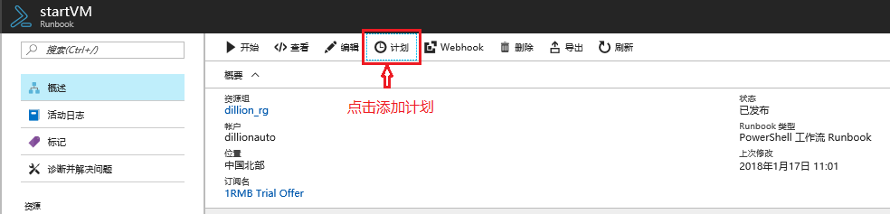

依次点击 “**创建新计划**”，然后输入计划名称，并设置一个执行开始时间：

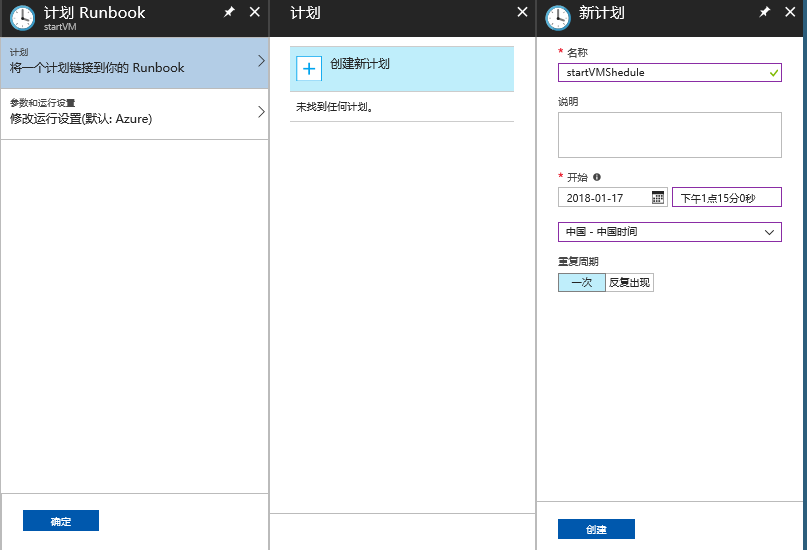

例如这里根据上面截图中的设置，这个 RUNBOOK 会在 2018 年 1 月 17 日的 13:15 执行。<br>
如果需要重复执行计划，可以选择反复出现，并设置重复间隔以及过期时间。

> [!Note]
> 计划开始时间必须是为自创建计划起至少 5 分钟之后。开始时间将采用账户中指定的时区。

这样我们的开机脚本就设置完成了，同样的原理，可以使用下面的脚本配置一个关机脚本：

```PowerShell
workflow stopVM
{
    $Cred = Get-AutomationPSCredential -Name "Powercredential"; 
    Add-AzureRmAccount -Credential $Cred -EnvironmentName AzureChinaCloud;
    Select-AzureRmSubscription -SubscriptionName "1RMB Trial Offer";
    Stop-AzureRmVM -ResourceGroupName "dillion_rg" -Name "managedVM" -Force
}
```

这个脚本创建在名为 stopVM 的 Runbook 中。

> [!NOTE]
> 此处 `Stop-AzureRmVM` 命令一定要添加 `-Force` 参数，不然在命令执行的时候会停在确认是否要关闭虚拟机的界面而无法完成关闭操作。

后面的配置操作与前面 Start 的类似，这里就不赘述了。

## <a id="resource"></a>更多参考资料

关于 Runbook 共享资源的说明

- [凭据（Credential）](https://technet.microsoft.com/zh-cn/library/dn919926.aspx)
- [连接（Connection）](https://technet.microsoft.com/zh-cn/library/dn919922.aspx)
- [变量（Variable）](https://technet.microsoft.com/zh-cn/library/dn919925.aspx)
- [计划（Schedule）](https://technet.microsoft.com/zh-cn/library/dn919914.aspx)
- [创作自动化 Runbook](https://technet.microsoft.com/zh-cn/library/dn469262.aspx)
- [Getting Started with NEW Azure Automation preview feature](http://blogs.technet.com/b/keithmayer/archive/2014/04/04/step-by-step-getting-started-with-windows-azure-automation.aspx)
- [面向 IT 专业人员的脚本资源](https://gallery.technet.microsoft.com/scriptcenter/site/search?f%5B0%5D.Type=User&f%5B0%5D.Value=SC%20Automation%20Product%20Team&f%5B0%5D.Text=SC%20Automation%20Product%20Team&f%5B1%5D.Type=RootCategory&f%5B1%5D.Value=WindowsAzure&f%5B1%5D.Text=Windows%20Azure)