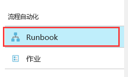
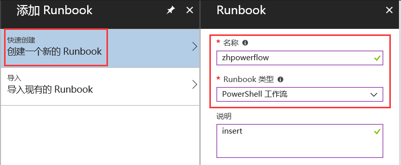
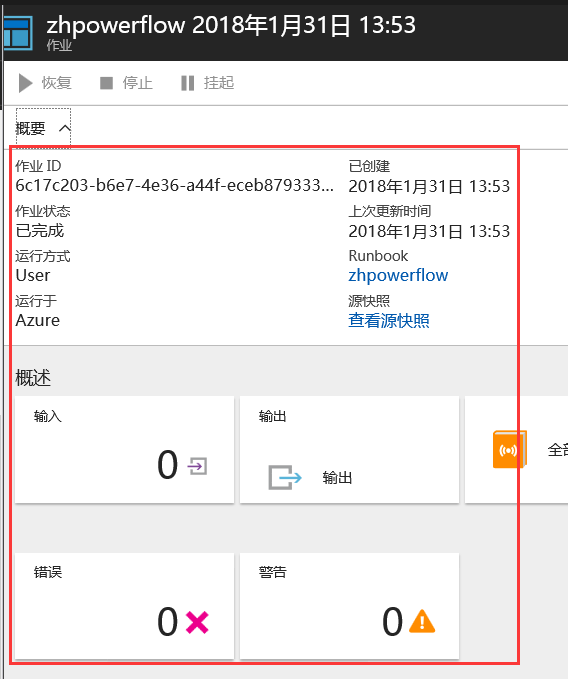
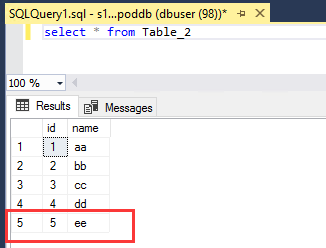

# 如何通过自动化任务执行 SQL 脚本

## 简介

由于 Azure SQL 数据库服务并没有 Agent 服务，因此无法通过 SSMS 的定时任务去执行一些脚本，本片文章主要介绍，如何通过 Azure 上的自动化任务，连接并定时执行 SQL 脚本。

## 实现方法

1. 首先登陆到 [Azure 门户](https://portal.azure.cn/)，选择 **自动化账户**：

    
2. 添加自动化账户，如 zhauto：

    
3. 选择 Runbook：

    
4. 点击 “**添加 Runbook**”：

    

5. 创建一个新的 Runbook，如 zhpowerflow，类型选择 PowerShell 工作流：

    

6。 编辑 PowerShell 工作流 Runbook，可以使用以下示例代码：(替换相关参数：连接字符串`ConnectionString`以及需要执行的 SQL 语句 `CommandText`)

{
    InlineScript {
        $SqlConnection = New-Object System.Data.SqlClient.SqlConnection
        $SqlConnection.ConnectionString = "Server=tcp:s12.database.chinacloudapi.cn,1433;Initial Catalog=poddb;Persist Security Info=False;User ID=dbuser;Password=*********;MultipleActiveResultSets=False;Encrypt=True;TrustServerCertificate=False;Connection Timeout=30;"
        $SqlCmd = New-Object System.Data.SqlClient.SqlCommand
        $SqlCmd.CommandText = "insert into Table_2 values(5,'ee')"
        $SqlCmd.Connection = $SqlConnection
        $SqlConnection.Open()
        $SqlCmd.ExecuteNonQuery()
        $SqlConnection.Close()
    }
}

7. 启动任务测试，等待作业完成。

    

8. 查看结果，返回到数据中查看 Table_2 表，可以看出，5 和 ee 这两条数据已经成功插入。

    