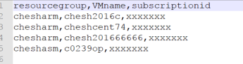
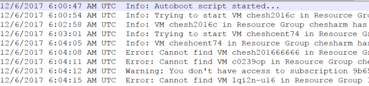

# 在 Azure 自动化中按需执行 ARM 虚拟机定时开关机并记录云端日志

## 使用场景

本脚本利用 Azure 自动化服务的 Runbook，通过读取存储在指定存储账户中的 .csv 文件，对文件中列出的 ARM 虚拟机执行按需定时开机或关机操作，并将相应的日志写到存储账户中的追加 Blob 文件里。文件中列出的虚拟机可以分布在不同的订阅或资源组中，用户可以通过更改存储账户中的 .csv 文件，控制每天需要对哪些虚拟机执行开关机操作。

## 前提条件

1. 脚本在 3.3.1 的 Azure 和 AzureRM 模块下测试通过，用户需要手动将 Azure 自动化服务的 PowerShell 模块更新到对应版本。请参考文档：[如何更新 Azure 自动化服务的 PowerShell 模块](https://docs.azure.cn/zh-cn/articles/azure-operations-guide/automation/aog-automation-powershell-module-update)，将自动化账户的 PowerShell 模块以 <a href="https://github.com/wacn/AOG-CodeSample/blob/master/Automation/PowerShell/module/AzureRM.Profile.zip" down="AzureRM.Profile.zip">**AzureRM.Profile**</a> -> <a href="https://github.com/wacn/AOG-CodeSample/blob/master/Automation/PowerShell/module/Azure.Storage.zip" down="Azure.Storage.zip">**Azure.Storage**</a> -> <a href="https://github.com/wacn/AOG-CodeSample/blob/master/Automation/PowerShell/module/AzureRM.Storage.zip" down="AzureRM.Storage.zip">**AzureRM.Storage**</a> -> <a href="https://github.com/wacn/AOG-CodeSample/blob/master/Automation/PowerShell/module/AzureRM.Compute.zip" down="AzureRM.Compute.zip">**AzureRM.Compute**</a> 的顺序更新。

2. 脚本调用 Azure 自动化账号中名为 "**credname**" 的 PowerShell 凭据作为登陆时使用的账号，请参考文档：[创建新凭据资产](https://docs.azure.cn/zh-cn/automation/automation-credentials#creating-a-new-credential-asset) 为自动化账户添加 PS 凭据。

3. 脚本默认读取指定存储账户中 autoboot 容器下名为 “**年_月_日_vmtostart.csv**” 或 “**年_月_日_vmtostop.csv**” 的文件，如 **2017_12_04_vmtostart.csv**。用户需要手动在存储账户中建立此容器，并可以通过调整 `$StorageSubscriptionId`、`$StorageAccountGroup` 和 `$StorageAccountName` 变量来指定订阅和存储账户，更改 `$VMlistContainerName` 和 `$VMlistFileName` 变量来更改容器名和 .csv 文件名。

4. .csv 文件中需要列出虚拟机的**资源组名**、**虚拟机名**和**订阅 ID**，以逗号分隔，如下图。脚本会从第二行开始查询对应的虚拟机：

    

5. 脚本会将日志写到指定存储账户中 autobootlogs 容器下，以 “**年_月_日_vmstartlog.log**” 或 “**年_月_日_vmstoplog.log**” 命名。用户需要手动在存储账户中建立此容器，并可以通过更改 `$logcontainername` 和 `$logfilename` 变量来更改容器名和.log 文件名。

    日志示例：

    

## 脚本下载

- [AutoBoot_fromAzureAutomation_v1.0](https://github.com/wacn/AOG-CodeSample/blob/master/Automation/PowerShell/script/AutoBoot_fromAzureAutomation_v1.0.ps1)
- [AutoStop_fromAzureAutomation_v1.0](https://github.com/wacn/AOG-CodeSample/blob/master/Automation/PowerShell/script/AutoStop_fromAzureAutomation_v1.0.ps1)

## 注意事项

1. 此脚本已编写为 Azure 自动化格式。如需在本地运行，请自行更改 `$usercred` 变量的获取方式，并去除脚本开始的 `InlineScript` 参数。

2. 使用的凭据需具有订阅、存储和虚拟机的管理权限。

3. 如果凭据是用户，则需要考虑用户的密码过期问题。可以根据文档：[如何配置 Azure Active Directory 账户密码永不过期](https://docs.azure.cn/zh-cn/articles/azure-operations-guide/active-directory/aog-active-directory-account-never-expire) 配置用户密码永不过期，或根据文档：[在 Azure 自动化中通过证书管理 Resource Manager 资源](https://docs.azure.cn/zh-cn/articles/azure-operations-guide/automation/aog-automation-powershell-manage-arm-resource-with-cert) 配置通过证书和服务主体的验证。

4. 关于 Azure 自动化服务的配置，请参考文档：[我的第一个 PowerShell 工作流 Runbook](https://docs.azure.cn/zh-cn/automation/automation-first-runbook-textual)。