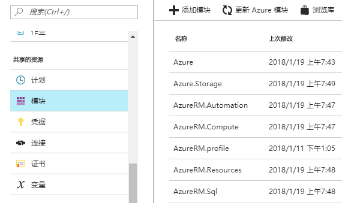
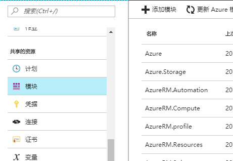

# 如何手动更新 Azure 自动化服务的 PowerShell 模块

借助 Azure 自动化，用户可以自动完成通常要在云环境和企业环境中执行的手动、长时间进行、易出错且重复性高的任务。 
Azure 自动化账户中默认使用的 PowerShell 模块版本为 1.0。通过账户内置的升级 PowerShell 模块功能，可以将模块自动升级至最新版本。 
在某些情况下，用户可能需要特定版本的 PowerShell 模块，使得自动化服务的输出符合用户预期。本文介绍了如何手动更新 Azure 自动化服务使用的 PowerShell 模块。 

## 前提条件

- 有效的 Azure 订阅。
- 已经安装了最新 [Azure PowerShell](https://docs.microsoft.com/zh-cn/powershell/azure/install-azurerm-ps?view=azurermps-5.1.1) 模块的本地 Windows 电脑。

## 确定当前 PowerShell 模块版本

在本地电脑中，打开 PowerShell，使用 `Get-Module -ListAvailable -Name <module name> | Select Version` 命令，列出用户关注的模块当前的版本。

登录[ Azure 门户](https://portal.azure.cn/)，在左侧导航栏中找到自动化账户 -> 模块，点击相应模块查看版本。

## 准备 PowerShell 模块文件

由于 Azure 自动化服务需要 PowerShell 模块以 zip 文件的形式被上传，用户需要在安装了相应模块的本地电脑上找到并打包模块。 
用户可以在 PowerShell 中使用 `Get-Module -ListAvailable` 来列出所有已安装的模块，并找到模块的具体安装位置。

## 在自动化服务中安装 PowerShell 模块

在自动化账户页面，找到模块，点击上方的添加模块，并上传打包成.zip 文件的 PowerShell 模块。当提示安装完成后，点击模块查看版本。 
需要注意某些模块可能依赖于其他模块，如安装 `AzureRM.Resources` 模块需要首先安装 `AzureRM.Profile` 模块。如果安装模块时报错，可以仔细查阅报错信息，并安装相应的前提模块。更多排错信息，请参阅[常见 Azure 自动化错误的错误处理提示](https://docs.azure.cn/zh-cn/automation/automation-troubleshooting-automation-errors)。

## 更多信息

- [Azure 自动化概述](/automation/automation-intro)
- [常见 Azure 自动化错误的错误处理提示](/automation/automation-troubleshooting-automation-errors)