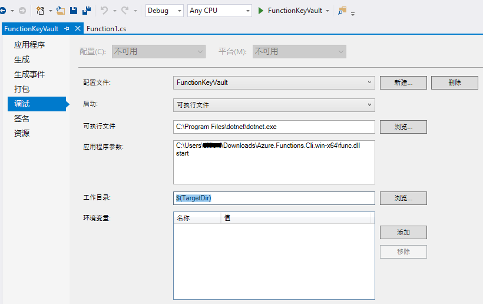
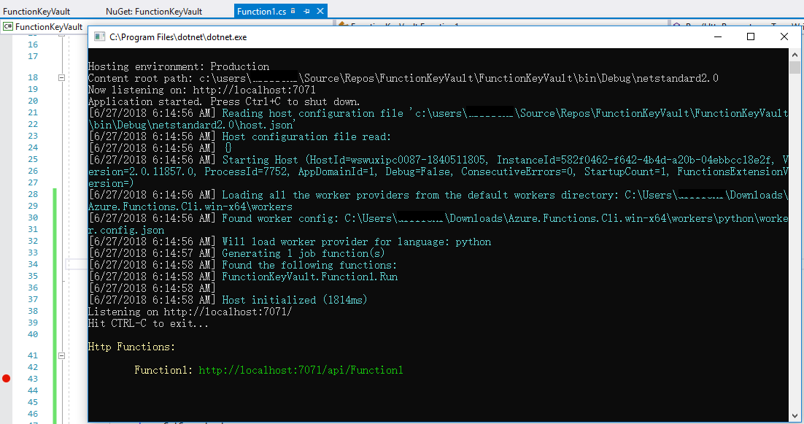

# 如何解决 Azure Functions unable to load one or more of the requested types 错误

## 问题描述

用户在 Azure Functions V2 (.net core) 应用中添加 Azure Active Directtory 引用并获取 Azure 密钥保管库中的机密，在本地 Visual Studio 2017 中运行应用时遇到 “**Unable to load one or more of the requested types**” 错误，详细信息如下：

```
The following 1 functions are in error:
Function1: Unable to load one or more of the requested types. Retrieve the LoaderExceptions property for more information.

```


本地测试环境信息如下： Visual Studio 2017 15.6.4 版本， Azure Function v2 版本， Azure Function SDK 版本 1.0.6，Azure Functions and Web Jobs Tools 15.0.40215.0 版本。

## 问题分析

该错误主要与 Azure Functions Runtime 的本地版本有关。在上述本地测试环境下运行函数应用时，发现 Azure Function Runtime 版本为 2.0.11353 版本 (即 Azure Functions core tools 2.0.1-beta 版本)。


而该错误已经在 [Azure Functions Runtime 2.0.11857 版本](https://github.com/Azure/azure-functions-host/releases/tag/v2.0.11857-alpha) (即 Azure Functions core tools 2.0.1-beta.29 版本) 中被修复了，因此用户可以在本地更新 Azure Function core tools 版本，使用 2.0.1-beta.29 版本运行函数应用。

由于 **Azure Function core tools 2.0.1-beta.29 版本目前尚未提供给 Visual Studio 用户**, 用户可以手动下载该版本，并在应用程序中修改配置，然后使用该工具运行函数应用。

## 解决方法

1. 下载用于 Windows 的 [Azure Functions core tools 2.0.1-beta.29 版本](https://github.com/Azure/azure-functions-core-tools/releases)。

2. 在 Visual Studio 中设置函数应用调试配置，使用指定工具运行函数应用。在应用程序属性面板中，打开调试选项卡，修改如下配置：

    * 启动：“可执行文件“
    * 可执行文件：< dotnet.exe 文件路径 >
    * 应用程序参数：< Azure Functions core tools 2.0.1-beta.29 版本工具解压包路径>\Azure.Functions.Cli.win-x64\func.dll start
    * 工作目录：$(TargetDir)

    

3. 保存设置后，重新编译 Azure Function 应用并运行，可以看到该问题已经解决。

    