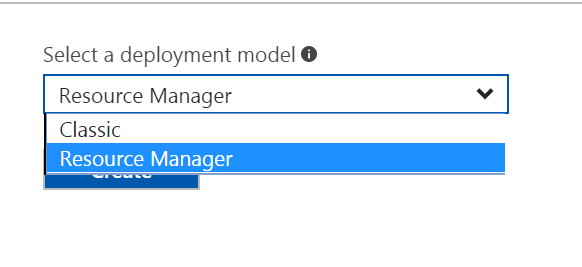
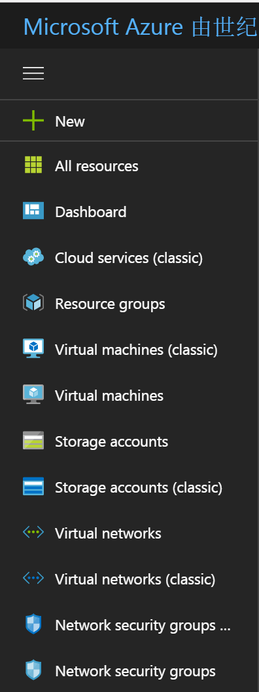
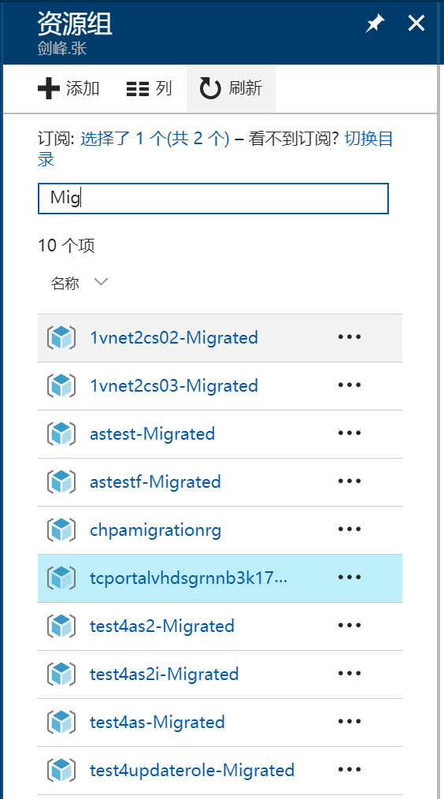

# 经典门户和 Azure 门户的相关说明

## 经典模式与资源管理器模式

随着 Azure 不断的开发，为了提供更丰富的功能和更好的用户体验，对 IaaS 资源及部分采用了新的部署模式。两种模式我们分别称为经典模式和资源管理器模式（关于两种部署模式请参见:[Azure 部署模型](https://docs.azure.cn/zh-cn/azure-classic-rm)）。针对这两种模式，也开发了不同的门户，称为经典门户和 Azure 门户。我们推荐用户使用资源管理器模式和 Azure 门户，以利用 Azure 推出的新特性和新功能。

资源管理器模式相比于经典模式，主要的优势在于：

- 模板重复部署
    支持使用 JSON 模板部署资源，方便资源的重复部署和属性更新。
- 基于角色的控制(RBAC)
    根据用户的角色，对资源进行更细粒度的权限控制，如 Manager 仅拥有可读权限，开发人员仅能对测试环境有读权限，以实现企业级安全标准
- 基于标签的账单
    支持为资源打标签，便于成本管理。
- 增强的门户体验
    支持自定义门户主题，定义主板显示内容；支持管理经典资源，并能实现经典门户无法完成的工作，如部署经典模式的 DS 系列虚拟机或者管理经典模式的高级存储
- Azure 镜像市场解决方案模板
    支持通过 Azure 镜像市场部署资源，并提供了丰富的解决方案模板
- 分离的网络模型
    计算和网络概念的清晰划分，网络更类似于传统的物理设备。将网络，存储和计算资源进行了逻辑上的区分，用户能更好的理解部署模式。
- 锁语义减少
    大并发部署。经典模式同一个云服务一次仅能进行一个操作；但资源管理器模式支持并发操作，减少用户等待时间。
- 增强的计算容量
    改善 SSH 体验和 RDP 体验，恢复默认的 3389 和 22 端口的访问；同时，用户能自定义容错域/更新域数量，以满足不同的应用可用性需求
- 新功能
    许多 Azure 新功能和产品仅支持资源管理器模式，如 VMSS，Azure Resource Explorer 等

## 经典资源和资源管理器资源在 Azure 门户中的显示

现在，随着产品开发的持续进行，也为了更好的统一的资源管理体验，会逐渐将经典资源转移到 Azure 门户进行统一管理。资源管理器中默认要求每个资源必须属于一个资源组，因此，在将经典资源移动到新门户时，平台默认会为其创建资源组，资源组名带 Default 等字样。具体对应关系请参见：

<table>
	<tr>
	    <th>ASM Entry</th>
	    <th>ARM Entry</th>
	    <th>ARM Resource Group</th>
	    <th>Time of Unavailable in Classic Portal</th>
	    <th>Comments</th>
	</tr>
	<tr>
	    <td>https://manage.windowsazure.cn</td>
	    <td>https://portal.azure.cn</td>
	    <td></td>
	    <td>not yet decided</td>
	    <td></td>
	</tr>
	<tr>
	    <td rowspan="2">Web Apps</td>
	    <td rowspan="2">App Service</td>
	    <td>Default-Web-ChinaEast</td>
	    <td rowspan="2"></td>
	    <td rowspan="2"></td>
	</tr>
	<tr>
	    <td>Default-Web-ChinaNorth</td>
	</tr>
	<tr>
	    <td>Virtual machines</td>
	    <td>Virtual machines (classic)</td>
	    <td><CloudServiceName></td>
	    <td>Soon. No exact date</td>
	    <td></td>
	</tr>
	<tr>
	    <td>Cloud Service(IaaS)</td>
	    <td>Cloud services (classic)</td>
	    <td><CloudServiceName></td>
	    <td>Soon. No exact date</td>
	    <td></td>
	</tr>
	<tr>
	    <td rowspan="2">Batch Service</td>
	    <td rowspan="2">Batch accounts</td>
	    <td>Default-AzureBatch-ChinaEast</td>
	    <td rowspan="2">9/15/2017</td>
	    <td rowspan="2"></td>
	</tr>
	<tr>
	    <td>Default-AzureBatch-ChinaNorth</td>
	</tr>
	<tr>
	    <td rowspan="2">SQL Databases</td>
	    <td rowspan="2">SQL databases</td>
	    <td>Default-SQL-ChinaEast</td>
	    <td rowspan="2">9/15/2017</td>
	    <td rowspan="2"></td>
	</tr>
	<tr>
	    <td>Default-SQL-ChinaNorth</td>
	</tr>
	<tr>
	    <td rowspan="2">Storage</td>
	    <td rowspan="2">Storage accounts (classic)</td>
	    <td>Default-Storage-ChinaEast</td>
	    <td rowspan="2">9/15/2017</td>
	    <td rowspan="2"></td>
	</tr>
	<tr>
	    <td>Default-Storage-ChinaNorth</td>
	</tr>
	<tr>
	    <td rowspan="2">Media Service</td>
	    <td rowspan="2">Media services</td>
	    <td>Default-Media-ChinaEast</td>
	    <td rowspan="2">9/15/2017</td>
	    <td rowspan="2"></td>
	</tr>
	<tr>
	    <td>Default-Media-ChinaNorth</td>
	</tr>
	<tr>
	    <td rowspan="2">Service Bus (Event)</td>
	    <td rowspan="2">Event Hubs - PREVIEW</td>
	    <td>Default-EventHub-ChinaEast</td>
	    <td rowspan="2">9/15/2017</td>
	    <td rowspan="2"></td>
	</tr>
	<tr>
	    <td>Default-EventHub-ChinaNorth</td>
	</tr>
	<tr>
	    <td rowspan="2">Service Bus (Notification Hub)</td>
	    <td rowspan="2">N/A</td>
	    <td>Default-NotificationHubs-ChinaEast</td>
	    <td rowspan="2">9/15/2017</td>
	    <td rowspan="2"></td>
	</tr>
	<tr>
	    <td>Default-NotificationHubs-ChinaNorth</td>
	</tr>
	<tr>
	    <td rowspan="2">Service Bus (Queue, Message, Relay)</td>
	    <td rowspan="2">Service Bus - PREVIEW</td>
	    <td>Default-ServiceBus-ChinaEast</td>
	    <td rowspan="2">9/15/2017</td>
	    <td rowspan="2"></td>
	</tr>
	<tr>
	    <td>Default-ServiceBus-ChinaNorth</td>
	</tr>
	<tr>
	    <td rowspan="2">Recovery service</td>
	    <td rowspan="2">N/A</td>
	    <td>RecoveryServices-<ID>-China-East</td>
	    <td>9/1/2017</td>
	    <td>Site Recovery service will be available only in the new Azure portal starting 2017/9/1</td>
	</tr>
	<tr>
	    <td>RecoveryServices-<ID>-China-North</td>
        <td>10/31/2017</td>
        <td>Azure Backup Recovery Services will automatically be upgraded to the new Azure portal by 2017/10/31.</td>
	</tr>
	<tr>
	    <td>Automation</td>
	    <td>N/A</td>
	    <td>N/A</td>
	    <td>not yet decided	</td>
	    <td></td>
	</tr>
	<tr>
	    <td rowspan="2">CDN</td>
	    <td rowspan="2">CDN Profiles</td>
	    <td>Default-Cdn-ChinaEast</td>
	    <td rowspan="2">9/15/2017</td>
	    <td rowspan="2"></td>
	</tr>
	<tr>
	    <td>Default-Cdn-ChinaNorth</td>
	</tr>
	<tr>
	    <td rowspan="2">MySQL on Azure</td>
	    <td rowspan="2">MySQL Database on Azure</td>
	    <td>Default-MySql-ChinaEast</td>
	    <td rowspan="2">9/30/2017</td>
	    <td rowspan="2">don't support move resources between resource groups</td>
	</tr>
	<tr>
	    <td>Default-MySql-ChinaNorth</td>
	</tr>
	<tr>
	    <td rowspan="2">Scheduler</td>
	    <td rowspan="2">Scheduler Job Collection</td>
	    <td>CS-ChinaEast-scheduler</td>
	    <td rowspan="2">9/15/2017</td>
	    <td rowspan="2"></td>
	</tr>
	<tr>
	    <td>CS-ChinaNorth-scheduler</td>
	</tr>
	<tr>
	    <td rowspan="2">Stream Analytics</td>
	    <td rowspan="2">Stream Analytics jobs</td>
	    <td>StreamAnalytics-Default-China-East</td>
	    <td rowspan="2">9/15/2017</td>
	    <td rowspan="2"></td>
	</tr>
	<tr>
	    <td>StreamAnalytics-Default-China-North</td>
	</tr>
	<tr>
	    <td>Networks</td>
	    <td>Virtual networks (classic)</td>
	    <td>Default-Networking</td>
	    <td>9/30/2017</td>
	    <td></td>
	</tr>
	<tr>
	    <td>Traffic Manager</td>
	    <td>Traffic Manager profile</td>
	    <td>Default-TrafficManager</td>
	    <td>9/15/2017</td>
	    <td></td>
	</tr>
	<tr>
	    <td>Management Service</td>
	    <td>N/A</td>
	    <td>N/A</td>
	    <td>not yet decided</td>
	    <td>Be replaced as activity log in Azure portal</td>
	</tr>
	<tr>
	    <td>Active Directory</td>
	    <td>N/A</td>
	    <td>N/A</td>
	    <td>not yet decided	</td>
	    <td></td>
	</tr>
</table>	

> [!NOTE]
> 随着产品持续开发，时间或者功能上线与否可能发生变化，请关注门户中的最新通知。

目前，由于部分功能尚未在新门户上线，这部分资源将支持继续在经典门户管理，如 Automation，Azure AD 等。

Azure 门户支持两种模式的部署，对 IaaS 资源来讲，在部署时选择不同的模式，会将部署导向不同的创建过程，创建后的资源也会展现在不同的集合。

带（classic）字样的资源都是经典资源；不带的为资源管理资源，或者资源本身不区分模式，后台实现方式是一样的。

## 经典资源迁移到资源管理器资源

Azure 在某些条件下支持用户将资源从经典模式迁移到资源管理器模式。注意，这和经典资源显示在 Azure 门户时不同的，迁移是不仅仅是显示上的移动，更是模式上的转变。迁移后，资源将不会显示在经典门户，也不会再显示在带（classic）的集合中。迁移后资源组将默认显示为带`-Migrated` 的名称。

更多关于迁移的信息，请参考：

迁移步骤：[使用 Azure PowerShell 将 IaaS 资源从经典部署模型迁移到 Azure Resource Manager](https://www.azure.cn/documentation/articles/virtual-machines-windows-ps-migration-classic-resource-manager/)

迁移的前提条件：[平台支持的从经典部署模型到 Azure Resource Manager 的 IaaS 资源迁移](https://www.azure.cn/documentation/articles/virtual-machines-windows-migration-classic-resource-manager/)