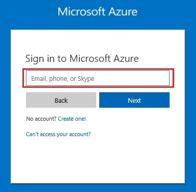
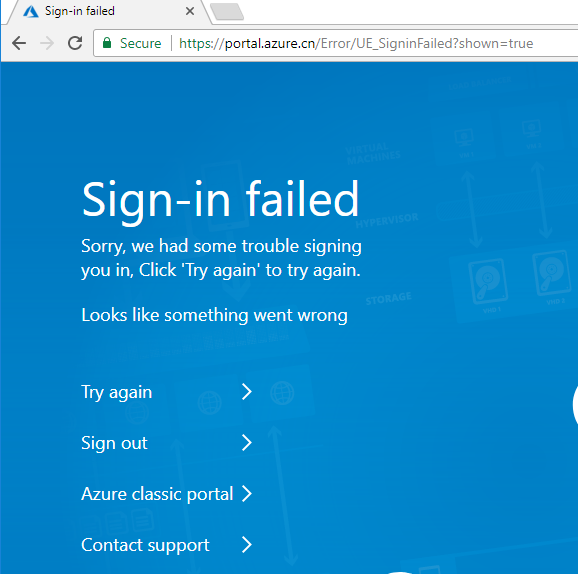
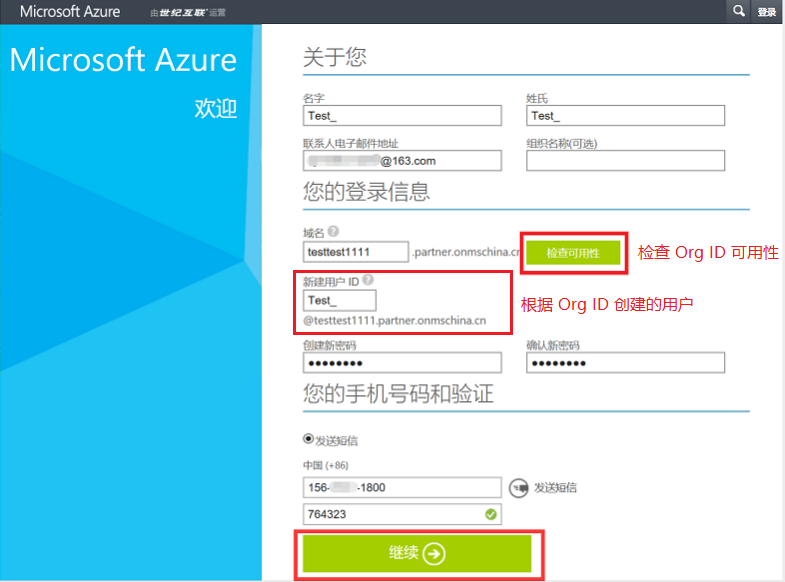
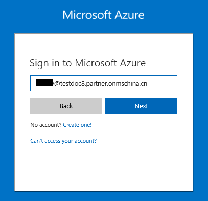

# 如何解决中国区 Azure 门户登录失败的问题

## 问题描述

用户注册完 Azure 账户之后，在进行 [Azure 门户](http://portal.azure.cn/) 登录时，登录界面会提示使用 **Email**、**Phone** 或者 **Skype** 登录，如下所示：

然而，当用户使用以上方式登录时，在确认账户和密码都没有出错的情况下却仍然显示登录失败。

## 问题分析

目前, 中国区 Azure 由世纪互联运营，与全球其它地区由微软运营的 Azure 服务在物理上和逻辑上都是独立的。 
所以这就导致了中国区 Azure 与境外 Azure 在开发以及使用过程中会有很大区别，相关信息可以参考：[中国区 Azure 应用程序开发说明](/articles/guidance/developerdifferences?toc=%2fguides%2fdeveloper%2ftoc.json)

此处，用户无法通过 **Email**、**Phone** 以及 **Skype** 登录也是该原因导致的，目前中国区 Azure 只能通过 **组织 ID** 登录 [Azure 门户](http://portal.azure.cn/)。

关于**组织 ID**，此处我们进行一下相关解释： 
组织 ID 简称 Org ID，是由世纪互联运营的 Microsoft Azure 提供的特殊用户名系统。 
我们在申请 Azure 账户时，首先就需要检查 Org ID 是否可用，如下图所示，`testtest1111.partner.onmschina.cn` 即为 Org ID。

> [!Note]
> 当前可供注册的域是 “\*.partner.onmschina.cn”，“\*” 代表用户注册部分，唯一标识用户在 Azure AD 中注册的组织。

创建完 Org ID 后，可以使用该 Org ID 创建不同的账户来登录 Azure 门户并管理 Azure 资源，如上图中 `Test_@testtest1111.partner.onmschina.cn` 即为我们用于登录的 Azure 账号。

## 解决方法

使用通过 Org ID 创建的账户登录 Azure 门户。

