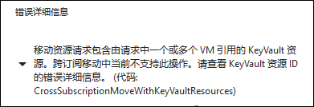

# 从 ASM 升级到 ARM 的虚拟机在进行跨订阅迁移时报错

## 问题描述

当您尝试在将 Azure 资源组迁移到另外一个订阅，而资源组中包含有从 ASM 迁移到 ARM 的虚拟机,这种情况下，您可能收到报错如下：

```
“移动资源请求包含由请求中一个或多个 VM 引用的 KeyVault 资源。跨订阅移动中当前不支持此操作。请查看 KeyVault 资源 ID 的错误详细信息 （代码：CrossSubscriptionMoveWithKeyVaultResources）”
“The Move resources request contains KeyVault resources which are referenced by one or more VMs in the request“
```



## 问题分析

ASM 模式下的云服务启用的证书 (每个云服务有一个证书) 在迁移到 ARM 模式后，被转移到 Azure 密钥保管库 (Key Vault)下，而虚拟机将会引用该密钥保管库中的证书。但被虚拟机引用的 Key Vault 无法进行跨订阅迁移，从而导致错误发生。

## 解决方法

在迁移之前去除虚拟机对这些证书的引用。

```PowerShell
$vmName = "vmName"
$rgName = "rgName"
$vm = Get-AzureRmVM -ResourceGroupName $rgName -Name $vmName
$vm.OSProfile.Secrets = New-Object -TypeName "System.Collections.Generic.List[Microsoft.Azure.Management.Compute.Models.VaultSecretGroup]"
Update-AzureRmVM -ResourceGroupName $rgName -VM $vm -Debug
```

> [!NOTE]
> 请正确定义:
> $vmname: 虚拟机名
> $rgName: 资源组名

您也可以使用 CLI 2.0 :

```Azure CLI
az vm update -g rgname -n vmname --set osProfile.Secrets=[]
```

成功去除虚拟机对证书的引用后请再次尝试迁移。