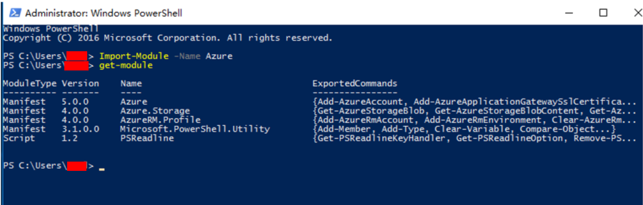

# 解决订阅欠费在恢复使用后恢复服务保管库仍然提示订阅已过期的问题

## 现象描述

预付费客户在订阅欠费后充值使订阅恢复使用，但是发现恢复服务保管库的备份作业从订阅恢复后一直执行失败，在 `\Program Files\Microsoft Azure Recovery Services Agent\Temp` 下的 CBEngineCurr.errlog 日志中看到 ErrorCode 为 `SubscriptionExpiryError`。

## 解决方案

1. 我们需要通过 PowerShell 登录到订阅下重新注册 Recovery Services Provider。如果您已经在使用 Azure PowerShell 了，请直接跳至第三步。如果您未使用过 Azure PowerShell，请先下载最新版的 [Azure PowerShell](https://github.com/Azure/azure-powershell/releases)。

2. 安装完成后打开 PowerShell,运行 `Import-Module -Name Azure` 导入 Azure Module，然后执行 `Get-Module` 命令确认 Azure PS 模块是否已导入成功，如下图所示：

    

3. 导入成功后，使用下述命令来登陆您的 Azure 账号：

    ```PowerShell
    Login-AzureRmAccount -EnvironmentName AzureChinaCloud
    ```
    
4. 如您有多个订阅，请执行如下命令选择对应的订阅号，如果账户下仅有一个订阅，请跳过该步骤。

    ```PowerShell
    Get-AzureRMSubscription
    Select-AzureRMSubscription -SubscriptionName <yourSubscriptionName>
    ```

5. 执行如下命令来注册 Recovery Service Provider：

    ```PowerShell
    Register-AzureRmResourceProvider -ProviderNamespace "Microsoft.RecoveryServices"
    ```

6. 最后重新执行备份任务即可。