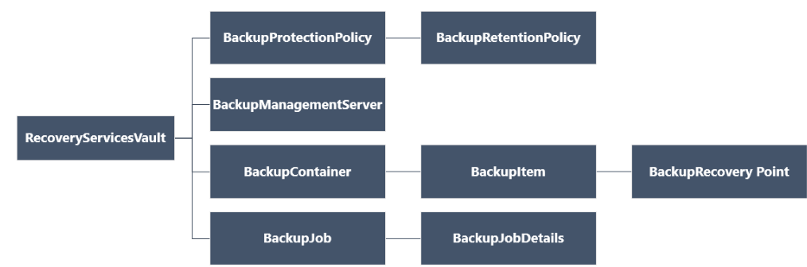
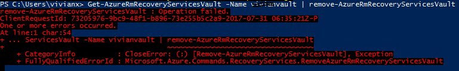
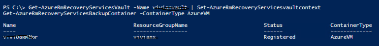
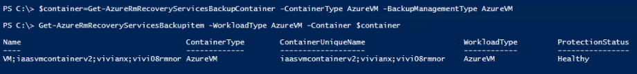
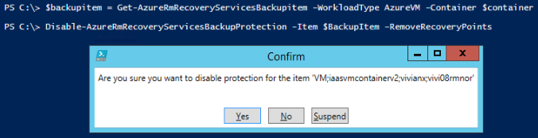
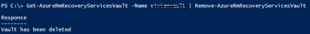

# 如何用 PowerShell 删除 Azure 虚拟机的备份保管库

## 概述

本文说明如何使用 Azure PowerShell cmdlet 删除 Azure VM 备份保管库。 恢复服务保管库是一种 Azure Resource Manager 资源，用于保护 Azure 备份和 Azure Site Recovery 服务中的数据与资产。可以使用恢复服务保管库来保护 Azure Service Manager 部署型 VM 以及 Azure Resource Manager 部署型 VM。

与创建备份保管库相同，在开始之前，您首先要了解对象的层次结构。如下图所示。



所以在删除备份保管库之前我们需要确认：

**保管库中是否有备份的内容**

可以参考当时创建保管库用的 PowerShell 命令。或者参考文档：[使用 PowerShell 从恢复服务保管库备份虚拟机](https://docs.azure.cn/zh-cn/backup/backup-azure-vms-automation)

其实删除操作就是一个相对于创建时的逆向操作。

## 具体步骤

### 查看保管库

首先列出备份保管库, 找到您要删除的保管库名称:

```PowerShell
Get-AzureRmRecoveryServicesVault
```

### 删除 Azure VM 备份保管库

如果确定保管库中没有任何内容，可以尝试用以下命令直接删除保管库:

```PowerShell
Get-AzureRmRecoveryServicesVault -Name xxxx | remove-AzureRmRecoveryServicesVault
```

如果遇到资源不为空的错误，那么就需要先逐级删除保管库中的资源，然后再删除保管库。




1.	首先设置上下文：

    ```PowerShell
    Get-AzureRmRecoveryServicesVault -Name xxxx | Set-AzureRmRecoveryServicesVaultContext 
    ```

2.	查看保管库中的容器得到容器名称 `-Name`：

    ```PowerShell
    Get-AzureRmRecoveryServicesBackupContainer -ContainerType “AzureVM” 
    ```

    

3.	根据 Container Name 继续得到下一层信息 backupItem：

    ```PowerShell
    $container = Get-AzureRmRecoveryServicesBackupContainer -ContainerType AzureVM -BackupManagementType AzureRM 

    Get-AzureRmRecoveryServicesBackupItem -WorkloadType AzureVM -Container $container 
    ```

    

4.	删除 recovery point 和 backup protection：

    ```PowerShell
    $BackupItem = Get-AzureRmRecoveryServicesBackupItem -WorkloadType AzureVM -Container $container

    Disable-AzureRmRecoveryServicesBackupProtection -Item $BackupItem -RemoveRecoveryPoints
    ```

    

5.	在禁用了 backup protection 并删除了 recovery point 之后，我们就可以去删除备份保管库了。

    ```PowerShell
    Get-AzureRmRecoveryServicesVault -Name xxxx | Remove-AzureRmRecoveryServicesVault 
    ```

    