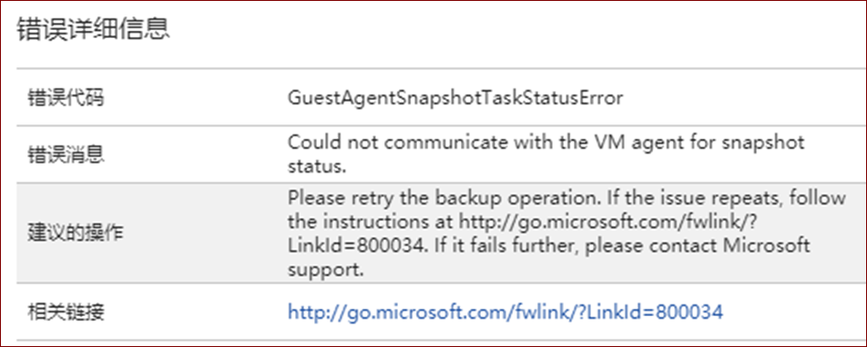

# 如何手动卸载 Azure Windows 虚拟机的备份扩展

## 备份扩展概述

当 Azure 备份服务在计划的时间启动备份作业时，它将触发 Snapshot 所需的备份扩展。 Azure 备份服务在 Windows 中使用 VMSnapshot 扩展，在 Linux 中使用 VMSnapshotLinux 扩展。 在第一个 VM 备份期间安装扩展。详情请参考文档:[在 Azure 中计划 VM 备份基础结构](/backup/backup-azure-vms-introduction)。

## 问题描述

当备份的虚拟机发生扩展无法更新或者加载的情况时，您可以尝试从 [Azure 门户](https://portal.azure.cn)上重新安装扩展，步骤如下：

1. 转到 [Azure 门户](https://portal.azure.cn)
2. 找到存在备份问题的 VM
3. 单击 “**设置**” -> “**扩展**”
4. 单击 “**VMsnapshot 扩展**”
5. 单击 “**卸载**” 

在下一次备份期间 VMSnapshot 扩展会被重新安装。详细步骤请参考：[如何解决无法更新或加载备份扩展](/backup/backup-azure-troubleshoot-vm-backup-fails-snapshot-timeout#the-backup-extension-fails-to-update-or-load)

但如果以上方法仍然无法解决问题，或者备份扩展在卸载后无法重新安装成功，报错如： `GuestAgentSnapshotTaskStatusError`。

在这种情况下，可以尝试从虚拟机内部手动删除 VMSnapshot 的组件：

> [!NOTE]
> 在尝试手动删除前，请先按照以下文档进行常规排错：
> [Azure 备份故障排除：代理和/或扩展的问题](/backup/backup-azure-troubleshoot-vm-backup-fails-snapshot-timeout)

## 解决方法

通过以下步骤手动卸载 VMSnapshot 扩展：

1. 从 Azure 门户上删除 Vmsnapshot 扩展后，清除注册表键值。
    1. 登录到该虚拟机
    2. 打开注册表编辑器 `regedit.exe`。 定位到注册表键值：`HKLM\Software\Microsoft\Windows Azure\HandlerState`
    3. 如果在列表中存在 Snapshot 相关的键值如：`Microsoft.Azure.RecoveryServices.VMSnapshot_xxxxx`，请右键删除。
        > [!WARNING]
        > 在删除之前建议请先右键 Export 进行备份。

2. 删除相应文件夹

    1. 定位到 C:\Packages\Plugins 文件夹
    2. 删除 VMSnapshot 相关文件夹`Microsoft.Azure.RecoveryServices.VMSnapshot`
        

3. 在 Azure 门户上重新尝试虚拟机备份并选择 “**现在备份**”。查看 VMsnapshot 是否安装成功。
    

> [!IMPORTANT]
> 该解决方法只适用于符合 “**问题描述**” 中的场景中。