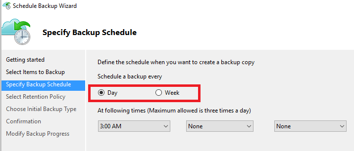
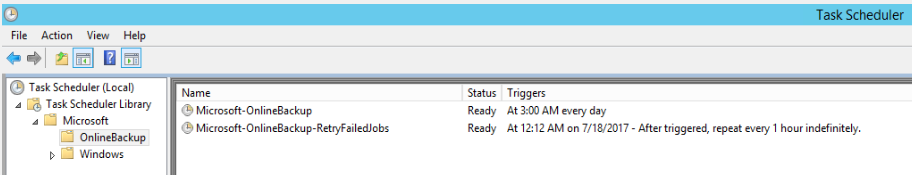
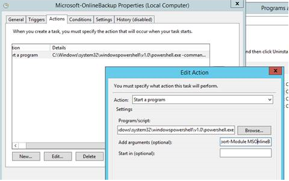

# Azure 备份代理中设置的备份计划不执行

## 问题描述

使用 Azure 备份将 Windows Server（或 Windows 客户端）文件和文件夹备份到 Azure，安装并配置了Azure备份代理中的备份计划, 例如：

但是备份计划并没有执行，在事件查看器中也没有相应的报错。

> [!NOTE]
> 事件查看器-> Applications and Services logs -> Cloud Backup -> Operational 中记录了Azure backup的操作记录。

## 问题分析

Azure 备份代理生成的备份任务会添加到任务计划，但任何计划执行 `import-module msonlinebackup` 命令时失败。

### 排错过程

1.	运行 Azure 备份代理，尝试手动运行一次备份，查看备份是否成功运行。
2.	打开任务计划 Task Scheduler，确保备份计划被成功创建。

    

3.  可以尝试新建一个备份任务，比如每 5 分钟执行一次备份，来查看该任务计划是否会成功执行。如此来判断时任务计划的问题还是备份本身的问题。

4.	打开任务计划详细，在 Actions 选项卡中查看具体的命令。拷贝该命令并尝试手动运行。

    

5.	在手动执行命令时，发现import-module msonlinebackup报错Module 不存在

## 解决方法

手动添加 MSOnlineBackup Module:

1.	到 `C:/ProgramFiles/Microsoft Azure Recovery Services/Bin/Modules/MSOnlineBackup` 文件夹下。
2.	拷贝 MSOnlineBackup.psd1 到 `C:\Windows\System32\WindowsPowerShell\v1.0.` 目录。
3.	重新运行 `import-module msonlinebackup` 命令。