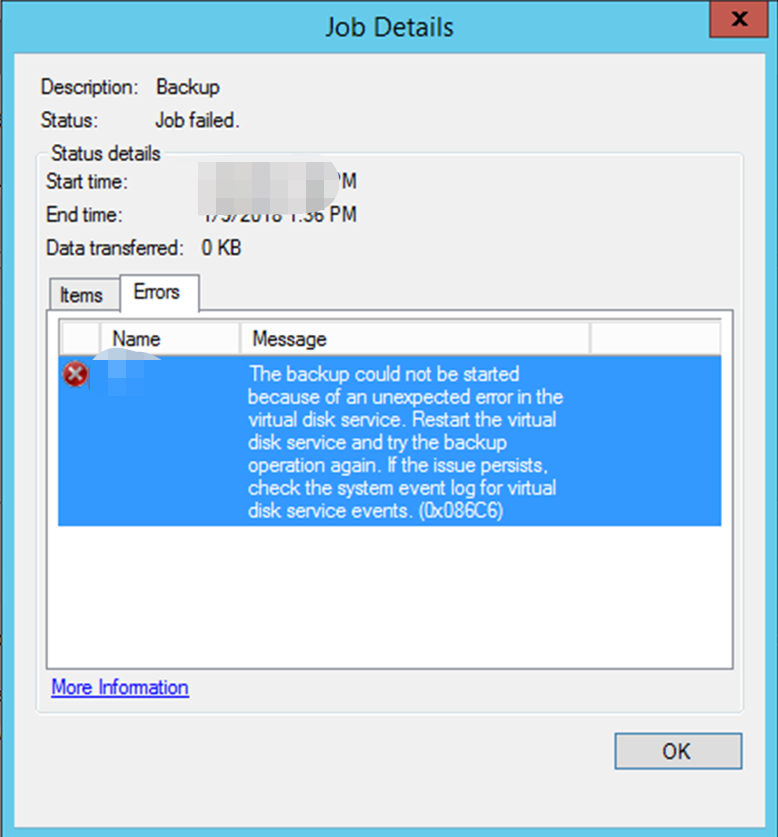
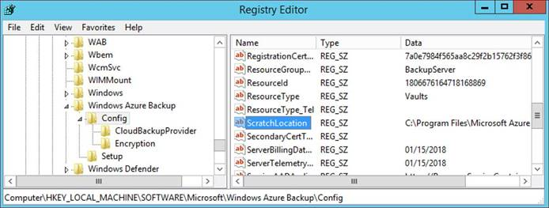
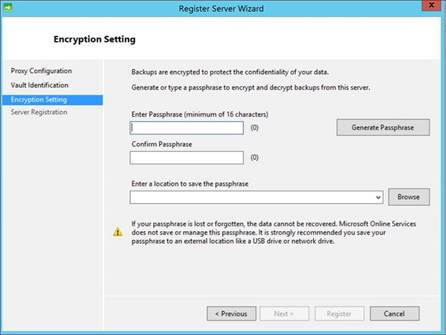

# 如何解决使用 Azure 备份代理备份 Windows Server/Client 出现的错误

## 问题描述

使用 Azure 备份代理备份 Windows Server 或 Windows Client 文件和文件夹到 Azure 时，备份代理报错，错误信息如下：

```
Error: The backup could not be started because of an unexpected error in the virtual disk service. Restart the virtual disk service and try the backup operation again. If the issue persists, check the system event log for virtual disk service events. (0x086C6)
```



## 问题分析

Windows Server/Client 存储层的问题导致备份文件的 VHD 无法加载。<br>
可以通过重建备份的缓存文件夹 Scratch 的方式来解决该问题。

## 解决方法

> [!IMPORTANT]
> 该解决方法只适用于 **问题描述** 中的场景：
> - 安装了 Microsoft Azure Recovery Services Agent 的 Windows Server 以及 Windows  Client。
> - 错误代码为：`0x086C6`。

重建备份缓存文件 Scratch 的步骤如下：

1. 下载并安装最新的 Azure 备份代理。
2. 以管理员运行 CMD，并键入以下命令停止备份服务: `net stop obengine`
3. 在注册表编辑器中查看 Scratch 文件夹的位置： `HKEY_LOCAL_MACHINE\Software\Microsoft\Windows Azure Backup\Config\ScratchLocation`

    

4. 默认值为：`C:\Program Files\Microsoft Azure Recovery Services Agent\Scratch\VHDs`
5. 先将 Scratch 文件夹进行备份以防后续步骤出错。
6. 删除 Scratch 文件夹。保证所有的 VHD 文件都删除成功。
7. 从控制面板中卸载 Azure 备份代理。
8. 重新安装备份代理。
9. 重新注册备份代理到 Azure。

    > [!NOTE]
    > 注册时请使用第一次注册时生成的 passphrase 而不要重新生成。

    

10. 用命令行启动服务 `net start obengine`。
11. 再次启动备份。（建议您先尝试用一个较小的文件来验证备份是否可以成功运行。） 
12. 备份成功运行后，您即可删除之前备份的 Scratch 文件夹了（第 5 步）。至此问题已解决

## 更多信息

关于备份缓存文件夹的更多信息，请参考：[Azure 备份代理常见问题](/backup/backup-azure-file-folder-backup-faq#backup)。