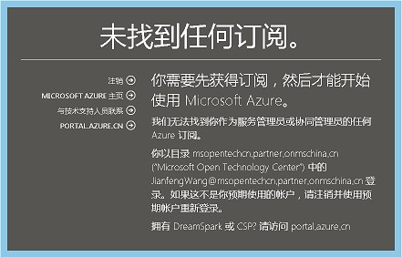
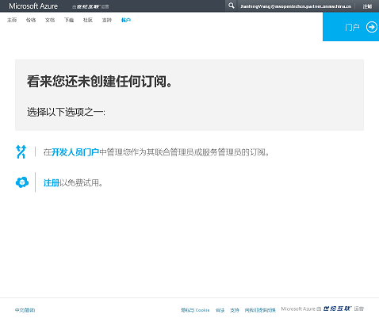

<h1 style="font-size: 1.4em; font-weight: bold; font-family: 'Microsoft YaHei', 'Segoe UI Light'" align="center" >当您看到 “看来您还未创建任何订阅” 的提示信息</h1>

针对线上购买订阅的用户，当您登陆 <a href="https://portal.azure.cn/">Azure 门户</a> 或 <a href="https://account.windowsazure.cn/">Azure 账户中心</a> 看到 “看来您还未创建任何订阅” 的提示信息，如下面两种示例，这表示您的 Azure 账户尚未创建订阅成功，您需要进行订阅创建的操作流程，具体说明如下：

&nbsp;&nbsp;

<ol style="font-size: 1em; font-family: 'Microsoft YaHei', 'Segoe UI Light'">
<li>保持您登录的状态，在同一个页面，返回 <a href="http://www.azure.cn/">Azure 中国官网</a>。</li>
<li>根据您需要的订阅，在页面右上角点击相对应的注册页面。1 元试用订阅请点击 “申请试用”，标准预付费订阅请点击 “我要购买”。请留意每位新用户仅能申请一次 1 元试用订阅，更多细节规定请参考 <a href="https://www.azure.cn/offers/ms-mc-azr-44p/">1 元试用订阅详情</a>。</li>
<li>进行订阅注册操作流程。</li>
<li>在您完成费用支付后，订阅即创建成功，您可开始进行 Azure 服务。</li>
</ol>

<h2 style="font-size: 1.2em; font-weight: bold; font-family: 'Microsoft YaHei', 'Segoe UI Light'">了解更多</h2>

<a href="https://school.azure.cn/courses/48">Azure 门户使用概览</a> 
<a href="https://www.azure.cn/pricing/billing/azure-pia-application-and-signup/">注册标准预付费订阅</a>

<h2 style="font-size: 1.2em; font-weight: bold; font-family: 'Microsoft YaHei', 'Segoe UI Light'">问题未解决？联系支持人员</h2>

如果仍需帮助，请<a href="https://www.azure.cn/support/contact/">联系支持人员</a>以快速解决问题。

