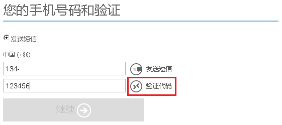
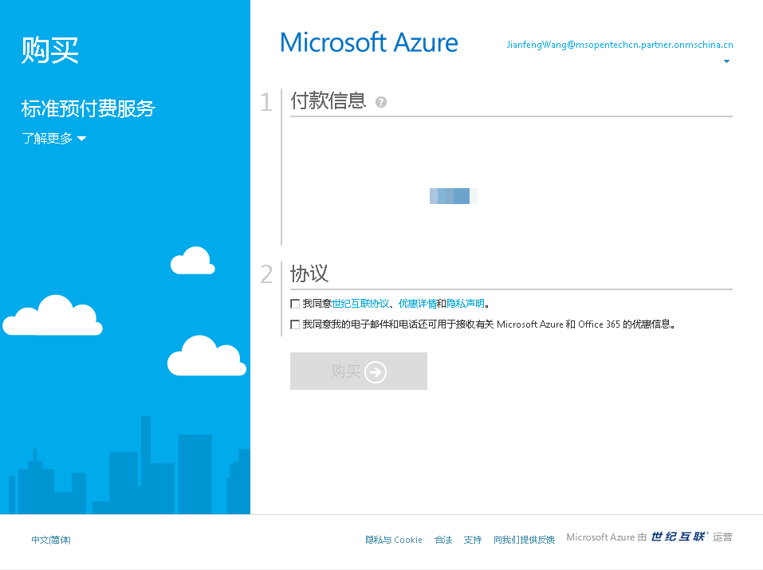

<h1 style="font-size: 1.4em; font-weight: bold; font-family: 'Microsoft YaHei', 'Segoe UI Light'" align="center" >Azure线上注册的常见问题</h1>

本文列出了用户在线上注册Azure服务时常见的操作问题及其解决方案。如果您所遇到的问题仍无法被解决，请<a href="https://www.azure.cn/support/contact/">联系支持人员</a>获取协助。

<ol style="font-size: 1em; font-family: 'Microsoft YaHei', 'Segoe UI Light'">
<li style="font-weight: bold">回填短信代码后无法点击 “继续”，如下图。</li>

解决方案：在您填入验证码之后，您需要先点击 “验证代码” 进行验证。验证成功后，才能点击 “继续”。
<li style="font-weight: bold">注册过程中，进度条挂起，长时间持续，如下图。</li>

解决方案：您的浏览器必须允许第三方cookie。您可参考以下方法修改您的浏览器cookie设置。不同版本的浏览器，设置的方法可能不同，请参考浏览器的帮助内容。
<ul>
<li>Chrome：设置>显示高级设置>隐私>内容设置>清除 “禁止第三方cookie和站点数据”。</li>
<li>Edge：设置>查看高级设置> Cookie >不要阻止cookie。</li>
<li>Safari：设置>Safari>阻止Cookie>总是允许。</li>
</ul>
修改完成后，请刷新当前的Azure注册页，检查问题是否已解决。如果刷新没有解决此问题，请退出并重新启动您的浏览器，然后再试一次。
<li style="font-weight: bold">注册页面出现“抱歉！1元人民币的试用订阅/标准预付费服务不可用。您没有资格获得此特定Promo产品/服务”的提示信息</li>
解决方案：若您之前申请过Azure试用，但没有完成注册流程。这个提示信息表示您未能在有效期内使用注册激活码，您可点击以下链接重新申请。 
<a href="https://www.azure.cn/pricing/1rmb-trial-full/?form-type=identityauth">Azure试用申请表</a> 
<a href="https://www.azure.cn/pricing/pia-waiting-list/?form-type=identityauth">Azure预付费产品购买申请表</a>
<li style="font-weight: bold">当您登录Azure门户或Azure账户中心看到”看来您还未创建任何订阅”的提示信息</li>
解决方案：这表示您的Azure账户尚未创建订阅成功，请参考登录后未创建任何订阅完成Azure账户创建。
</ol>

<h2 style="font-size: 1.2em; font-weight: bold; font-family: 'Microsoft YaHei', 'Segoe UI Light'">了解更多</h2>

<a href="https://www.azure.cn/pricing/billing/azure-1rmb-trial-application-and-signup/">注册1元试用订阅</a> 
<a href="https://www.azure.cn/pricing/billing/azure-pia-application-and-signup/">注册标准预付费订阅</a>

<h2 style="font-size: 1.2em; font-weight: bold; font-family: 'Microsoft YaHei', 'Segoe UI Light'">问题未解决？联系支持人员</h2>

如果仍需帮助，请<a href="https://www.azure.cn/support/contact/">联系支持人员</a>以快速解决问题。
