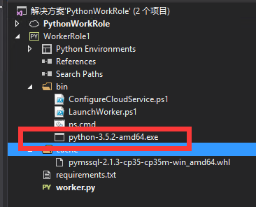

# 如何在云服务中发布 Python 应用程序

在 Azure 云服务发布 Python Work Role 应用程序，需要在启动应用程序之前，先要下载并安装 Python 环境，并且使用 pip 安装必需的第三方包。但这个过程中，往往会受到网络的影响导致下载失败，并使云服务应用启动失败。而且当，本文将介绍一种使用离线 Python 下载包安装 Python 运行环境，并缓存 pip 离线包的方法，来加速 Python 应用程序的启动。

首先，我们需要按照官方推荐的方法来创建 Python Work Role 项目，具体可参考此文档：[用于 Visual Studio 的 Python 工具中的 Python Web 角色和辅助角色](https://docs.azure.cn/zh-cn/cloud-services/cloud-services-python-ptvs)。

之后，我们需要从 Python 官方网站下载离线安装包，并将其放置到项目脚本目录下。



然后，创建 cache 目录，用来存放离线第三方包，下载第三方依赖包，并放置到该目录下，Python 包的依赖可能比较复杂，我们可以执行以下命令下载依赖包，使用离线依赖的作用就是可以防止在云服务上下载依赖，减少云服务启动时间。

`py -m pip download -r requirements.txt -i https://pypi.tuna.tsinghua.edu.cn/simple/ -d cache --timeout 60`

最后，修改 Python 脚本，使其能够使用本地包，来安装 Python 运行环境，参考以下完整脚本 :

```Python
$is_emulated = $env:EMULATED -eq "true"
$is_python2 = $env:PYTHON2 -eq "on"
$nl = [Environment]::NewLine

if (-not $is_emulated){
    Write-Output "Checking if python is installed...$nl"
    if ($is_python2) {
        & "${env:SystemDrive}\Python27\python.exe"  -V | Out-Null
    }
    else {
        py -V | Out-Null
    }

    if (-not $?) {

        $outFile = "$(Get-Location)\python-3.5.2-amd64.exe"

        if ($is_python2) {
            $url = "https://www.python.org/ftp/python/2.7.12/python-2.7.12.amd64.msi"
            $outFile = "${env:TEMP}\python-2.7.12.amd64.msi"
        }

        Write-Output "Install $outFile$nl"
        

        if ($is_python2) {
			Write-Output "Installing Python2$nl"
            Start-Process msiexec.exe -ArgumentList "/q", "/i", "$outFile", "ALLUSERS=1" -Wait
        }
        else {
			Write-Output "Installing Python3$nl"
            Start-Process "$outFile" -ArgumentList "/quiet", "InstallAllUsers=1" -Wait
        }

        Write-Output "Done$nl"
    }
    else {
        Write-Output "Already installed"
    }
}

if (-not $is_emulated){
    Write-Output "Checking if requirements.txt exists$nl"
    if (Test-Path ..\requirements.txt) {
        Write-Output "Found. Processing pip$nl"

        if ($is_python2) {
			cd..
            & "${env:SystemDrive}\Python27\python.exe" -m pip download -r requirements.txt -i https://pypi.tuna.tsinghua.edu.cn/simple/ -d cache  --timeout 60
			& "${env:SystemDrive}\Python27\python.exe" -m pip install -r requirements.txt --find-links cache

        }
        else {
			cd..
			Write-Output "Downloading Package$nl"
            py -m pip download -r requirements.txt -i https://pypi.tuna.tsinghua.edu.cn/simple/ -d cache --timeout 60
			Write-Output "Installing Package$nl"
			py -m pip install -r requirements.txt --find-links cache
        }
        Write-Output "Done$nl"
    }
    else {
        Write-Output "Not found$nl"
    }
}
```

通过以上操作，我们就可以使用离线包，在 Cloud Service 上安装 Python 运行环境，大大降低了出现问题的几率和发布的时间。