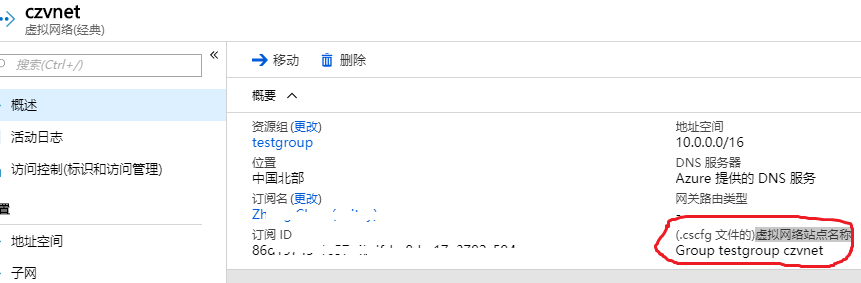

# 云服务配置虚拟网络和公共 IP

## 经典云服务配置虚拟网络

只可以配置经典虚拟网络，需要在云服务的配置文件 .cscfg 中添加 NetworkConfiguration，并且需要重新部署做 full deployment 才能生效。需要注意检查添加相关配置之后的 xml 文件是否为有效文件，可以通过在线工具 [XML Beautifier](http://xmlbeautifier.com/) 生成有效 xml 文件。参考示例如下：

```xml
<ServiceConfiguration>  
  <NetworkConfiguration>  
    <VirtualNetworkSite name="经典虚拟网络的虚拟网络站点名称"/>  
    <AddressAssignments>  
      <InstanceAddress roleName="角色名称">  
        <Subnets>  
          <Subnet name="子网名称"/>  
        </Subnets>  
      </InstanceAddress>
    </AddressAssignments>  
  </NetworkConfiguration>  
</ServiceConfiguration>
```

经典虚拟网络站点名称:



云服务配置虚拟网络请参考：[NetworkConfiguration Schema](https://docs.microsoft.com/en-us/previous-versions/azure/reference/jj156091%28v%3dazure.100%29)

## 经典云服务配置公共 IP

首先您需要创建 Azure 公共 IP，然后通过以下方式设置公共 IP，配置公共 IP 可能会解决云服务的应用频繁访问外网出现丢包的异常。

1. 下载云服务的 .cscfg 文件。

2. 修改云服务的配置文件 .cscfg，添加 InstanceAddress 节点，并且为 Webrole 配置公网 IP。

    ```xml
    <?xml version="1.0" encoding="utf-8"?>
    <ServiceConfiguration serviceName="ILPIPSample" xmlns="http://schemas.microsoft.com/ServiceHosting/2008/10/ServiceConfiguration" osFamily="4" osVersion="*" schemaVersion="2014-01.2.3">
      <Role name="WebRole1">
        <Instances count="1" />
            <ConfigurationSettings>
        <Setting name="Microsoft.WindowsAzure.Plugins.Diagnostics.ConnectionString" value="UseDevelopmentStorage=true" />
            </ConfigurationSettings>
      </Role>
      <NetworkConfiguration>
       <AddressAssignments>
          <InstanceAddress roleName="WebRole1">
            <PublicIPs>
              <PublicIP name="MyPublicIP" domainNameLabel="MyPublicIP" />
            </PublicIPs>
          </InstanceAddress>
        </AddressAssignments>
      </NetworkConfiguration>
    </ServiceConfiguration>
    ```

3. 上传该 .cscfg 文件到云服务

    详细介绍请参考：[Manage an ILPIP for a Cloud Services role instance](https://docs.microsoft.com/en-us/azure/virtual-network/virtual-networks-instance-level-public-ip#manage-an-ilpip-for-a-cloud-services-role-instance)

注意如果在配置了虚拟网络的情况下配置公共 IP 需要按照顺序填写，先是 *Subnets* 然后 *PublicIPs*，参考如下：

```xml
<NetworkConfiguration>
    <VirtualNetworkSite name="Group testgroup czclassicvnet" />
    <AddressAssignments>
      <InstanceAddress roleName="ContosoAdsWeb">
        <Subnets>
          <Subnet name="default" />
        </Subnets>
         <PublicIPs>
          <PublicIP name="mypublicip" domainNameLabel="czpublicip" />
        </PublicIPs>
      </InstanceAddress>
    </AddressAssignments>
  </NetworkConfiguration>
```