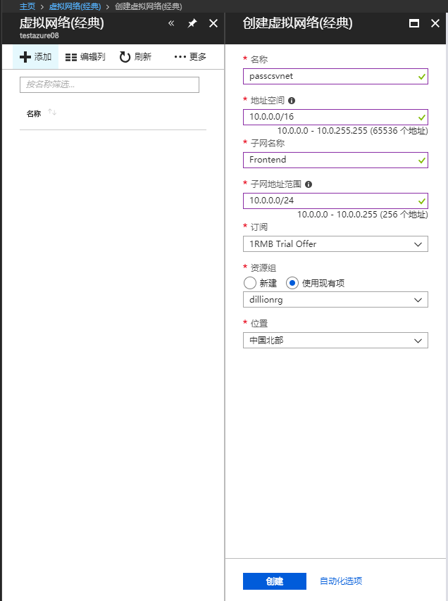
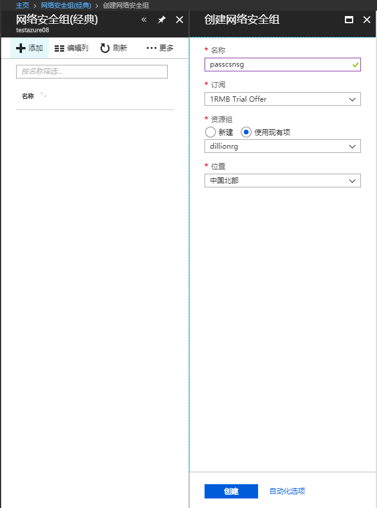
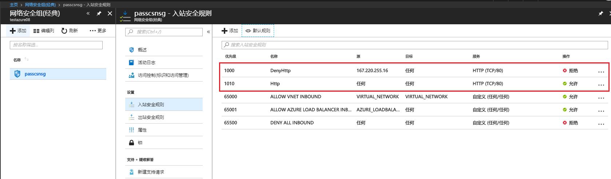
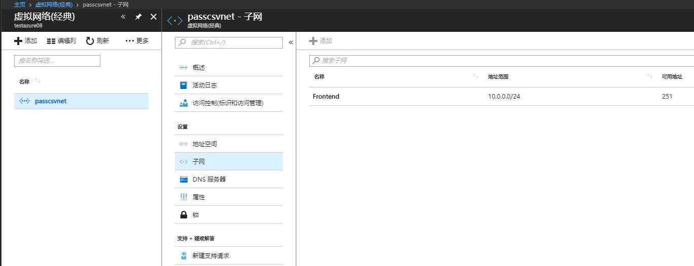
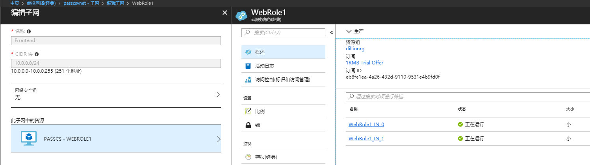
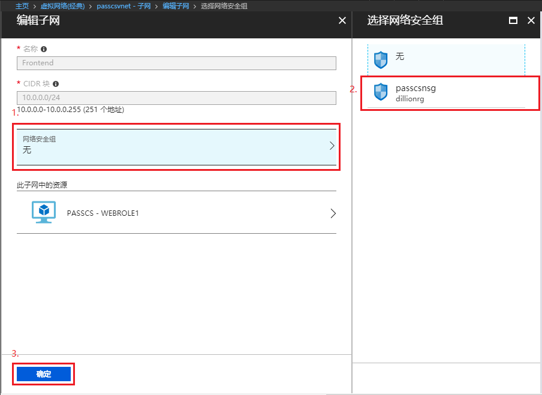

# PaaS 云服务如何拒绝可疑 IP 的访问

当客户发布 Azure PaaS 云服务时，如果应用程序本身没有做 IP 过滤，那么默认情况下，是允许所有 IP 访问的。那假如发生来自可疑 IP 的恶意攻击，有没有好的解决方案来保护云服务？答案是有。

一句话描述该解决方案就是：将云服务添加到虚拟网络(经典)，使用网络安全组筛选网络流量。

具体操作步骤如下：

1. 登录 [Azure 门户](http://portal.azure.cn)，添加经典虚拟网络。

    依次点击“所有服务”->”虚拟网络(经典)“->“添加”，配置虚拟网络

    

2. 添加网络安全组(经典)，配置入站规则。

    依次点击“所有服务”->”网络安全组(经典)“->“添加”，输入网络安全组名称，选择资源组

    

    添加完成后，在网络安全组侧边栏中选择”入站安全规则“，添加入站规则，在本示例中添加了**允许** 80 端口入站规则和**禁止** 167.220.255.16 IP 入站规则。

    

    > [!Note]
    > 
    > 注意[网络安全规则](https://docs.azure.cn/virtual-network/security-overview#security-rules)的优先级。

3. 在本地修改 PaaS 云服务配置文件。

    在 ServiceConfiguration.Cloud.cscfg 中添加以下配置：

    ```
    <NetworkConfiguration>
        <VirtualNetworkSite name="Group <资源组名称> <经典虚拟网络名称>" />
        <AddressAssignments>
            <InstanceAddress roleName="<角色名称>">
                <Subnets>
                    <Subnet name="<子网名称>" />
                </Subnets>
            </InstanceAddress>
        </AddressAssignments>
    </NetworkConfiguration>
    ```

    

    配置完成后，重新编译打包，重新部署 PaaS 云服务。

    > [!Note]
    > 
    > 部署过程中如果遇到”无法在部署更新或升级过程中添加或移除虚拟网络站点“错误，请删除部署环境中已有的部署，重新上传部署包。

4. 为虚拟网络子网添加网络安全组。

    上一步部署完成后，打开经典虚拟网络，查看子网资源，可以看到 PaaS 云服务已经部署到虚拟网络中

    

    

    在编辑子网窗口，点击网络安全组，选择之前添加的网络安全组，点击确定按钮保存设置

    

    保存成功后，配置的网络访问控制将马上生效。

    关于更多 PaaS 云服务的网络访问控制的设置，可参照官网说明：[NetworkConfiguration Schema](https://msdn.microsoft.com/library/zh-cn/JJ156091.aspx)。