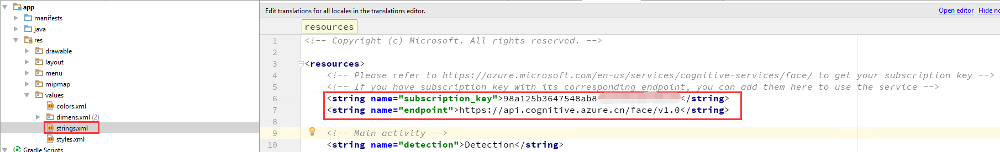
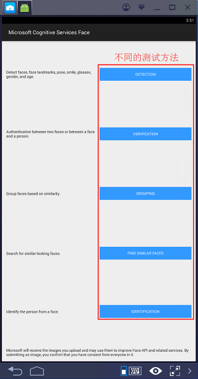
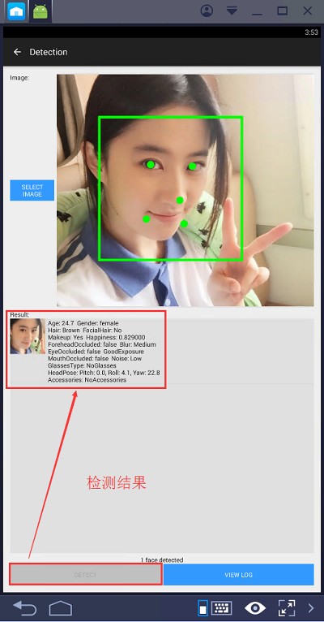

# 认知服务 Android 使用示例

这个示例是一个 Android 应用程序，用来演示如何使用微软认知服务 API。它演示了人脸检测、人脸验证、人脸分组、查找相似人脸和面部识别功能。

## 环境要求

Android4.1 或更高 (API Level 16 或更高)

## 下载项目

1. 下载地址：[https://github.com/microsoft/cognitive-Face-Android](https://github.com/microsoft/cognitive-Face-Android)。

2. 在 Android Studio 中导入示例项目。

3. 修改 **app** -> **res** -> **values** -> **strings.xml** 的值，注意系统默认的是国外的 Endpoint，需要修改为国内的 Endpoint 并添加对应的 key。修改示例如下：

    

4. 编译创建 apk，安装使用。

## 测试示例

使用 Android 模拟器测试 apk :

1. 程序主界面：

    

2. 测试 DETECTION 方法：

    

## 更多参考

* [中国版认知服务使用指导](https://docs.azure.cn/zh-cn/articles/cognitive-services/aog-cognitive-services-guidance)
* [Microsoft/ProjectOxford-ClientSDK](https://github.com/Microsoft/ProjectOxford-ClientSDK/tree/master/Face)

