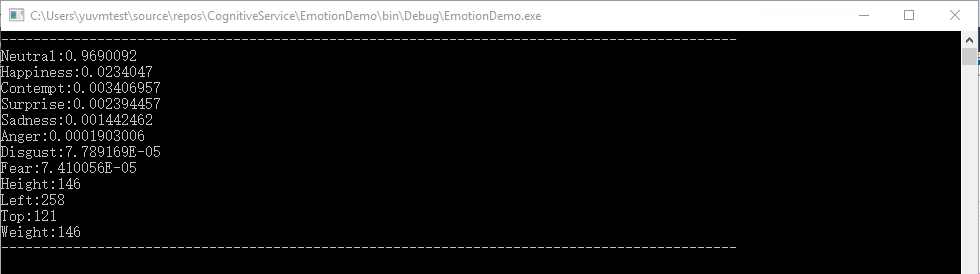

# 情绪识别 API C# SDK使用示例

认知服务为开发者提供了一组 API 和 SDK，从而将微软公司不断演进的人工智能技术扩展到广大开发者手中。<br>
通过情绪识别 API，可以用来识别图像中人脸所表达的情感，并给出相应的置信度值。<br>
本文介绍使用 C# SDK 且基于中国版情绪识别的 key 的控制台示例程序。

## 示例程序

```C#
using Microsoft.ProjectOxford.Common.Contract;
using Microsoft.ProjectOxford.Emotion;
using System;
using System.Threading.Tasks;

namespace EmotionDemo
{
    class Program
    {
        //初始化对象
        static string subscriptionKey = "<Emotion API key>";
        static EmotionServiceClient emotionServiceClient = new EmotionServiceClient(subscriptionKey, "https://api.cognitive.azure.cn/emotion/v1.0");
        static void Main(string[] args)
        {
            Console.WriteLine("--------------------------------------------------------------------------------------------");
            Emotion[] emotionResult = MyMethod().GetAwaiter().GetResult();

            //输出返回的结果
            foreach (var result in emotionResult)
            {
                foreach (var emotion in result.Scores.ToRankedList())
                {
                    Console.WriteLine(emotion.Key + ":" + emotion.Value);
                }
                Console.WriteLine("Height:" + result.FaceRectangle.Height);
                Console.WriteLine("Left:" + result.FaceRectangle.Left);
                Console.WriteLine("Top:" + result.FaceRectangle.Top);
                Console.WriteLine("Weight:" + result.FaceRectangle.Width);
            }

            Console.WriteLine("--------------------------------------------------------------------------------------------");
            Console.ReadKey(true);
        }

        static async Task<Emotion[]> MyMethod()
        {
            //图片的 URL，此处既可以使用公网可以访问的图片，也可以直接读取本地图片的 URL
            Emotion[] emotionResult = await emotionServiceClient.RecognizeAsync("http://h.hiphotos.baidu.com/baike/pic/item/7a899e510fb30f2445d60e4dc195d143ad4b032b.jpg");
            return emotionResult;
        }
    }
}
```

## 测试结果



## 更多参考

[情绪识别 API C# 教程](https://docs.azure.cn/zh-cn/cognitive-services/emotion/tutorials/csharptutorial)
[Emotion API](https://dev.cognitive.azure.cn/docs/services/5639d931ca73072154c1ce89/operations/563b31ea778daf121cc3a5fa)
[中国版认知服务使用指导](https://docs.azure.cn/zh-cn/articles/azure-operations-guide/cognitive-services/aog-cognitive-services-guidance)