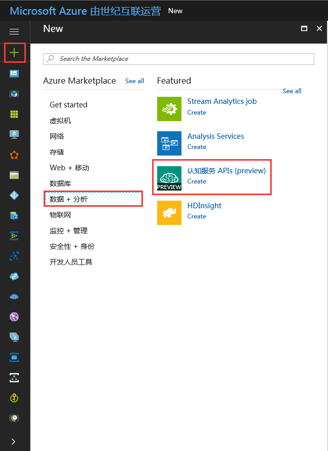
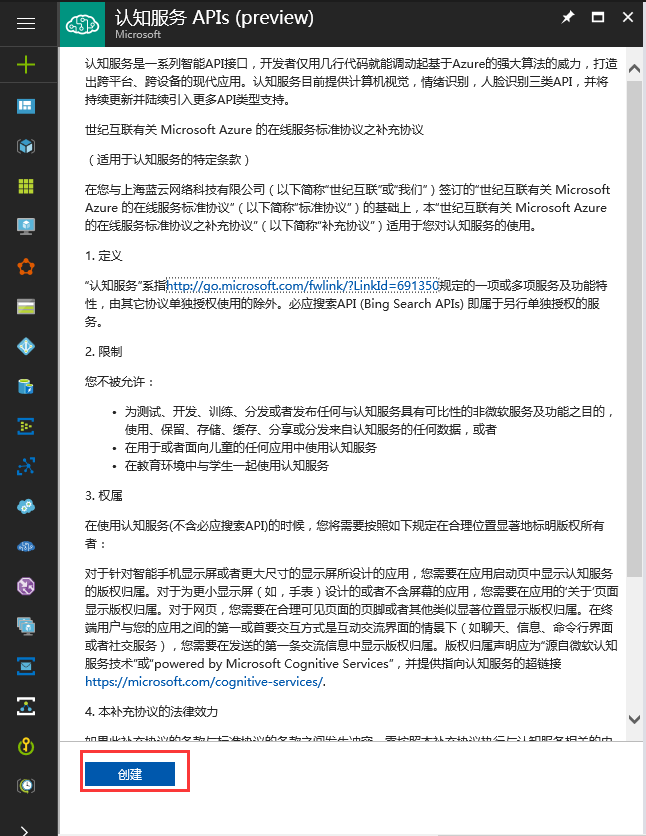
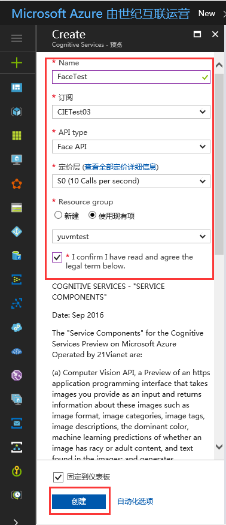

# 中国版认知服务使用指导

认知服务为开发者提供了一组 API 和 SDK，从而将微软公司不断演进的人工智能技术扩展到广大开发者手中。通过认知服务，您的应用可以轻松地获得智能。首批登陆[中国的 API](https://www.azure.cn/documentation/services/cognitive-services/) 包括人脸识别、情绪识别和计算机视觉。本文主要介绍认知服务的创建，控制台快速测试，多种语言的测试调用。本文以 Face API 的 detect 方法为例进行演示。

## 认知服务的创建

1. 登陆到 [China Azure 管理门户](https://portal.azure.cn)。

2. 新建 Face API (创建新服务 -> 数据 + 分析 -> 认知服务 APIS)：

    
    
    

3. 获取服务的 key：

    

## 控制台快速测试

1. [认知服务 - API 参考](https://dev.cognitive.azure.cn/docs/services/563879b61984550e40cbbe8d/operations/563879b61984550f30395236)

    

2. [Detect 控制台测试](https://dev.cognitive.azure.cn/docs/services/563879b61984550e40cbbe8d/operations/563879b61984550f30395236/console)

    

    

## Rest API 程序调用示例

- C# Code Samples：

    ```C#
    using System;
    using System.IO;
    using System.Net.Http;
    using System.Text;
    using System.Web;

    namespace FaceAPI
    {
        class Program
        {
            static void Main(string[] args)
            {
                //UsePictureURL();
                UseLocalPicture();
                Console.WriteLine("Hit ENTER to exit...");
                Console.ReadLine();
            }

            /// <summary>
            /// use picture URL
            /// </summary>
            static async void UsePictureURL()
            {
                var client = new HttpClient();
                var queryString = HttpUtility.ParseQueryString(string.Empty);

                // Request headers
                client.DefaultRequestHeaders.Add("Ocp-Apim-Subscription-Key", "4fe95********************fda06c6");//Face API key

                // Request parameters
                queryString["returnFaceId"] = "true";
                queryString["returnFaceLandmarks"] = "false";
                queryString["returnFaceAttributes"] = "age";
                var uri = "https://api.cognitive.azure.cn/face/v1.0/detect?" + queryString;

                HttpResponseMessage response;

                // Request body
                byte[] byteData = Encoding.UTF8.GetBytes("{\"url\":\"https://timgsa.baidu.com/timg?image&quality=80&size=b9999_10000&sec=1494416315487&di=5e05a310f8c7b3fec011901ff3d13f93&imgtype=0&src=http%3A%2F%2Fimgsrc.baidu.com%2Fbaike%2Fpic%2Fitem%2F4034970a304e251ff1e3819aa486c9177f3e53bf.jpg\"}");//Picture URL

                using (var content = new ByteArrayContent(byteData))
                {
                    response = await client.PostAsync(uri, content);
                }

                //response result
                string result = await response.Content.ReadAsStringAsync();
                Console.WriteLine("response:" + result);
            }

            /// <summary>
            /// use local picture
            /// </summary>
            static async void UseLocalPicture()
            {
                var client = new HttpClient();

                var queryString = HttpUtility.ParseQueryString(string.Empty);

                // Request headers
                client.DefaultRequestHeaders.Add("Ocp-Apim-Subscription-Key", "4fe95********************fda06c6");//Face API key

                // Request parameters
                queryString["returnFaceId"] = "true";
                queryString["returnFaceLandmarks"] = "false";
                queryString["returnFaceAttributes"] = "age";
                var uri = "https://api.cognitive.azure.cn/face/v1.0/detect?" + queryString;

                HttpResponseMessage response;

                //read local picture to byte[]
                string path = @"C:\Users\yuvmtest\Desktop\test.jpg";//local picture path
                FileStream fs = File.OpenRead(path); //OpenRead
                int filelength = 0;
                filelength = (int)fs.Length;
                byte[] image = new byte[filelength];
                fs.Read(image, 0, filelength);
                fs.Close();

                using (var content = new ByteArrayContent(image))
                {
                    content.Headers.Add("Content-Type", "application/octet-stream");//set content-type
                    response = await client.PostAsync(uri, content);
                }

                //response result
                string result = await response.Content.ReadAsStringAsync();
                Console.WriteLine("response:" + result);
            }
        }
    }
    ```

- Java Code Samples：

    ```Java
    package buct.edu.cn;

    import java.io.FileInputStream;
    import java.net.URI;

    import org.apache.http.HttpEntity;
    import org.apache.http.HttpResponse;
    import org.apache.http.client.HttpClient;
    import org.apache.http.client.methods.HttpPost;
    import org.apache.http.client.utils.URIBuilder;
    import org.apache.http.entity.ByteArrayEntity;
    import org.apache.http.entity.StringEntity;
    import org.apache.http.impl.client.HttpClients;
    import org.apache.http.util.EntityUtils;

    public class FaceAPI {

        public static void main(String[] args) {

            System.out.println("Begin FaceAPI Test.");

            //UsePictureURL();
            UseLocalPicture();
        }
        /**
        * Use Picture URL
        */
        public static void UsePictureURL()
        {
            HttpClient httpclient = HttpClients.createDefault();

            try
            {
                URIBuilder builder = new URIBuilder("https://api.cognitive.azure.cn/face/v1.0/detect");

                builder.setParameter("returnFaceId", "true");
                builder.setParameter("returnFaceLandmarks", "false");
                builder.setParameter("returnFaceAttributes", "age");

                URI uri = builder.build();
                HttpPost request = new HttpPost(uri);
                request.setHeader("Content-Type", "application/json");
                request.setHeader("Ocp-Apim-Subscription-Key", "4fe95********************fda06c6");

                // Request body
                StringEntity reqEntity = new StringEntity("{\"url\":\"https://timgsa.baidu.com/timg?image&quality=80&size=b9999_10000&sec=1494416315487&di=5e05a310f8c7b3fec011901ff3d13f93&imgtype=0&src=http%3A%2F%2Fimgsrc.baidu.com%2Fbaike%2Fpic%2Fitem%2F4034970a304e251ff1e3819aa486c9177f3e53bf.jpg\"}"); //URL 图片地址
                request.setEntity(reqEntity);

                HttpResponse response = httpclient.execute(request);
                HttpEntity entity = response.getEntity();

                if (entity != null) 
                {
                    System.out.println(EntityUtils.toString(entity));
                }
            }
            catch (Exception e)
            {
                System.out.println(e.getMessage());
            }
        }

        /**
        * use local picture
        */
        public static void UseLocalPicture()
        {
            HttpClient httpclient = HttpClients.createDefault();

            try
            {
                URIBuilder builder = new URIBuilder("https://api.cognitive.azure.cn/face/v1.0/detect");

                builder.setParameter("returnFaceId", "true");
                builder.setParameter("returnFaceLandmarks", "false");
                builder.setParameter("returnFaceAttributes", "age");

                URI uri = builder.build();
                HttpPost request = new HttpPost(uri);
                request.setHeader("Content-Type", "application/octet-stream");
                request.setHeader("Ocp-Apim-Subscription-Key", "4fe95********************fda06c6");

                // Request body
                String pic_path = "C:\\Users\\yuvmtest\\Desktop\\test.jpg";

                FileInputStream is = new FileInputStream(pic_path);
                int i = is.available();
                byte data[] = new byte[i];
                is.read(data);
                is.close();

                ByteArrayEntity bae = new ByteArrayEntity(data);
                request.setEntity(bae);

                HttpResponse response = httpclient.execute(request);
                HttpEntity entity = response.getEntity();

                if (entity != null)
                {
                    System.out.println(EntityUtils.toString(entity));
                }
            }
            catch (Exception e)
            {
                System.out.println(e.getMessage());
            }
        }
    }
    ```

- PHP Code Samples:

    ```PHP
    // User picture URL

    <?php

    use GuzzleHttp\Psr7\Request;
    use GuzzleHttp\Client;

    require_once 'vendor\autoload.php';

    $client = new Client();

    $headers = ['Content-Type' => 'application/json','Ocp-Apim-Subscription-Key' => '4fe95********************fda06c6'];

    $body = '{"url":"https://timgsa.baidu.com/timg?image&quality=80&size=b9999_10000&sec=1494416315487&di=5e05a310f8c7b3fec011901ff3d13f93&imgtype=0&src=http%3A%2F%2Fimgsrc.baidu.com%2Fbaike%2Fpic%2Fitem%2F4034970a304e251ff1e3819aa486c9177f3e53bf.jpg"}';

    $request = new Request('POST','https://api.cognitive.azure.cn/face/v1.0/detect?returnFaceId=true&returnFaceLandmarks=false&returnFaceAttributes=age', $headers , $body);

    $response = $client->send($request);

    echo $response->getBody();

    ?>
    ```

    ```PHP
    // User Local Picture

    <?php

    use GuzzleHttp\Psr7\Request;
    use GuzzleHttp\Client;

    require_once 'vendor\autoload.php';

    $client = new Client();

    $headers = ['Content-Type' => 'application/octet-stream','Ocp-Apim-Subscription-Key' => 'bd8e4ce12f444c639ac9c214d70ac72c'];

    //读取本地图片，测试图片放在项目目录下
    $myfile = fopen("tt.jpg", "r") or die("Unable to open file!");

    $request = new Request('POST','https://api.cognitive.azure.cn/face/v1.0/detect?returnFaceId=true&returnFaceLandmarks=false&returnFaceAttributes=age', $headers , $myfile);

    $response = $client->send($request);

    echo $response->getBody();

    fclose($myfile);
    ?>
    ```


- Python Code Samples(Python3.3):

    ```Python
    # User Picture URL

    import http.client, urllib.request, urllib.parse, urllib.error, base64

    headers = {
        # Request headers
        'Content-Type': 'application/json',
        'Ocp-Apim-Subscription-Key': '4fe95********************fda06c6',
    }

    params = urllib.parse.urlencode({
        # Request parameters
        'returnFaceId': 'true',
        'returnFaceLandmarks': 'false',
        'returnFaceAttributes': 'age',
    })

    try:
        conn = http.client.HTTPSConnection('api.cognitive.azure.cn')
        conn.request("POST", "/face/v1.0/detect?%s" % params, "{'url':'https://timgsa.baidu.com/timg?image&quality=80&size=b9999_10000&sec=1494416315487&di=5e05a310f8c7b3fec011901ff3d13f93&imgtype=0&src=http%3A%2F%2Fimgsrc.baidu.com%2Fbaike%2Fpic%2Fitem%2F4034970a304e251ff1e3819aa486c9177f3e53bf.jpg'}", headers)
        response = conn.getresponse()
        data = response.read()
        print(data)
        conn.close()
    except Exception as e:
        print("[Errno {0}] {1}".format(e.errno, e.strerror))
    ```

    ```Python
    # User Local Picture

    import http.client, urllib.error

    headers = {
        # Request headers
        'Content-Type': 'application/octet-stream',
        'Ocp-Apim-Subscription-Key': 'bd8e4ce12f444c639ac9c214d70ac72c',
    }

    params = urllib.parse.urlencode({
        # Request parameters
        'returnFaceId': 'true',
        'returnFaceLandmarks': 'false',
        'returnFaceAttributes': 'age',
    })

    try:
        # 读取本地图片
        filenamePath="tt.jpg"  # 测试图片存放在项目目录下
        picturesdata = open(filenamePath, 'rb')

        conn = http.client.HTTPSConnection('api.cognitive.azure.cn')
        conn.request("POST", "/face/v1.0/detect?%s" % params, picturesdata, headers)
        response = conn.getresponse()
        data = response.read()
        print(data)

        picturesdata.closed
        conn.close()
    except Exception as e:
        print("[Errno {0}] {1}".format(e.errno, e.strerror))

    ```

- JavaScript Code Sample :

    ```JavaScript
    // User Local Picture

    <html>
    <head>
        <title>Face detection using Project Oxford in javascript</title>
        <script src="https://code.jquery.com/jquery-2.2.2.min.js"></script>
    </head>                         
                            
    <body>
        <div>
            <label for="filename">Select image: </label>
            <input type="file" id="filename" name="filename" accept="image/*">
            <br />
            <br />
            <button id="btn">Detect faces</button>
        </div>
        <div>
            <p id="response"></p>
        </div>
        <div>
            <canvas id="myCanvas" width="1000" height="800">
                Your browser does not support the HTML5 canvas tag.
            </canvas>
        </div>
    <script>

    $('#btn').click(function () {
        alert("click");
        var file = document.getElementById('filename').files[0];
        detectFaces(file);
    });

    $("#filename").change(function () {
        showImage();
    });

    function detectFaces(file) {
        var apiKey = "bd8e4ce12f444c639ac9c214d70ac72c";
        
        // Call the API
        $.ajax({
            url: "https://api.cognitive.azure.cn/face/v1.0/detect",
            beforeSend: function (xhrObj) {
                xhrObj.setRequestHeader("Content-Type", "application/octet-stream");
                xhrObj.setRequestHeader("Ocp-Apim-Subscription-Key", apiKey);
                $("#response").text("Calling api...");
            },
            type: "POST",
            data: file,
            processData: false
        })
            .done(function (response) {
                // Process the API response.
                processResult(response);
            })
            .fail(function (error) {
                // Oops, an error :(
                $("#response").text(error.getAllResponseHeaders());
            });
    }

    function processResult(response) {
        var arrayLength = response.length;

        if (arrayLength > 0) {
            var canvas = document.getElementById('myCanvas');
            var context = canvas.getContext('2d');

            context.beginPath();
            
            // Draw face rectangles into canvas.
            for (var i = 0; i < arrayLength; i++) {
                var faceRectangle = response[i].faceRectangle;
                context.rect(faceRectangle.left, faceRectangle.top, faceRectangle.width, faceRectangle.height);
            }

            context.lineWidth = 3;
            context.strokeStyle = 'red';
            context.stroke();
        }

        // Show the raw response.
        var data = JSON.stringify(response);
        $("#response").text(data);
    }

    function showImage() {
        var canvas = document.getElementById("myCanvas");
        var context = canvas.getContext("2d");
        context.clearRect(0, 0, canvas.width, canvas.height);

        var input = document.getElementById("filename");
        var img = new Image;

        img.onload = function () {
            context.drawImage(img, 0, 0);
        }

        img.src = URL.createObjectURL(input.files[0]);
    }

    </script>
    </body>
    </html>
    ```

    ```JavaScript
    # User Picture URL
    <!DOCTYPE html>
    <html>
    <head>
        <title>Detect Faces Sample</title>
        <script src="http://ajax.googleapis.com/ajax/libs/jquery/1.9.0/jquery.min.js"></script>
    </head>
    <body>

    <script type="text/javascript">
        function processImage() {
            // **********************************************
            // *** Update or verify the following values. ***
            // **********************************************
            // Replace the subscriptionKey string value with your valid subscription key.
            var subscriptionKey = "bd8e4ce12f444c639ac9c214d70ac72c";
            // Replace or verify the region.
            //
            // You must use the same region in your REST API call as you used to obtain your subscription keys.
            // For example, if you obtained your subscription keys from the westus region, replace
            // "westcentralus" in the URI below with "westus".
            //
            // NOTE: Free trial subscription keys are generated in the westcentralus region, so if you are using
            // a free trial subscription key, you should not need to change this region.
            var uriBase = "https://api.cognitive.azure.cn/face/v1.0/detect";

            // Request parameters.
            var params = {
                "returnFaceId": "true",
                "returnFaceLandmarks": "false",
                "returnFaceAttributes": "age,gender,headPose,smile,facialHair,glasses,emotion,hair,makeup,occlusion,accessories,blur,exposure,noise",
            };

            // Display the image.
            var sourceImageUrl = document.getElementById("inputImage").value;
            document.querySelector("#sourceImage").src = sourceImageUrl;

            // Perform the REST API call.
            $.ajax({
                url: uriBase + "?" + $.param(params),

                // Request headers.
                beforeSend: function(xhrObj){
                    xhrObj.setRequestHeader("Content-Type","application/json");
                    xhrObj.setRequestHeader("Ocp-Apim-Subscription-Key", subscriptionKey);
                },
                type: "POST",

                // Request body.
                data: '{"url": ' + '"' + sourceImageUrl + '"}',
            })

            .done(function(data) {
                // Show formatted JSON on webpage.
                $("#responseTextArea").val(JSON.stringify(data, null, 2));
            })

            .fail(function(jqXHR, textStatus, errorThrown) {
                // Display error message.
                var errorString = (errorThrown === "") ? "Error. " : errorThrown + " (" + jqXHR.status + "): ";
                errorString += (jqXHR.responseText === "") ? "" : (jQuery.parseJSON(jqXHR.responseText).message) ? 
                    jQuery.parseJSON(jqXHR.responseText).message : jQuery.parseJSON(jqXHR.responseText).error.message;
                alert(errorString);
            });
        };
    </script>

    <h1>Detect Faces:</h1>
    Enter the URL to an image that includes a face or faces, then click the <strong>Analyze face</strong> button.
    <br><br>
    Image to analyze: <input type="text" name="inputImage" id="inputImage" value="https://timgsa.baidu.com/timg?image&quality=80&size=b9999_10000&sec=1494416315487&di=5e05a310f8c7b3fec011901ff3d13f93&imgtype=0&src=http%3A%2F%2Fimgsrc.baidu.com%2Fbaike%2Fpic%2Fitem%2F4034970a304e251ff1e3819aa486c9177f3e53bf.jpg" />
    <button onclick="processImage()">Analyze face</button>
    <br><br>
    <div id="wrapper" style="width:1020px; display:table;">
        <div id="jsonOutput" style="width:600px; display:table-cell;">
            Response:
            <br><br>
            <textarea id="responseTextArea" class="UIInput" style="width:580px; height:400px;"></textarea>
        </div>
        <div id="imageDiv" style="width:420px; display:table-cell;">
            Source image:
            <br><br>
            
        </div>
    </div>
    </body>
    </html>
    ```

### 测试结果：

`[{"faceId":"13a27b70-db59-4d36-b7fe-6a2e3ad306f5","faceRectangle":{"top":126,"left":95,"width":137,"height":137},"faceAttributes":{"age":26.2}}]`

## SDK程序调用示例

- C# SDK Code Sample：

    ### 环境搭建说明

    - SDK：Microsoft.ProjectOxford.Face
    - GitHub：[Cognitive-Face-Windows](https://github.com/Microsoft/Cognitive-Face-Windows)

    ### 示例代码

    ```C#
    using Microsoft.ProjectOxford.Face;
    using Microsoft.ProjectOxford.Face.Contract;
    using System;
    using System.Collections.Generic;
    using System.IO;

    namespace CognitiveServiceTaro
    {
        class Program
        {
            private readonly static IFaceServiceClient faceServiceClient =
                new FaceServiceClient("<face api key>", "https://api.cognitive.azure.cn/face/v1.0");
            static void Main(string[] args)
            {
                // The list of Face attributes to return.
                IEnumerable<FaceAttributeType> faceAttributes =
                    new FaceAttributeType[] { FaceAttributeType.Gender, FaceAttributeType.Age, FaceAttributeType.Smile, FaceAttributeType.Emotion, FaceAttributeType.Glasses, FaceAttributeType.Hair,FaceAttributeType.FacialHair,FaceAttributeType.HeadPose};

                //The url of picture.
                //String imageUrl = "https://timgsa.baidu.com/timg?image&quality=80&size=b9999_10000&sec=1494416315487&di=5e05a310f8c7b3fec011901ff3d13f93&imgtype=0&src=http%3A%2F%2Fimgsrc.baidu.com%2Fbaike%2Fpic%2Fitem%2F4034970a304e251ff1e3819aa486c9177f3e53bf.jpg";
                //Face[] faces = faceServiceClient.DetectAsync(imageUrl, returnFaceId: true, returnFaceLandmarks: true, returnFaceAttributes: faceAttributes).GetAwaiter().GetResult();

                //use local picture
                string imageFilePath = @"D:\test.jpg";
                Stream imageFileStream = File.OpenRead(imageFilePath);

                // Call the Face API.
                Face[] faces = faceServiceClient.DetectAsync(imageFileStream, returnFaceId: true, returnFaceLandmarks: true, returnFaceAttributes: faceAttributes).GetAwaiter().GetResult();

                imageFileStream.Close();

                foreach (Face face in faces)
                {
                    Console.WriteLine("FaceId: " + face.FaceId);
                    Console.WriteLine("Age: " + face.FaceAttributes.Age);
                    Console.WriteLine("face.FaceLandmarks.PupilLeft.X： " + face.FaceLandmarks.PupilLeft.X);
                }

                Console.ReadKey(true);
            }
        }
    }
    ```

- Java SDK Code Sample：

    ### 环境搭建说明

    - SDK 下载：

        如果使用 Android 项目添加依赖包，可以直接在 [maven 中心仓库](https://mvnrepository.com/)搜索：`com.microsoft.projectoxford:face` 添加 `dependency` 即可；<br>
        如果使用 java 项目，需要下载对应的 arr 包，解压得到其中的 classes.jar，添加到项目即可。

    - 第三方依赖pom.xml：

        ```XML
        <dependencies>
            <dependency>
            <groupId>com.google.code.gson</groupId>
            <artifactId>gson</artifactId>
            <version>2.3.1</version>
            <scope>compile</scope>
            </dependency>
            <dependency>
                <groupId>org.apache.httpcomponents</groupId>
                <artifactId>httpclient</artifactId>
                <version>4.5.2</version>
            </dependency>
        </dependencies>
        ```

    - GitHub：[Cognitive-Face-Android](https://github.com/Microsoft/Cognitive-Face-Android)

    ### 示例代码

    ```Java
    package buct.edu.cn;

    import java.io.FileInputStream;
    import java.io.IOException;
    import java.io.InputStream;
    import com.microsoft.projectoxford.face.FaceServiceClient;
    import com.microsoft.projectoxford.face.FaceServiceClient.FaceAttributeType;
    import com.microsoft.projectoxford.face.FaceServiceRestClient;
    import com.microsoft.projectoxford.face.contract.Face;
    import com.microsoft.projectoxford.face.rest.ClientException;

    public class FaceAPIDemo {

        private static FaceServiceClient faceServiceClient =  
                new FaceServiceRestClient("https://api.cognitive.azure.cn/face/v1.0","bd8e4ce12f444c639ac9c214d70ac72c");  
        
        public static void main(String[] args) throws ClientException, IOException {
            // TODO Auto-generated method stub
            
            FaceAttributeType[] parameters = { FaceAttributeType.Age,FaceAttributeType.Gender};
            
            //Use URL
    //		Face[] result = faceServiceClient.detect(
    //                "https://timgsa.baidu.com/timg?image&quality=80&size=b9999_10000&sec=1494416315487&di=5e05a310f8c7b3fec011901ff3d13f93&imgtype=0&src=http%3A%2F%2Fimgsrc.baidu.com%2Fbaike%2Fpic%2Fitem%2F4034970a304e251ff1e3819aa486c9177f3e53bf.jpg", 
    //                true,         // returnFaceId
    //                false,        // returnFaceLandmarks
    //                parameters       // returnFaceAttributes: a string like "age, gender"
    //        );

            //User local picture
            String imageFilePath = "D:\\timg.jpg";
            InputStream imageFileStream = new FileInputStream(imageFilePath);
            
            Face[] result = faceServiceClient.detect(
                    imageFileStream, 
                    true,         // returnFaceId
                    false,        // returnFaceLandmarks
                    parameters       // returnFaceAttributes: a string like "age, gender"
            );
            
            imageFileStream.close();
            
            for(Face face:result)
            {
                System.out.println("FaceID: " + face.faceId);
                System.out.println("Age:" + face.faceAttributes.age);
            }
        }
    }
    ```

- Python SDK Code Sample：

    ### 环境搭建说明

    - SDK安装：pip install cognitive_face
    - GitHub：[Cognitive-Face-Python](https://github.com/Microsoft/Cognitive-Face-Python)

    ### 示例代码

    ```Python
    import cognitive_face as CF

    KEY = '<face api key>'  # Replace with a valid subscription key (keeping the quotes in place).
    URL = 'https://api.cognitive.azure.cn/face/v1.0/'
    CF.Key.set(KEY)
    CF.BaseUrl.set(URL)

    # You can use this example JPG or replace the URL below with your own URL to a JPEG image.
    filenamePath = "D:/timg.jpg"  # the path of pciture
    img_local = open(filenamePath, 'rb')

    img_url = 'https://timgsa.baidu.com/timg?image&quality=80&size=b9999_10000&sec=1494416315487&di=5e05a310f8c7b3fec011901ff3d13f93&imgtype=0&src=http%3A%2F%2Fimgsrc.baidu.com%2Fbaike%2Fpic%2Fitem%2F4034970a304e251ff1e3819aa486c9177f3e53bf.jpg'
    result = CF.face.detect(img_local,face_id=True,attributes='age,gender') #img_local or img_url
    print(result)
    ```

### 测试结果：

`[{'faceId': 'd9c2f3c7-8053-4910-9f26-67ecff5a614f', 'faceRectangle': {'top': 126, 'left': 95, 'width': 137, 'height': 137}, 'faceAttributes': {'gender': 'female', 'age': 26.2}}]`


## 参考链接

- [认知服务价格详情](https://www.azure.cn/pricing/details/cognitive-services/)
- [Cognitive-Samples-IntelligentKiosk](https://github.com/Microsoft/Cognitive-Samples-IntelligentKiosk)
- [Java 调用 Azure 认知服务 Demo--Computer API](http://www.cnblogs.com/taro/p/6516722.html)
- [CognitiveServices SDK](https://github.com/Microsoft/ProjectOxford-ClientSDK)
- [PHP 调用认知服务证书认证问题](https://docs.azure.cn/zh-cn/articles/cognitive-services/aog-cognitive-services-qa-php-certification)