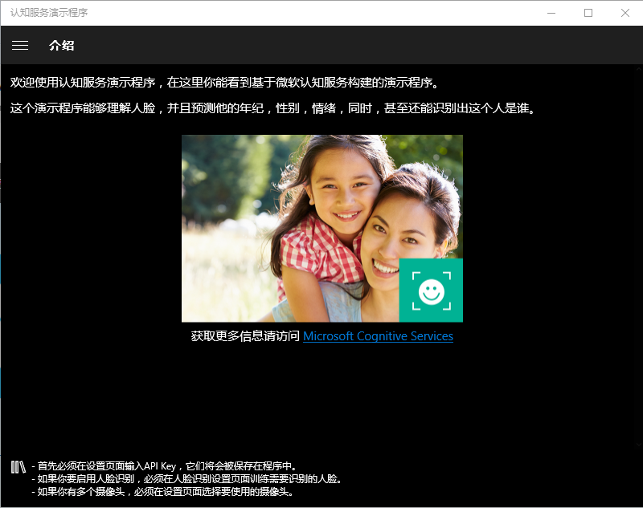
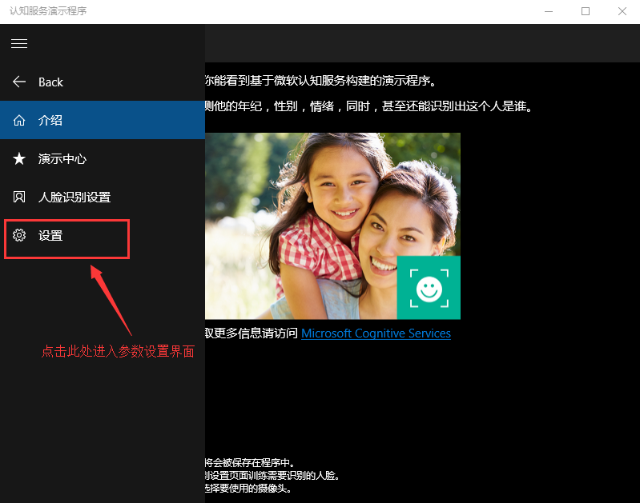
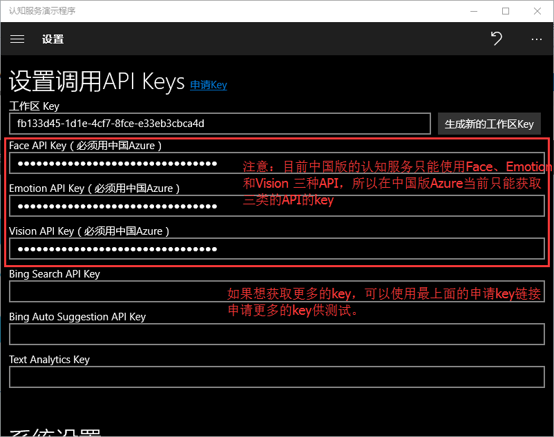
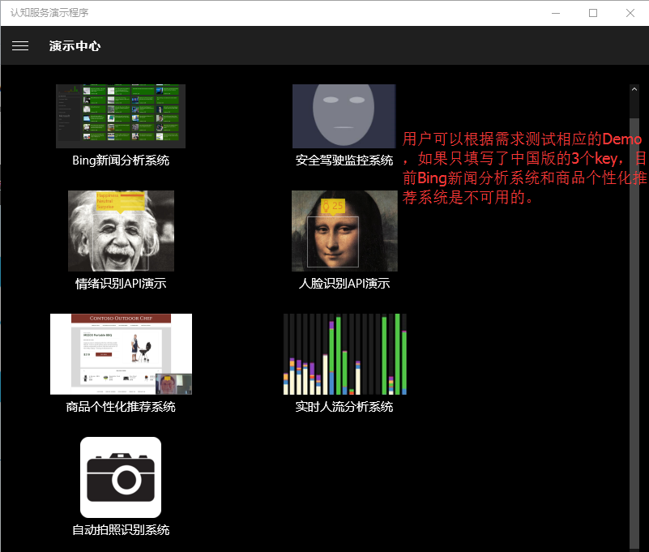
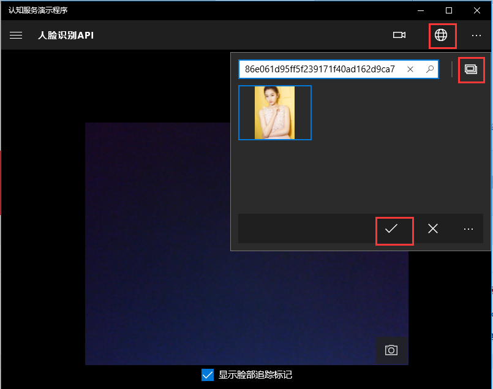
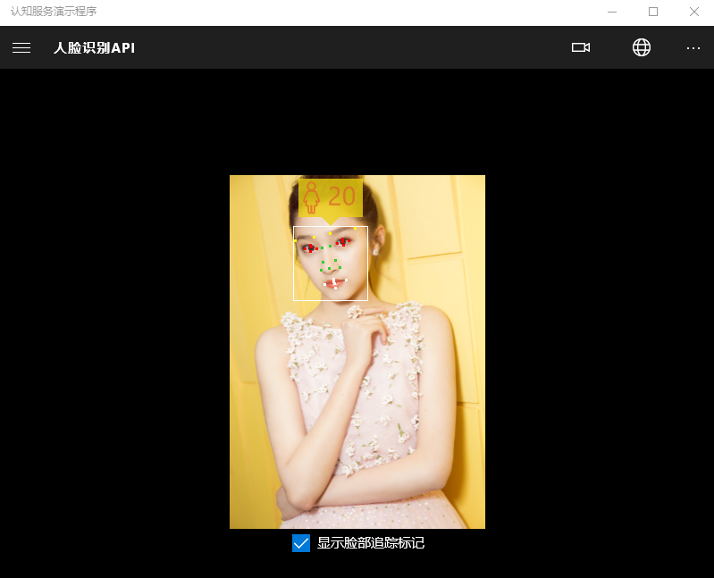

# 认知服务 Windows 使用示例

这个示例是一个 Windows 应用程序，用来演示如何使用微软认知服务 API。它演示了认知服务在实时人流分析系统，安全驾驶监控系统和自动拍照识别系统等领域的应用。

## 环境要求

Windows 10、Windows 10 Mobile、集成摄像头

## 项目下载

经过修改适合中国版的示例程序：[https://www.microsoft.com/zh-cn/store/p/cognitive-services-demo/9n3tkdkvg2tn?ocid=holiday_r_win10_header](https://www.microsoft.com/zh-cn/store/p/cognitive-services-demo/9n3tkdkvg2tn?ocid=holiday_r_win10_header)

适合国际版认知服务示例程序项目源码：[https://github.com/Microsoft/Cognitive-Samples-IntelligentKiosk](https://github.com/Microsoft/Cognitive-Samples-IntelligentKiosk)

> [!NOTE]
> 这是一个在 Microsoft 官方商场上的免费示例程序，感谢 Hollis Yao（尧敏华）贡献了该示例程序，如果客户希望根据源码扩展更多的应用，可以直接下载国际版的源码进行修改即可。

## 使用示例

1. 下载安装后的软件界面：

    

2. 设置参数（关于参数的获取，可以参考[中国版认知服务使用指南](https://docs.azure.cn/zh-cn/articles/intelligence-analytics/aog-cognitive-services-guidance)）：

    
    

3. 演示中心：

    

4. 人脸识别 API 演示：

    > [!NOTE]
    > 此处既可以使用摄像头获取图片，也可以加载本地图片，示例演示加载本地图片。

    
    

更多的示例使用建议用户参考相关 API 的功能定义，逐一了解并测试，结合自己的应用需求，集成相关的功能，构建丰富多彩的认知服务应用。

## 更多参考

* [中国版认知服务使用指导](https://docs.azure.cn/zh-cn/articles/cognitive-services/aog-cognitive-services-guidance)
* [认知服务 Android 使用示例](https://docs.azure.cn/zh-cn/articles/azure-operations-guide/cognitive-services/aog-cognitive-services-android-sample)
* [Face API](https://dev.cognitive.azure.cn/docs/services/563879b61984550e40cbbe8d/operations/563879b61984550f30395236)
* [Emotion API](https://dev.cognitive.azure.cn/docs/services/5639d931ca73072154c1ce89/operations/563b31ea778daf121cc3a5fa)
* [Computer Vision API](https://dev.cognitive.azure.cn/docs/services/56f91f2d778daf23d8ec6739/operations/56f91f2e778daf14a499e1fa)