# 帐单门户的功能及使用

## 登录方式

1. 通过账户管理门户登录

    1. 登录[账户管理门户](http://account.windowsazure.cn)。

    2. 点击“**账户中心**”，使用账户管理员的账号和密码登录。

        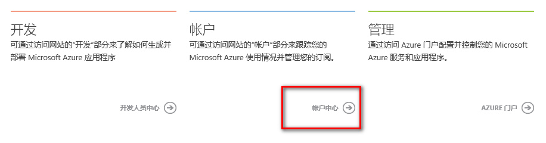

    3. 点击订阅。

        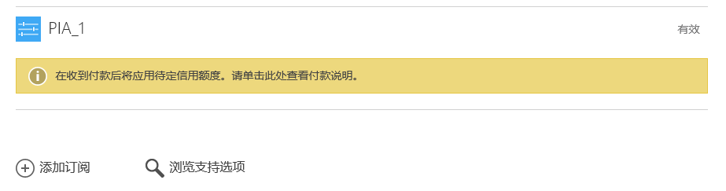

2. 通过 Azure 门户登录

    1. 登录 [Azure 门户](https://portal.azure.cn)
    
    2. 点击左侧的“**订阅**”，在出现的新的页面再次点击“**订阅**”。

        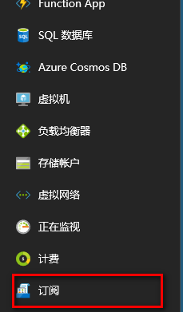
        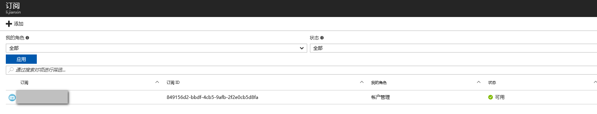

    3. 在“**概述**”里点击“**管理**”，会直接链接到账单门户。
        
        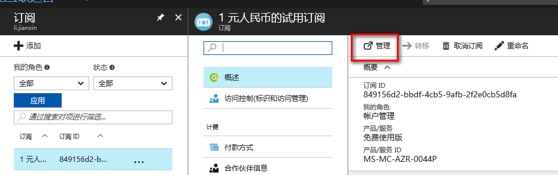

## 查看订阅的剩余信用额度以及到期日

因为标准预付费首次及随后的每次付款金额应至少为人民币 1,000 元。Azure 服务使用额度有效期为 12 个月。当您订阅账户的剩余使用额度为 0、或者信用额度过期后，您的订阅将被停用。当您的订阅处在停用状态，将无法备份数据；激活已停用的订阅后，相关服务需要重新配置。订阅暂停 90 天后，数据将永久删除。

您可以购买额外的 Azure 服务使用额度，额外使用额度从购买日起 12 个月有效。

而 1 元试用的 1,500 元 Azure 服务使用额度用完或一个月结束（以先到者为准），订阅将被停用，您的客户资料将被永久删除，除非在停用 15 天内充值重新激活订阅，订阅激活后需要重新配置相关服务。

这就意味着订阅的剩余信用额度以及到期日尤为重要。

账户管理员可以登录 [账户管理门户](http://account.windowsazure.cn)，在“**概述**”页面直接进行查看，包括剩余天数、剩余信用额度以及购买日期，以上信息只有付费的订阅可以查看，企业订阅无法在账单门户查看，需要在企业门户查看。

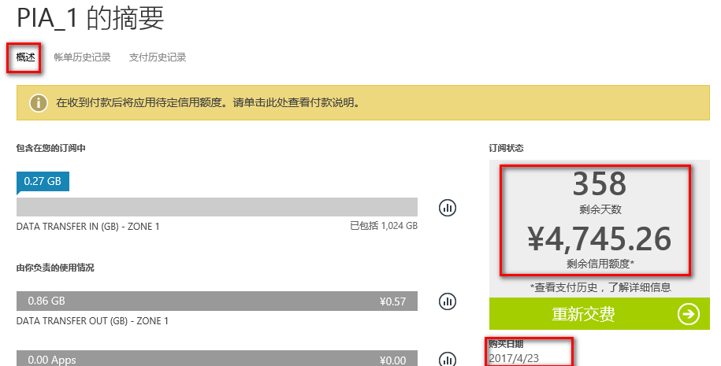

## 充值缴费

点击如下页面上的绿色按键图标：标准预付费充值时显示的是“**重新交费**”；1 元试用升级为标准预付费显示为“**立即升级**”。

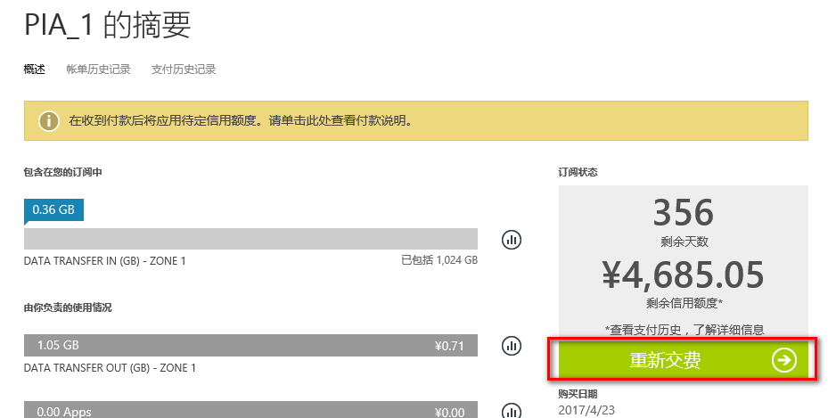
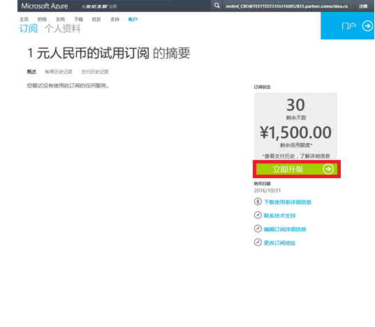

## 概述下显示的用量

[账户管理门户](http://account.windowsazure.cn)的概述里显示的用量为近十天内的（例：若当日时间为 8/15，那么显示的就是 8/5 - 8/15 的用量），由于该用量并非实时准确，建议用户通过下载使用量详细信息，并结合每周一系统发送的余额提醒通知邮件来进行一周的费用估算。

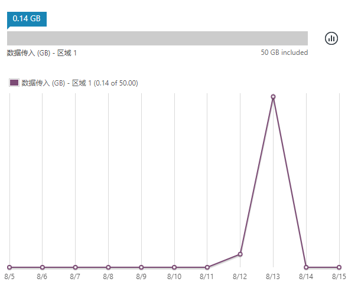

## 下载账单

点击“**概述**”页面右侧的“**下载使用量详细信息**”，或者点击“**账单历史记录**”。

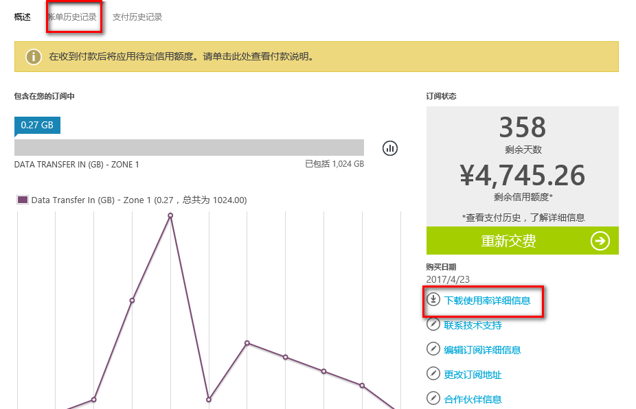

点击“**下载使用量**”。

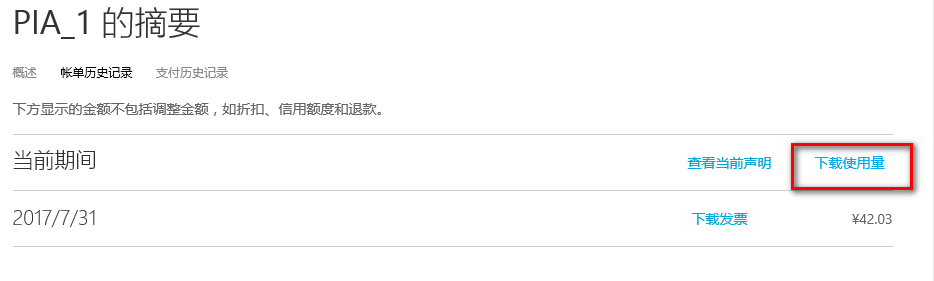

## 设置服务管理员

在账号创建最初，服务管理员会默认与账号管理员一致，如果需要将职能分派给其他人，账户管理员可以将其服务管理员做出修改。

在[账户管理门户](http://account.windowsazure.cn)，点击“**编辑订阅详细信息**”。

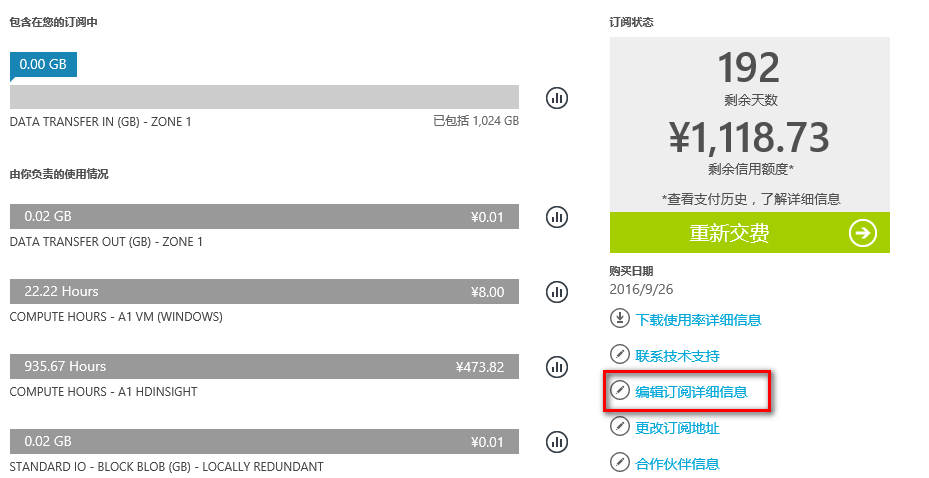

在弹出的对话框中可编辑**订阅名称**以及**服务管理员**，点击“**对勾**”进行确认。

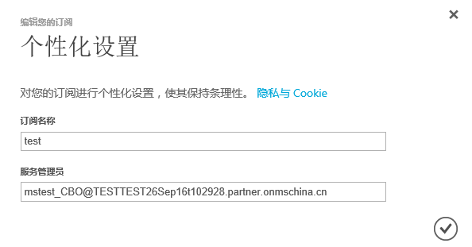

编辑完服务管理员，则可使用新更改的服务管理员来登录管理门户进行操作。

## 管理合作伙伴信息

点击页面右侧的“**合作伙伴信息**”。

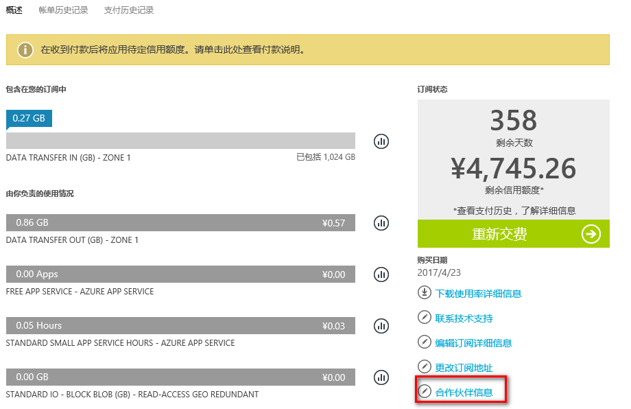

在弹出的页面输入**合作伙伴 ID**，然后点击“**检查 ID**”；如果 ID 是有效的，则会出现合作伙伴的公司名称，然后点击“**对勾**”确认。

如果需要更改合作伙伴，在**合作伙伴 ID** 输入正确的 ID 再次检查确认即可。

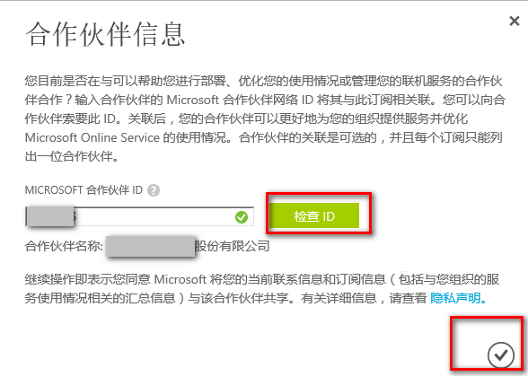

## 查看订单 ID 以及订阅 ID

在页面的右侧下面可查看**账户管理员**、**订阅 ID** 以及**订单 ID** (在注册发票系统时可使用此 ID)。

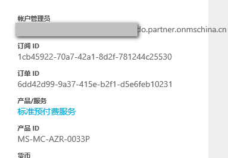

## 修改账户管理员的个人资料

1. 点击“**个人资料**”。

    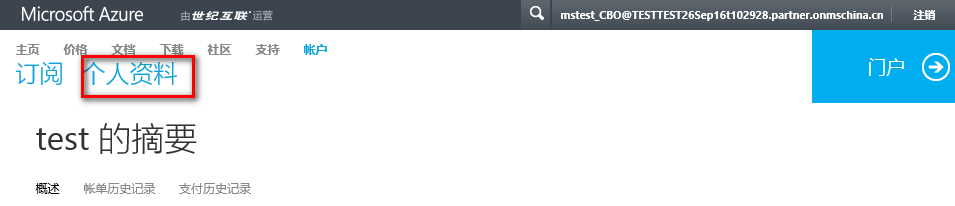

2. 点击“**编辑详细信息**”。

    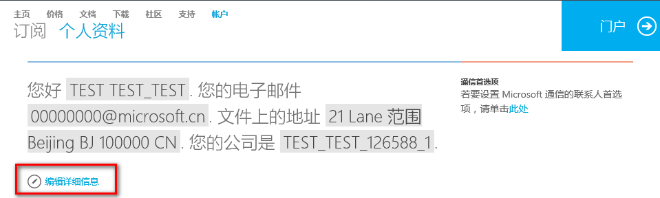

3. 修改 “**联系人电子邮件**”（您的邮箱则作为我们联系您的重要联系方式。每周一系统会自动发送余额通知邮件，通知邮件会包含剩余信用额度以及剩余天数。为保证您能正常接收系统寄发的 Azure 剩余余额通知邮件，需要确保您填写的邮箱的有效性以及正确性。）

    **名字**、**姓氏**、**电话号码**以及**公司组织名称**同样为是确认您为账户管理员的重要信息。

    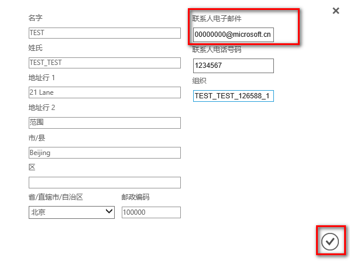

## 创建新订阅

默认情况下，每个账户下会有一个订阅，而在当前实名认证流程完善的基础上，如果标准预付费账户有多个部门使用 Azure 服务并且希望账单可以分开管理，则有必有在现有一个订阅的基础上，添加多个订阅进行管理。

> [!IMPORTANT]
> 当前此功能不可用，如需添加订阅，请联系支持团队给予指导或参考订阅管理部分的添加新订阅。
此功能当前已有计划开通，还在测试阶段，待可用时您可使用此功能直接在界面上添加新的标准预付费订阅。

企业账户添加订阅在[企业门户](http://ea.azure.cn)进行添加。

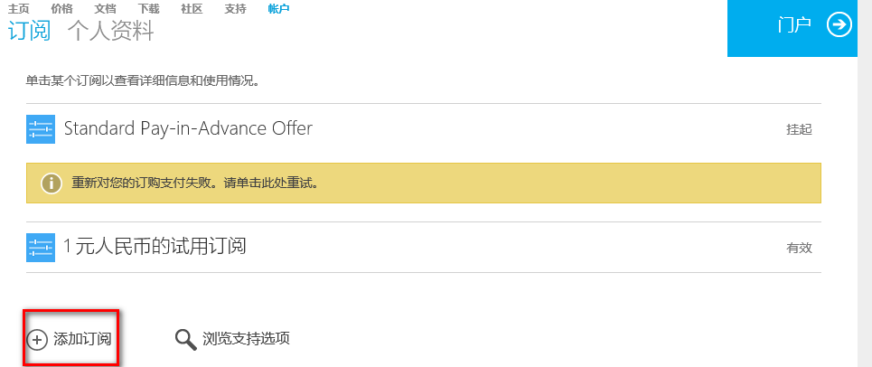

## 取消订阅

企业账户管理员可以有权限在[账户管理门户](http://account.windowsazure.cn)取消订阅，仅限企业用户，标准预付费没有权限在此页面取消订阅。

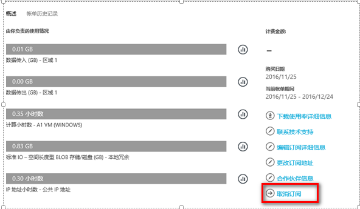