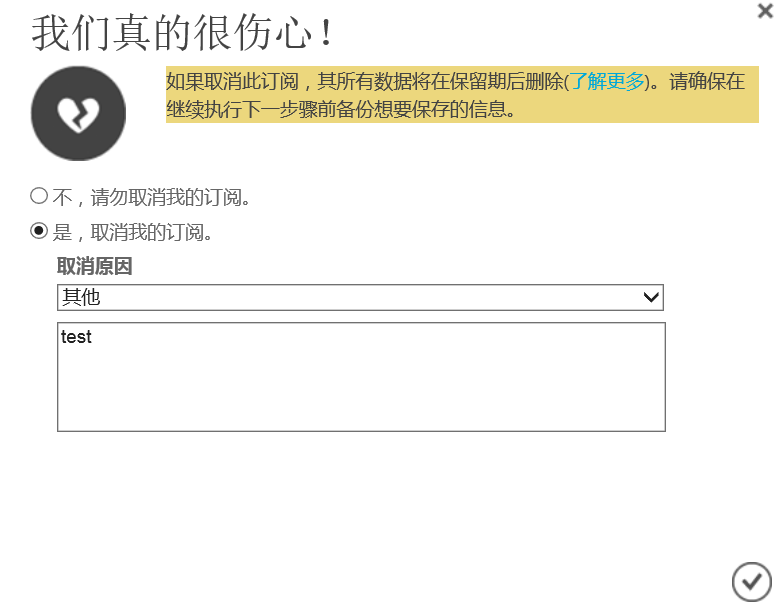

# 如何取消订阅？

## 通过 Azure 账户管理门户取消订阅

1. 使用账户所有者登录到 [Azure 账户管理门户](https://account.windowsazure.cn) > 点击要取消的**订阅名称** :

    

2. 点击 “**取消订阅**” :

    

3. 选择 “**是**”，**取消我的订阅**，并输入**取消的原因**，然后点击 “**完成**”。

    

## 通过 Azure 门户取消订阅

1. 使用账户所有者登录到 [Azure 门户](https://portal.azure.cn)
2. 依次点击页面左侧的 **订阅** > 选择要取消的 **订阅名称** ，在概述页面，点击 “**取消订阅**”

    

3. 选择 **忽略并取消订阅**， 输入 **订阅名称** 以及 **取消的原因**，点击 “**取消订阅**”

    

> [!IMPORTANT]
> 标准预付费订阅需要联系客服取消（取消后不支持退款）。

## 相关文档

- [如何创建订阅？](aog-subscription-management-create.md)
- [如何重命名订阅？](aog-subscription-management-rename.md)
- [如何在企业门户中迁移订阅？](aog-subscription-management-migrate.md)