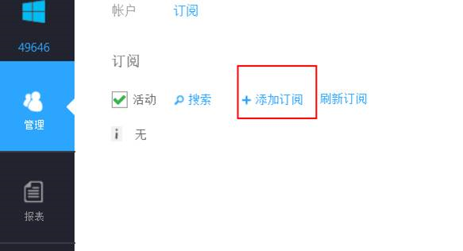
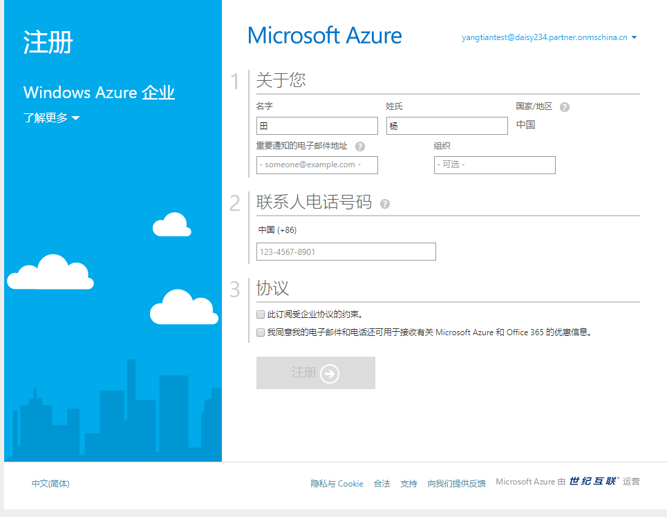
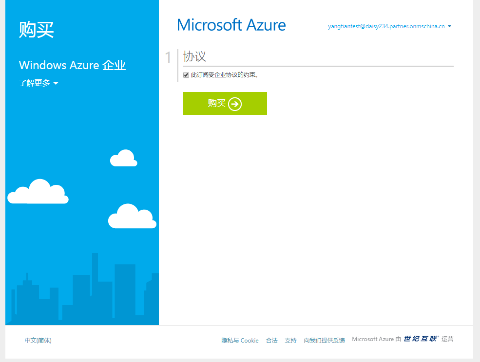
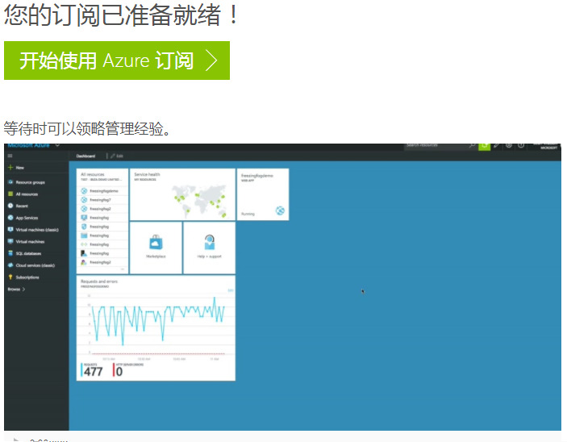
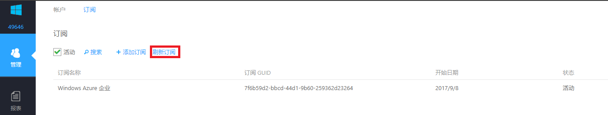

# 企业门户添加订阅

## 操作步骤

1. 只有账户管理员具有添加订阅的权限，使用账户管理员登陆 [企业门户](https://ea.azure.cn)。

2. 选择 “**管理**” - “**订阅**” - “**+添加订阅**” 。

    

3. 如果该账户是第一次添加订阅，将会出现如下注册界面，填写信息，点击 “**注册**”。

    

    如果该账户不是第一次添加订阅，将会出现如下界面，勾选 “**此订阅受企业协议的约束**” 选项，点击 “**购买**”。

    

4. 稍等一会儿，出现如下界面，说明订阅创建成功。

    

5. 点击 “**刷新订阅**”，新创建的订阅将会出现在订阅列表中。

    

6. 这时，您就可以使用账号管理员登陆 [Azure 管理门户](https://portal.azure.cn) 去部署服务了。