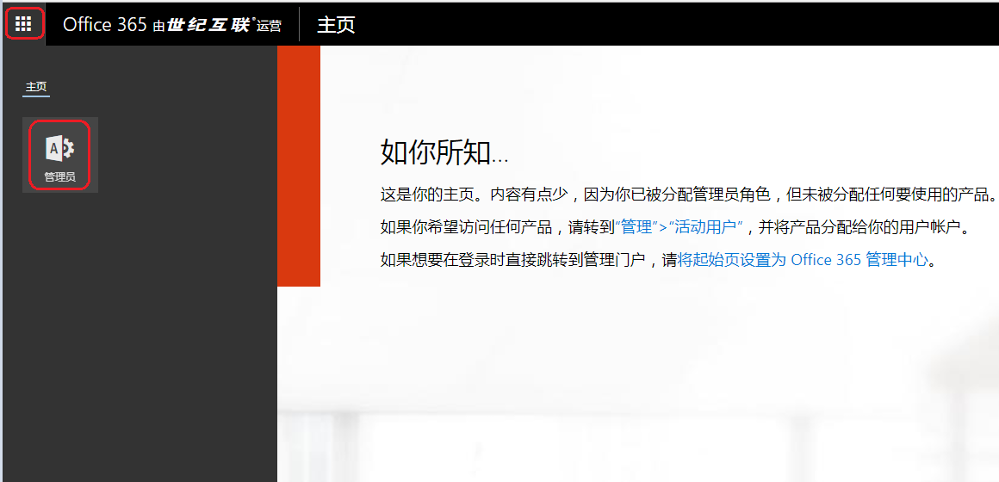
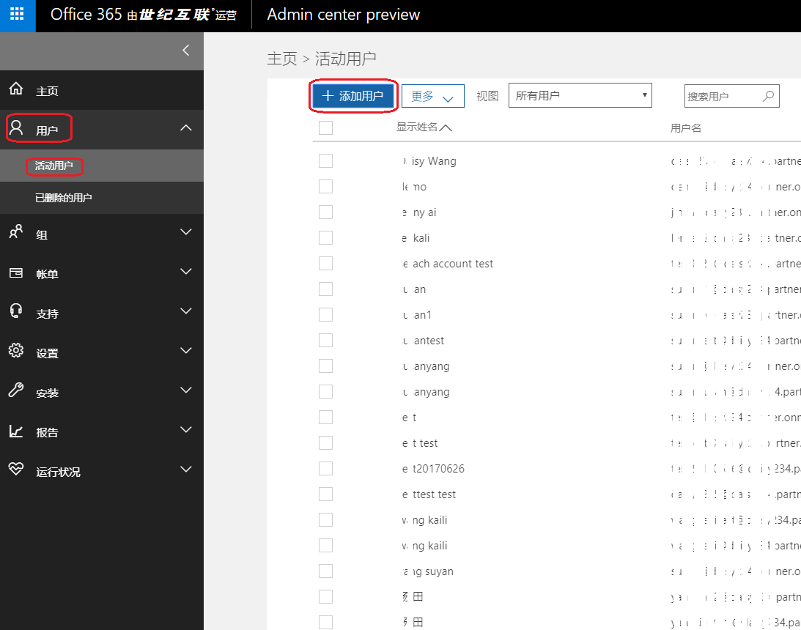
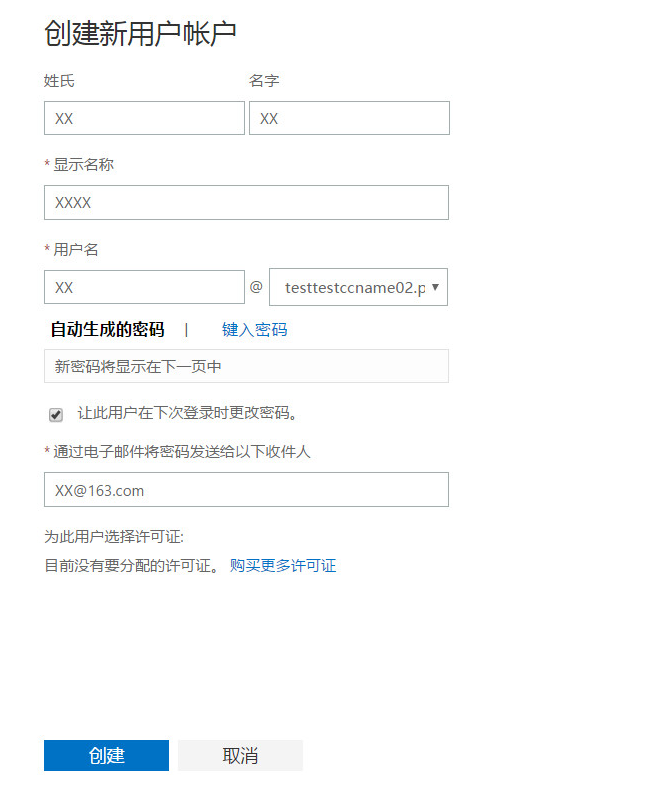
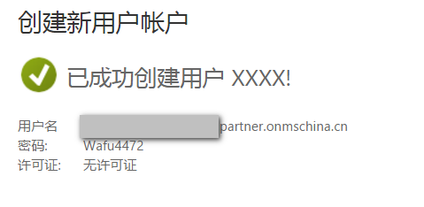
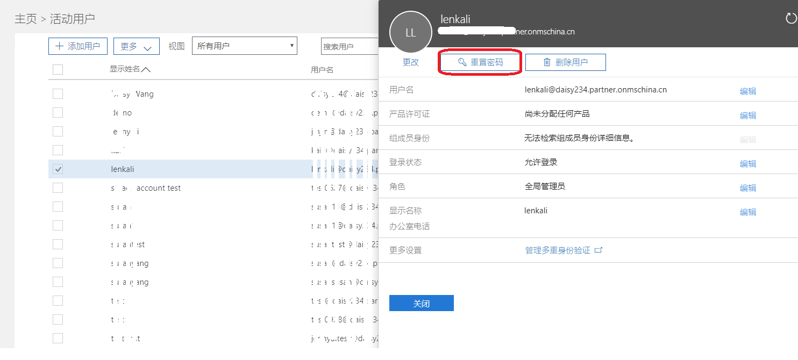
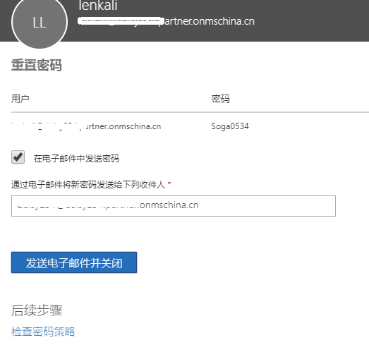
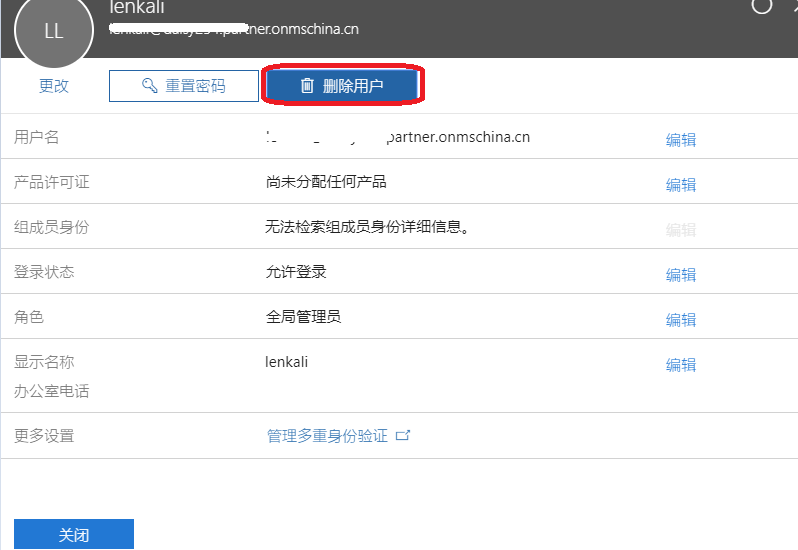
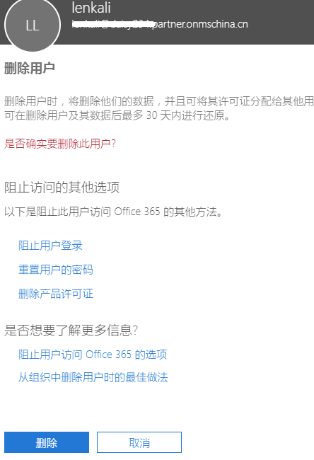

# 如何使用 O365 管理门户网站

## 添加活动用户

在 [Office365 管理门户](https://portal.partner.microsoftonline.cn) 里进行添加：

1. 点击左上角 9 宫格，选择“**管理员**”。

    

2. **用户** > **活动用户**，点击 “**+添加用户**” 添加活动用户。

    
    

3. 出现以下页面时，代表已成功创建了活动用户。

    

> [!NOTE]
> 活动用户在 AD 内或者在 Office365 管理门户添加之后，如果需要给账号分配权限，该操作需要查看下一节。

## 更改其他活动用户资料

1. 使用全局管理员登录 Office365 管理门户，勾选需要修改的用户，对需要更改的信息点击编辑即可。

    

2. 当对 “**角色**” 进行编辑时，可以更改该用户的身份（亦可设置为全局管理员）。备用电子邮件地址则用于用户自助修改密码时接收重置密码的邮件。

    

> [!NOTE]
> 自定义的管理员多用于 Office365 用户，Azure 用户可以忽略。

## 密码重置

全局管理员可以登录到 Office365 门户协助用户修改密码：

1. 选中需要修改密码的用户，点击重置密码。

    

2. 自动生成密码，是系统自动生成密码，可以选择通过电子邮件将密码发送给用户：

    

3. 创建密码，怎为自助创建密码，完成充值后同样可以选择通过电子邮件将密码发送给用户；

4. 不论如何更改密码，均可设置为 “让此用户在首次登录时更改其密码”。

## 删除活动用户以及保留期限

点开用户后，在 “**删除用户**” 下，可以设置用户的登录权限，如果不再需要此用户，点击删除即可。

## 其他

组、账单、支持等等仅适用于 Office365 用户，Azure 用户可以忽略。