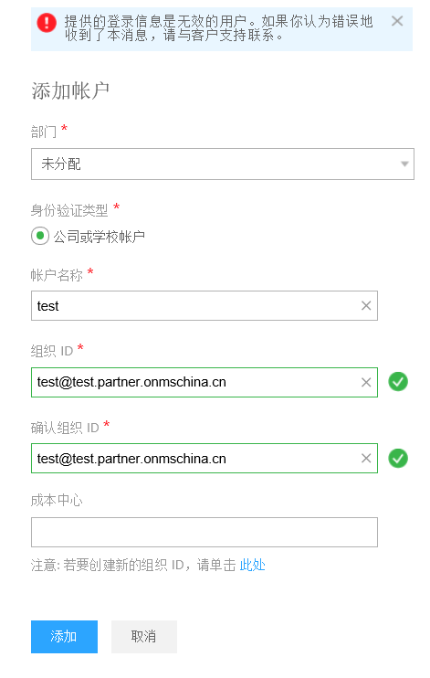
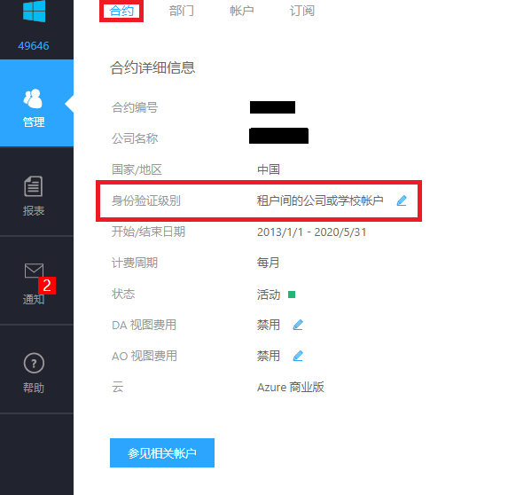

# 如何解决在企业门户中无法添加新账户的问题？

## 问题描述

客户在[企业门户](https://ea.azure.cn/)中添加新账户的时候提示 “**提供的登录信息是无效的用户。如果你认为错误地收到了本消息，请与客户支持联系。**”

## 问题分析

在添加新账户时，如果企业管理员的域名和新账户的域名不同，需要先将身份验证级别修改为 “**租户间的公司或学校账户**”。

## 解决方法

登录[企业门户](https://ea.azure.cn/)，点击左侧 “**管理**”，在 “**合约**” 标签页下，将 **身份验证级别** 修改为 “**租户间的公司或学校帐户**” 即可。此时您再重新添加新账户时将不会再报错了。

