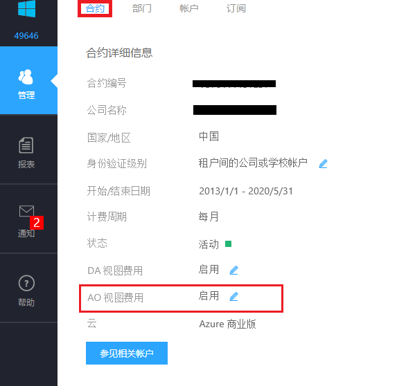

# 如何解决在企业门户中下载的账单不显示费用的问题？

## 问题描述

账户管理员在[企业门户](https://ea.azure.cn/)中下载了账单，但其中 “**资源费率**” 以及 “**扩展的成本**” 均显示为 0。

## 问题分析

只有当企业管理员启用了 **AO 视图费用**后，账户管理员才可以查看到自己创建的订阅的费用。

## 解决方法

以企业管理员身份登录[企业门户](https://ea.azure.cn/)，点击左侧 “**管理**”，在 “**合约**” 标签页下，将“**AO 视图费用**” 设置为 “**启用**” 。此时账户管理员即可看到自己创建的订阅的账单费用。
