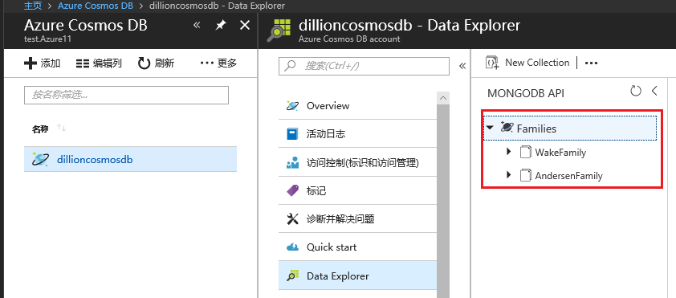
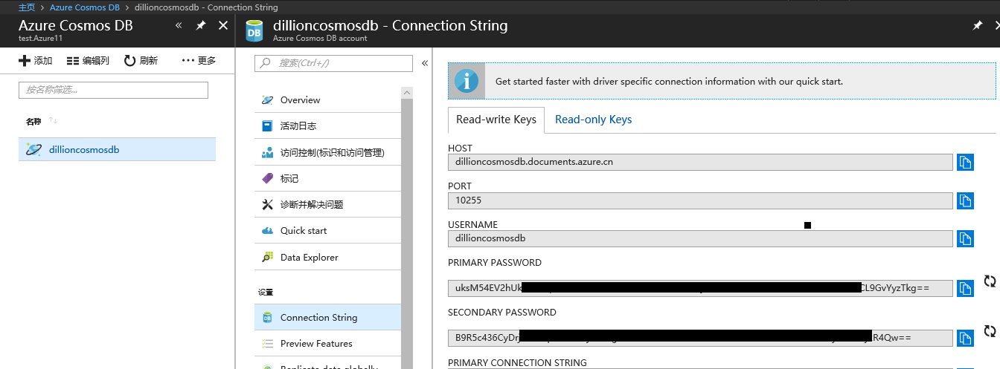
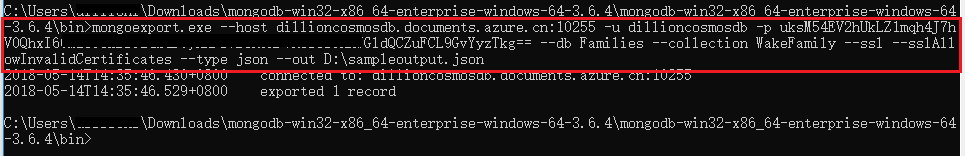
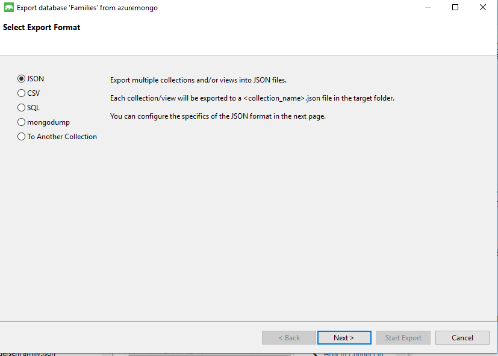
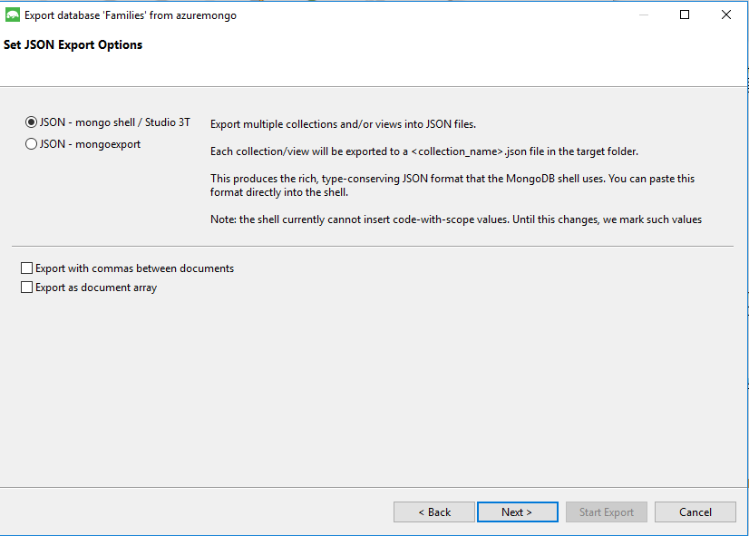
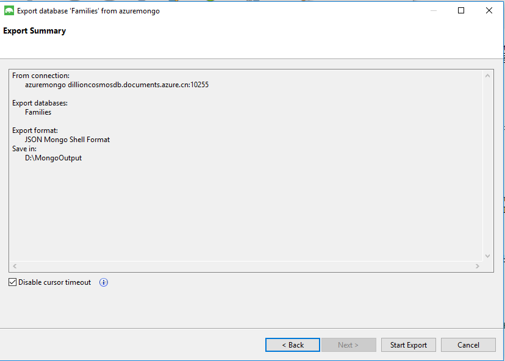

# Azure Cosmos DB Mongo API 如何导出 MongoDB 数据

## 问题描述

用户使用 Azure Cosmos DB MongoDB API 存储数据，需要将数据导出到本地，但是参考 [Azure Cosmos DB：数据迁移工具](https://docs.azure.cn/cosmos-db/import-data)时发现数据迁移工具不支持将 Azure Cosmos DB Mongo API 用作源或者目标，而且在 [Azure Cosmos DB：如何为 MongoDB API 迁移数据](https://docs.azure.cn/cosmos-db/mongodb-migrate) 中也没有有关如何导出 MongoDB 数据的方法，想了解 Azure Cosmos DB 该如何导出 MongoDB 数据？

## 问题分析

若要在 Azure Cosmos DB 中将数据从 MongoDB API 集合迁出到本地，可以[使用数据迁移工具](https://docs.azure.cn/cosmos-db/import-data)先将数据从 MongoDB API 集合导出到 Azure Cosmos DB SQL API 集合，然后与 SQL API 配合将数据导出到本地。另外，也可以使用 mongoexport.exe 或 Studio 3T 工具导出 MongoDB 数据。

本文主要使用以下方法导出 MongDB 数据：

- [使用 mongoexport 导出 MongDB 数据](#mongoexport)

- [使用 studio 3T 导出 MongDB 数据](#studio3t_export)

## 先决条件

* 增加吞吐量：数据迁移的持续时间取决于为集合设置的吞吐量。 请确保对于较大的数据迁移增加吞吐量。 完成迁移后，减少吞吐量以节约成本。 有关在 [Azure 门户](https://portal.azure.cn) 中增加吞吐量的详细信息，请参阅 [Azure Cosmos DB 中的性能级别和定价层](https://docs.azure.cn/cosmos-db/performance-levels)。

* 启用 SSL：Azure Cosmos DB 具有严格的安全要求和标准。 请确保在与帐户进行交互时启用 SSL。 

## 获取连接字符串信息（主机、端口、用户名、密码、数据库名称、集合名称）

1. 在 [Azure 门户](https://portal.azure.cn) 中打开 Azure Cosmos DB 服务，选中当前 Cosmos DB 账户。

2. 在边栏选项卡中点击 “Data Explorer”， 查看数据库名称以及集合名称。



3. 在边栏选项卡中点击 “Connection String”， 查看主机、端口、用户名以及密码信息。



## <a id="mongoexport" ></a>使用 mongoexport 导出 MongDB 数据到本地 

### 前提条件

1. 从 [MongoDB 下载中心](https://www.mongodb.com/download-center#enterprise)下载 mongoexport.exe (下载 MongoDB Enterprise Server ，解压安装包后可在 bin 目录下找到 mongoexport.exe。本文下载的 MongoDB Enterprise Server 是 windows x64 / 3.6.4 版本)。

2. 具有 MongoDB 帐户的 Azure Cosmos DB 连接字符串信息。

打开 “cmd” 命令行程序，导航到 mongoexport.exe 所在目录，使用以下模板将数据从 MongoDB API 集合导出到本地。

模板：

```
mongoexport.exe --host <your_hostname>:10255 -u <your_username> -p <your_password> --db <your_database> --collection <your_collection> --ssl --sslAllowInvalidCertificates --type json --out D:\sampleouput.json
```



## <a id="studio3t_export"></a>使用 Studio 3T 导出 MongDB 数据到本地 

### 前提条件

1. 下载并安装 [Studio 3T](https://studio3t.com/)（以前称为 MongoChef）。

2. 具有 MongoDB 帐户的 Azure Cosmos DB 连接字符串信息。

### 具体步骤如下

1. 在 Studio 3T 中建立 Azure Cosmos DB 连接，具体步骤请参阅 [Azure Cosmos DB：配合使用 Studio 3T 与 MongoDB API 帐户](https://docs.azure.cn/cosmos-db/mongodb-mongochef)

2. 建立连接后，在 Studio 3T 中选中数据库或集合，点击 “export” 按钮，选择导出文件格式以及目标文件夹，最后点击 ”Start Export“ 导出数据到本地。

步骤截图如下：


选择导出文件格式：





选择目标文件夹：




查看导出结果，或在目标文件夹中查看文件：

