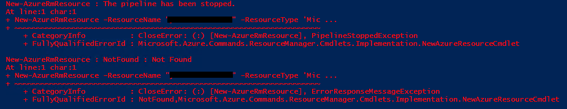
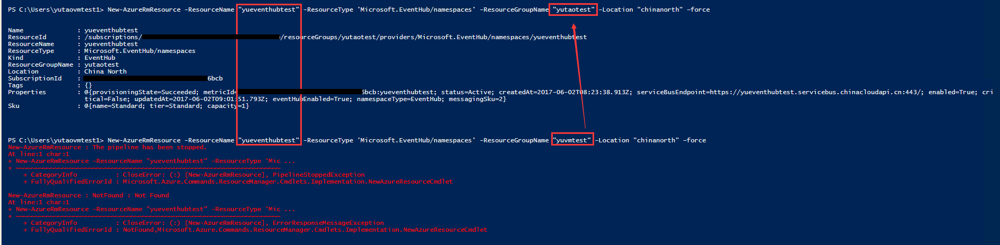
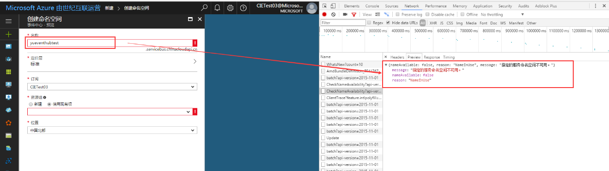

# PowerShell 创建事件中心报错

## 问题描述

使用 PowerShell 创建事件中心时产生 `The pipeline has been stopped` 错误：

## 原因分析

1. 服务总线和事件中心，在新的管理门户中虽然是分开的，但都是基于命名空间的模式来管理相应的资源。且服务总线和事件中心的 endpoint 都是 [namespace].servicebus.chinacloudapi.cn

2. PowerShell 指令中的 ResourceName 就对应 namespace，所以在使用时不仅不能与事件中心的 namespace 重复，也不能与服务中心 的namespace 重复。不同资源组中的 namespace 也不可以重复。

3. Powershell 测试：

4. Portal 中浏览器跟踪分析：

