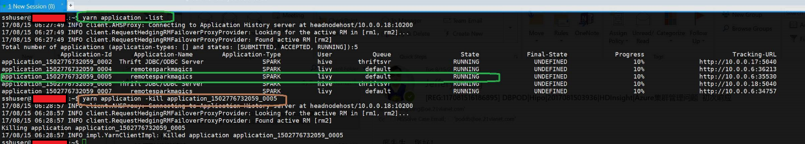
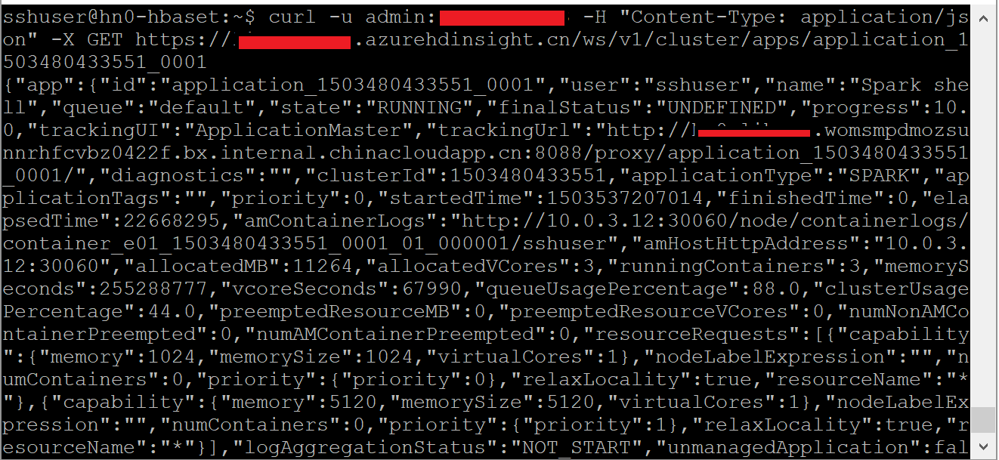
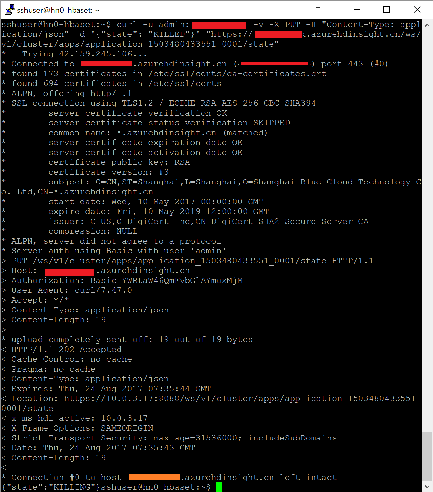
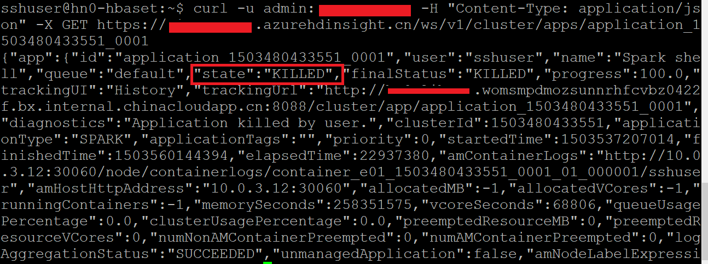

# 如何使用 Curl 停止 Spark 中某个正在运行的 Yarn 作业

在当前的 Spark 群集中，如果我们想停止某个正在运行的 Yarn 作业，我们可以使用 SSH 登录到已有的 Spark 节点，使用 `yarn application` 来实现（如下图）。

除此之外，我们也可以通过 Curl 来提交停止的请求，下面是具体的步骤：

1.	使用以下命令找到所有正在运行的作业：

    `curl -u <ambari user name>:<ambari password> -H "Content-Type: application/json" -X GET https://<cluster name>.azurehdinsight.cn/ws/v1/cluster/apps/<Application ID>`

    

2.	确认待停止的作业后，使用以下命令终止正在运行的作业：

    `curl -u <ambari user name>:<ambari password> -v -X PUT -H "Content-Type: application/json" -d '{"state": "KILLED"}' "https://<cluster name>.azurehdinsight.cn/ws/v1/cluster/apps/<application ID>/state"`

    

3.	运行成功后，运行语句确认作业状态。

    