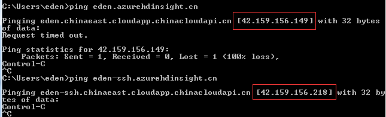
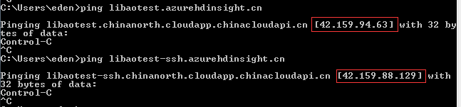
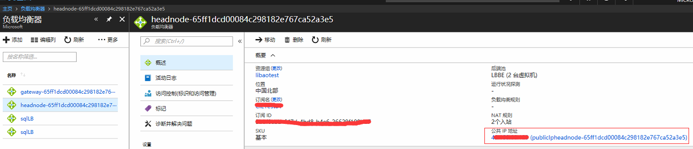

# 如何获取 HDInsight 集群的 Public IP

## 问题描述

对于我们的 HDInsight 集群，有时候客户根据自己的业务需求可能需要知道我们集群的 Public IP，比如说有的客户需要将 HDI 集群处理完的数据存到欧洲的 SQL 数据库中，这就需要将我们集群的 Public IP 添加到欧洲数据中心 SQL 数据库的防火墙中，这时候我们就需要知道集群的 Public IP。

## 环境准备

`eden.azurehdinsight` 为 **不在** 虚拟网络中的 HDI 集群;

`libaotest.azurehdinsight` 为 **在** 虚拟网络中的 HDI 集群;

## 获取方法

1. 如果我们在创建集群的时候没有选择虚拟网络这时候我们可以通过如下方式得到：

    

    其中 `ping XXX.azurehdinsight.cn` 得到的是 gateway 的 Public IP 地址，`ping XXX-ssh.azurehdinsight.cn` 得到的是 headnode 的 Public IP 地址。

2. 如果我们在创建集群的时候选择了虚拟网络这时候我们可以通过两种方式得到：

    1. 上一步中的方式同样适用：

        

        其中 `ping XXX.azurehdinsight.cn` 得到的是 gateway 的 Public IP 地址，`ping XXX-ssh.azurehdinsight.cn` 得到的是 headnode 的 Public IP 地址。

    2. 如果我们创建集群的时候选择了虚拟网络，相对应的会创建一个负载均衡器，那么您就可以在 [Azure 门户](https://portal.azure.cn) 上找到负载均衡器，然后找到相对应的 Public IP：

        

        在负载均衡器中您可以看到有 gateway 跟 headnode，分别点击进入也可以看到相对应的 Public IP，以 headnode 为例，如图所示。

        

通过上面两种方式就可以得到 HDI 集群的 Public IP 了。
