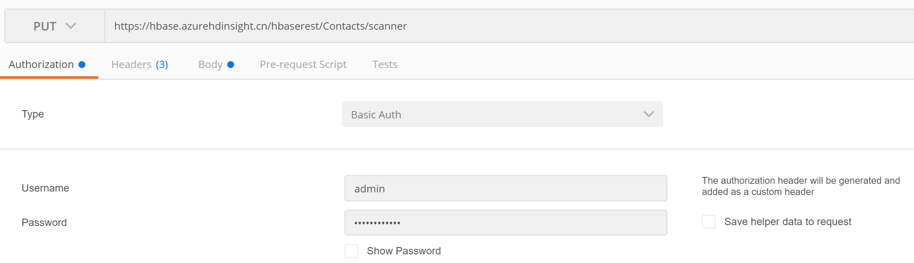
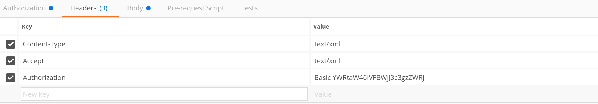
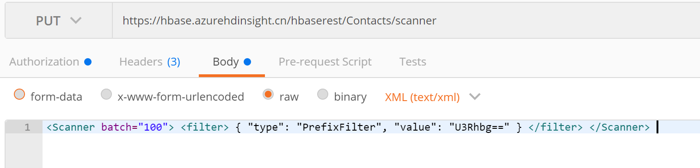
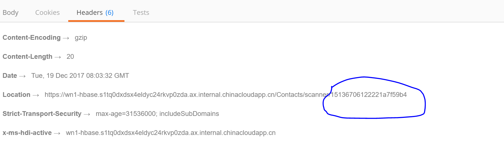
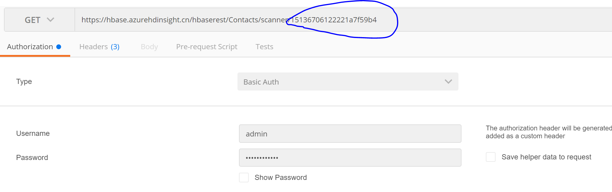
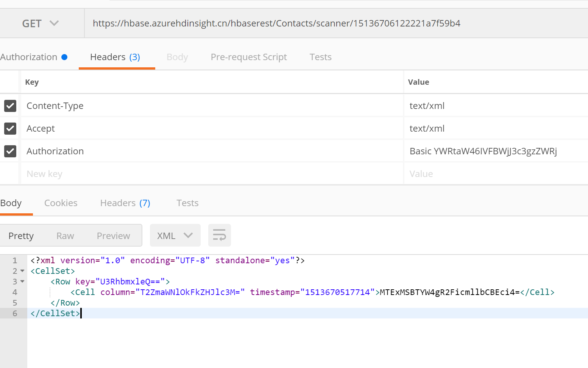

# 如何使用 REST API 访问 HBase 数据

HBase 是一个非关系型分布式数据库，可以通过 HBase Shell,Java API 来存取数据，也可以通过 REST API 来访问。

本文将使用 Postman 演示如何使用 REST API 创建一个使用了 PrefixFilter 的 scanner，并用其访问 Azure 上的 HBase 数据。

首先，创建一个 HDInsight 集群。在本示例中，HDInsight 的集群名字为：**hbase**.

在开始进行测试之前，建议您先创建一个自己的数据表 **Contacts**，并添加部分数据：

```
create 'Contacts', 'Personal', 'Office'
put 'Contacts', 'alex', 'Personal:Name', 'John Dole'
put 'Contacts', 'Bobb', 'Personal:Phone', '1-425-000-0001'
put 'Contacts', 'Jeremy', 'Office:Phone', '1-425-000-0002'
put 'Contacts', 'Stanley', 'Office:Address', '1111 San Gabriel Dr.'
```

接下来需要确认访问 HBase REST API 的路径。

访问路径的格式如下，其中 clustername 需要替换为用户自己的集群名。`https://{clustername}.azurehdinsight.cn/{clustername}restContacts/scanner`

在本示例中，集群的访问路径为：

`https://hbase.azurehdinsight.cn/hbaserestContacts/scanner`

以下介绍如何通过 Postman 使用 REST API 访问 Azure HBase：

首先创建 scanner:

1. **Request** 类型为 `PUT`, **Authorization** 方法使用 `Basic Auth`，账号密码为 Ambari 的管理员用户、密码。

    

2. **Headers** 部分，**Authorization** 参数为自动生成 (Username:Password=>Base64)。

    

3. **Body** 部分，**type** 应为 **PrefixFilter**（根据前缀过滤），需要注意的是，value 中的值应为 Base64 编码值，此处为 `Stan` 的 Base64 编码值(`U3Rhbg==`)。

    

4. 发送请求，记录下返回结果的 **Headers** 中蓝圈部分的 **scanid** 以备后文使用：

    

    此时我们已经向 HBase 提交了一个 scan 请求。

下文介绍如何获取查询结果：

1. 获取数据，**Request** 类型为 `GET`，并且将上一步中获取的 scanid 添加到 URL 结尾，然后点击 **send**。

    

2. 获取结果，可以看到结果为 **XML**。

    

3. 将以上结果经过 Base64 转码可得：`Row key="U3RhbmxleQ=="`转码后的 Row Key 为 `Stanley`，`Cell column="T2ZmaWNlOkFkZHJlc3M="`(Office:Address) 的值 `MTExMSBTYW4gR2FicmllbCBEcg==` 为 `1111 San Gabriel Dr.`。

> [!Note]
> PrefixFilter 是基于 Row key 的过滤条件。

至此数据查询完成。

更多的 REST API 过滤条件在此获取：[Apache HBase External APIs](http://hbase.apache.org/book.html#_rest)。