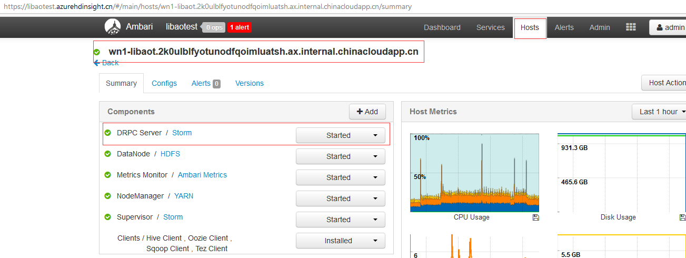

# Storm 集群如何添加多个 DRPC Server

## 问题描述

对于 HDInsight Storm 集群，创建成功后默认情况下只有一个 DRPC Server 是开启的，在 Storm 集群的头结点上，有的客户希望在集群上可以有多个 DRPC Server 从而分担一个 DRPC Server 的压力。

## 解决方法

1. 添加 DRPC_SERVER 到相应节点，本例给出的是添加到worker节点: 

    ```shell
    curl -H "X-Requested-By:ambari" --user 'admin:<password>' -i -X POST -d '{"host_components":[{"HostRoles":{"component_name":"DRPC_SERVER"}}]}' https://libaotest.azurehdinsight.cn/api/v1/clusters/libaotest/hosts?Hosts/host_name=wn1-libaot.2k0ulblfyotunodfqoimluatsh.ax.internal.chinacloudapp.cn
    ```

2. 在节点安装 DRPC_SERVER，本例给出的是在worker节点安装: 

    ```shell
    curl -H "X-Requested-By:ambari" --user 'admin:<password>' -i -X PUT -d '{"RequestInfo":{"context":"Install DRPC_SERVER","operation_level":{"level":"HOST_COMPONENT","cluster_name":"libaotest","host_name":"wn1-libaot.2k0ulblfyotunodfqoimluatsh.ax.internal.chinacloudapp.cn","service_name":"STORM"}},"Body":{"HostRoles":{"state":"INSTALLED"}}}' https://libaotest.azurehdinsight.cn/api/v1/clusters/libaotest/hosts/wn1-libaot.2k0ulblfyotunodfqoimluatsh.ax.internal.chinacloudapp.cn/host_components/DRPC_SERVER
    ```

3. 在节点启动 DRPC_SERVER，本例给出的是在worker节点启动: 

    ```shell
    curl -H "X-Requested-By:ambari" --user 'admin:<password>' -i -X PUT -d '{"RequestInfo":{"context":"Install DRPC_SERVER","operation_level":{"level":"HOST_COMPONENT","cluster_name":"libaotest","host_name":"wn1-libaot.2k0ulblfyotunodfqoimluatsh.ax.internal.chinacloudapp.cn","service_name":"STORM"}},"Body":{"HostRoles":{"state":"STARTED"}}}' https://libaotest.azurehdinsight.cn/api/v1/clusters/libaotest/hosts/wn1-libaot.2k0ulblfyotunodfqoimluatsh.ax.internal.chinacloudapp.cn/host_components/DRPC_SERVER
    ```

## 结果验证

登录 Ambari 选中 Hosts 到对应节点就可以看到 DRPC Server 是 Started 的状态：


