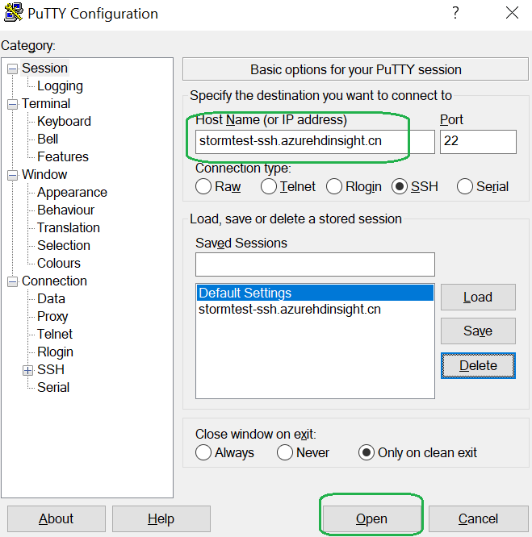
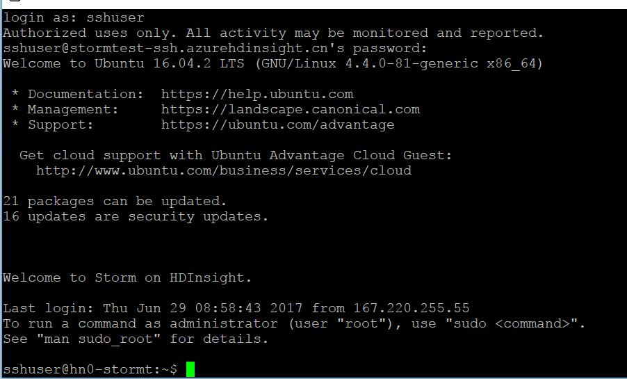
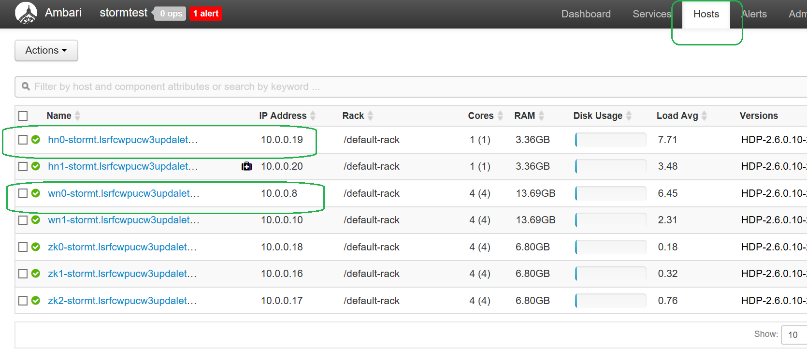
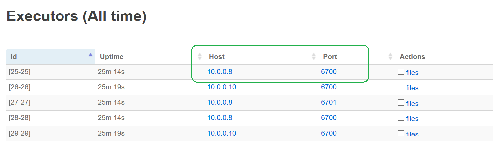
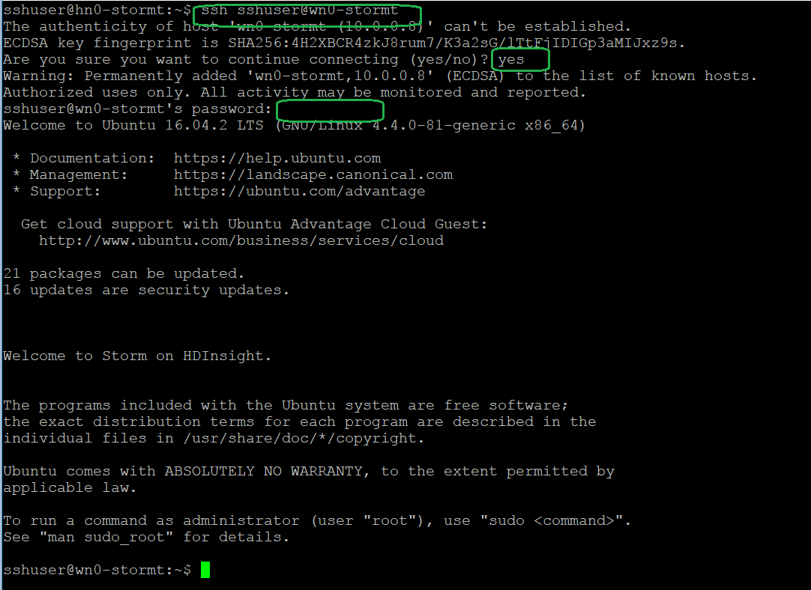
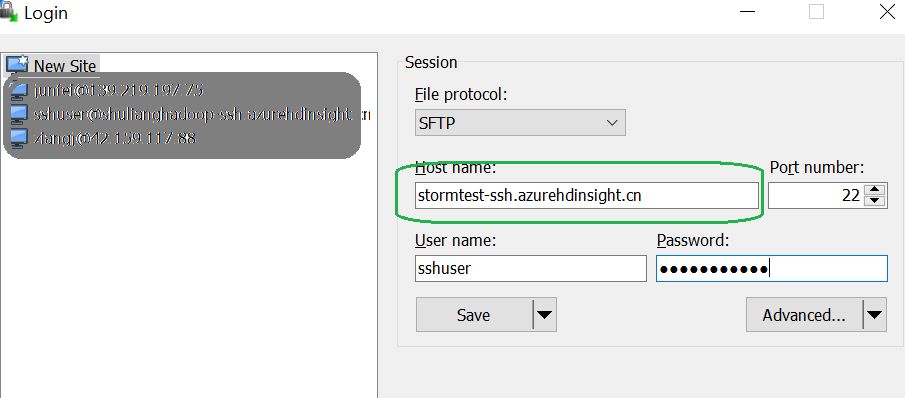

# 如何下载 HDInsight-Linux-Storm 拓扑日志

由于目前 HDInsight-Linux-Storm 设计原因，对于拓扑日志在 Web Page 上暂不提供下载到本地。

点击 **Download Full File** 选项只会在网页上直接显示 Log 信息。

但是通过以下步骤可以下载日志文件并可以对 Log 进行编辑。

## 先决条件

本地安装 SSH 客户端. （例如：Putty）

本地安装 SFTP, SCP FTP 客户端（例如 Winscp 等）

## 步骤

1. 登录 Primary Node ：

    

    在命令行中输入 ssh 登录名（默认为 sshuser，也可以在创建时进行更改）和密码。

    

2.	登录 Storm UI 界面 :

    

    进入具体的 topology, 选择想要下载的对应日志文件：本次实验选择下载 Host:10.0.0.8 Port:6700 的日志文件。

    

3. 查看各节点和其 ip 地址的对应关系 :

    因为 executor 是运行在 supervisor 节点上的，所以日志信息也是保存在对应节点上的。在 Ambari Hosts 界面上查看各个节点对应的 ip 地址信息。

    

    由于登录到 Primary 节点后发现节点为 hn0, 所以 hn0 节点的 ip 地址为: 10.0.0.19. 而我们想要下载的 10.0.0.8 对应的节点是 wn0-stormt.

4. 登录 worknode (Supervisor) 节点

    在步骤 1 的界面上输入：ssh sshuser@wn0-stormt（请根据实际情况替换 sshuser 和wn0-stormt）

    

    使用命令将日志文件从 supervisor 节点 copy 到 Primary 节点 /home/sshuser 文件夹下面：`scp /var/log/storm/workers-artifacts/xxxx/6700/worker.log  sshuser@10.0.0.19:/home/sshuser` (xxxx 是对应 topology 的名称，请将 10.0.0.19 替换成头结点的 ip 地址)

    在文件传输到 Primary 节点后，可以对其进行一些编辑，比如说只看最新的 1000 行或者对其中的关键字进行搜索等编辑操作。

5. 利用 SFTP 工具登录到 Primary 节点。

    

    >[!TIP]
    >将 **stormtest-ssh.azurehdinsight.cn** 根据实际 ssh 登录地址进行替换。

    然后在 /home/sshuser 目录下就能看到 worker.log，可以选择将文件 download 到本地。
