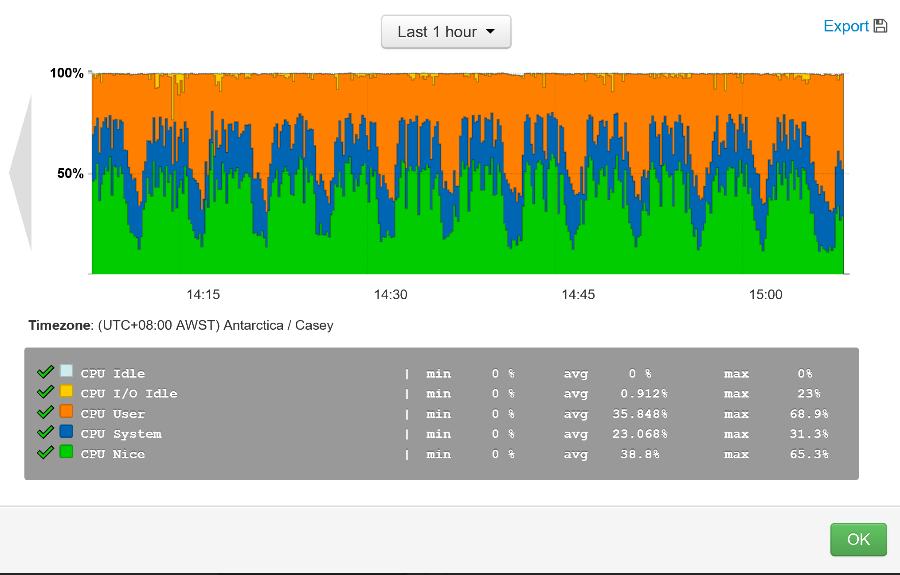
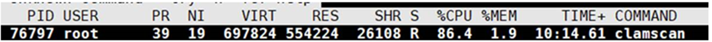
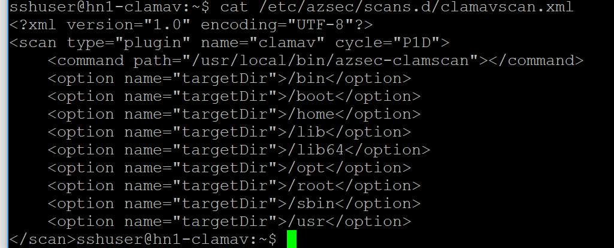
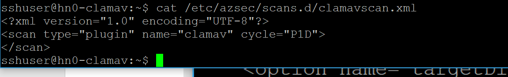
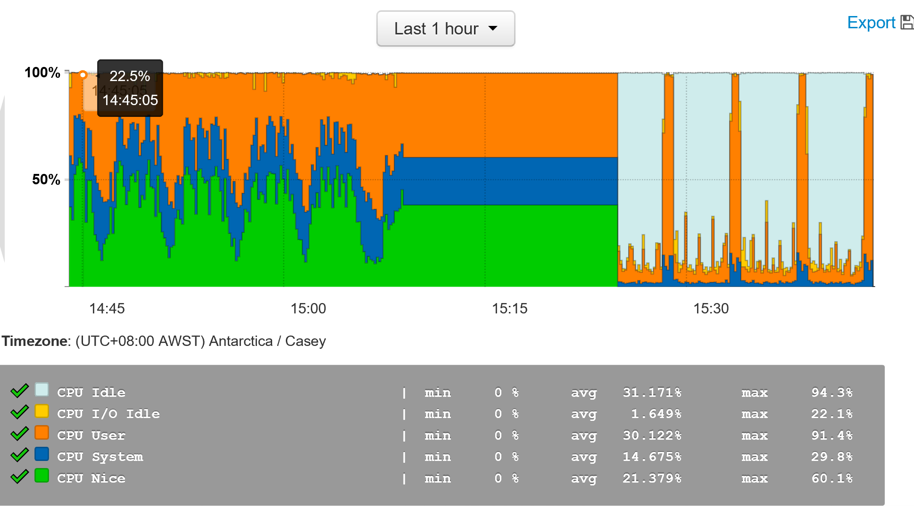
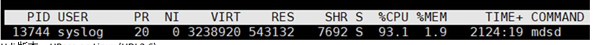

# HDInsight Clamav 进程占用 CPU 100%

本文章适用于 HDI(3.6)全系列环境。

本文章旨在对 Clamav 以及系统日志进程占用 CPU 100% 的解释说明及解决方法。

很多用户在使用 HDInsight 集群时会在监控界面上发现 CPU 使用率接近 100%，如下图所示。

## Clamscan 占用 CPU 过高

在上图中可以看到 CPU Nice 的使用比例为 38%，在 Azure HDInsight 集群中该类型的 CPU 通常为 clamscan 进程所占用，见下图：

Clamscan 属于开源杀毒软件 [Clamav](https://zh.wikipedia.org/wiki/Clam_AntiVirus)，被集成于 Azure HDInsight Cluster 中，并不推荐通过用户手工删除。 
同时用户可以看到该进程的 NI 值为 19，在 Linux 中 NI 值决定了进程的优先级，19 为最低。 
在用户进程需要使用 CPU 时，优先级低的进程会释放 CPU 给用户进程。所以当用户进程 CPU 高时，Clamav 只会占用不超过 2%的 CPU。

如果用户然对 Clamav 使用的 CPU 心存疑虑，可以通过修改服务器中的 “/etc/azsec/scans.d/clamavscan.xml” 文件来实现绕过扫描目录的方法。

以上方式即可实现绕过 clamav。下图可见 clamav 已经停止：

## MDSD 占用 CPU 过高

MDSD 是 HDI cluster 的日志进程，处于某些原因会占用较高的 CPU。

此时可以通过 `sudo service mdsd restart` 命令来重启该进程，即可解决问题。