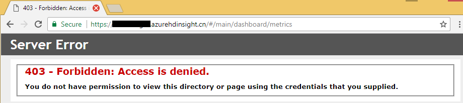
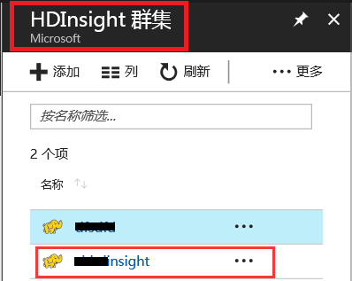
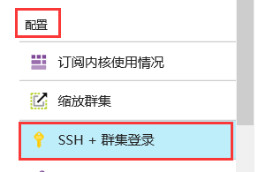
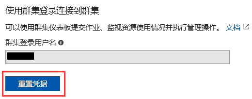
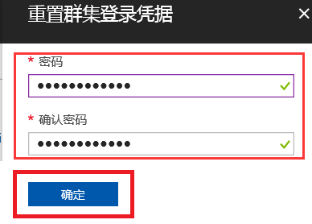
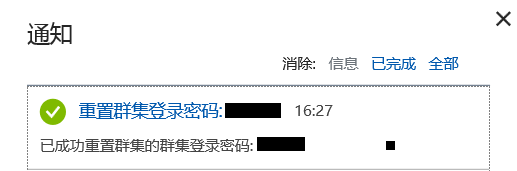
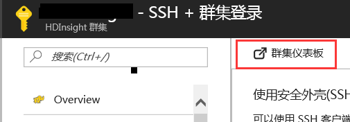
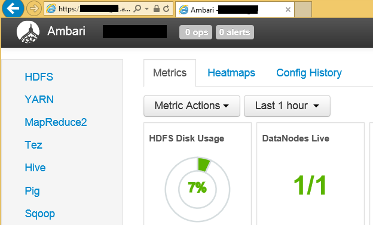

# 如何解决 HDInsight 群集仪表板登录时的 403 错误

## 问题描述

用户在使用 HDInsight **群集仪表板**时，在输入用户名和密码后，无法登录到 Ambari，错误提示：“**403 - Forbidden:Access is denied. You do not have permission to view this directory or page using the credentials that you supplied**”

## 问题分析

该错误通常是因为用户输入了错误的用户名或密码导致的，如果用户忘记了密码可通过 “**重置凭据**” 找回密码。

## 解决方法

首先建议您更换浏览器，重新输入密码再次尝试。

如果依旧产生错误，您可以重置凭据后，使用新密码再次尝试，具体步骤如下：

1. 登录到 [Azure 门户](https://portal.azure.cn)：
2. 选择需要更改的 HDInsight 群集：

    

3. 选择 “**配置**” 下的 “**SSH + 群集登录**”：

    

4. 点击 “**重置凭据**”：

    

5. 输入符合规则要求的新密码点击 “**确定**”：

    

6. 在通知中看到提示，已经成功重置集群登录密码：

    

7. 再次打开 “**群集仪表板**”，用新密码登录即可。
    
    

    