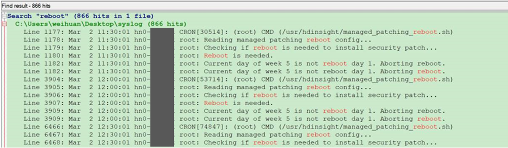
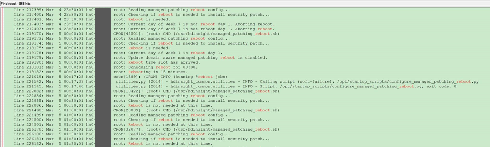
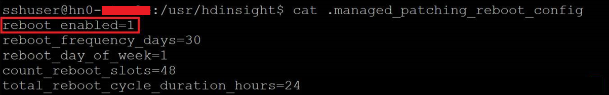

# 如何关闭 HDInsight 节点打补丁后强制重启的设置

## 问题描述

客户发现 HDInsight 节点被强制重启。在重启头节点上的 /var/log/syslog 文件中搜索关键字 “**reboot**”，可得到以下结果：





## 问题分析

根据日志可知，头节点 hn0 的操作系统每半个小时会检查一次是否需要打补丁重启(Checking if reboot is needed to install security patch...)，系统在 3 月 2 日前已经打好补丁(Reboot is needed)，而 3 月 5 日是打补丁后强制重启的期限(Current day of week 1 is reboot day 1)，因此在此时间之前并没有发生重启(Current day of week X is not reboot day 1. Aborting reboot) ，而 3 月 5 日 0 时 17 分左右系统发生了强制重启。

```
Line 219180: Mar  5 00:00:01 hn0-XXXX root: Reboot time slot has arrived.
Line 219181: Mar  5 00:00:01 hn0-XXXX root: Scheduling reboot for 00:00.
Line 219182: Mar  5 00:00:01 hn0-XXXX root: Rebooting in 15 minutes.
Line 221019: Mar  5 00:17:25 hn0-XXXX cron[1389]: (CRON) INFO (Running @reboot jobs)
Line 221542: Mar  5 00:17:39 hn0-XXXX  utilities.py [2014] - hdinsight_common.utilities - INFO - Calling script (soft-failure): /opt/startup_scripts/configure_managed_patching_reboot.py
Line 221545: Mar  5 00:17:40 hn0-XXXX  utilities.py [2014] - hdinsight_common.utilities - INFO - Script: /opt/startup_scripts/configure_managed_patching_reboot.py, exit code: 0
```

## 解决方案

由于节点强制重启可能导致业务中断，因此可以关闭此设定而自行选择合适时段进行手动重启。

将头节点上 /usr/hdinsight/.managed_patching_reboot_config 文件中 `reboot_enabled=1` 修改为 `0` 即可关闭强制重启功能。

