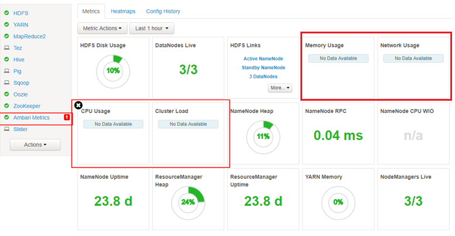
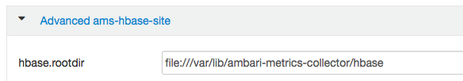
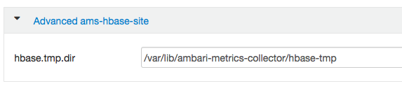

# HBase 集群的 Ambari Metrics 服务崩溃后修复方法

## 问题描述

用户发现 Ambari 上 HBase 集群的 hn0 节点有部分指标不能正常显示，如下所示：



同时，在 Collector 日志中发现以下信息：

```
org.apache.hadoop.yarn.server.applicationhistoryservice.metrics.timeline.query.DefaultPhoenixDataSource:
Unable to connect to HBase store using Phoenix.
org.apache.phoenix.schema.TableNotFoundException: ERROR 1012 (42M03): Table undefined. tableName=SYSTEM.CATALOG.
```

## 解决方法

经排查，怀疑是 Ambari Metrics Service(简称 AMS)崩溃所致，修复方法如下：

1. 在 Ambari 上关闭 Ambari Monitors 和 Collector；

2. 将故障节点的 `/var/lib/ambari-metrics-collector` 路径下的内容清空；

3. 在 Ambari 上选择 “**Ambari Metrics**” => “**Config**” => “**Advanced ams-hbase-site**” 下获取 `hbase.rootdir` 和 `hbase-tmp` 的路径；

    

    

4. 将 `hbase-tmp` 及 `hbase.rootdir` 路径下内容清空或移到其他路径下保存；

5. 在 Ambari 上重启 AMS；

6. 几分钟之后在 Ambari 上便可看到正常显示的指标了。