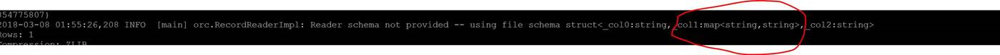

# 如何解决 HDinsight 使用 Hive 时遇到的异常错误

## 问题描述

由于目前 HDInsight 的环境使用的客户越来越多，同时 Hive 依然作为最流行 User Interactive Interface，在使用 HDInsight 集成的 Ambari 中的 Hive View 进行查询时会报出 `OCR does not support type conversion` 的错误。

## 问题分析

该问题是由于 Hive Table 中 Column 的数据类型与数据文件中的当前列不匹配，同时无法进行转换而报错。

常见于用户需要按需使用 HDInsight，所以会对集群进行创建、计算或删除。然而，在二次创建时，没有对 Hive 的 metadata 进行保存，或者因为开发，运维脚本不同步的原因导致开发人员进行了修改，但运维人员使用的为历史脚本。

## 解决方法

在 HDInsight 中可以通过如下命令来对 ocr 文件（hive 数据文件）进行 dump。

```shell
/usr/bin/hive --orcfiledump /hive/warehouse/hivedump >ocrdump.log
```

Hivedump 目录下的所有文件结构会放在 ocrdump.log 中。

下图是 dump 出来的表结构示例。



通过这种方法可以确认 ocr 文件中 column 的数据类型。

对于没有对 Hive 的 metadata 进行保存的问题，可以通过以下 shell 脚本进行全库建表语句导出，或直接以 SQL SERVER 作为 Hive metadata 库。

> [!NOTE]
> 脚本中的 `hiveDBName` 参数请根据您创建的数据库名称进行修改。

```shell
#!/bin/bash
hiveDBName="<testdbname>";
showcreate="show create table "
showpartitions="show partitions "

terminate=";"

tables=`hive -e "use $hiveDBName;show tables;"`
tab_list=`echo "${tables}"`

rm -f ${hiveDBName}_all_table_partition_DDL.txt

for list in $tab_list
do
   showcreatetable=${showcreatetable}${showcreate}${list}${terminate}
   listpartitions=`hive -e "use $hiveDBName; ${showpartitions}${list}"`

   for tablepart in $listpartitions
   do
      partname=`echo ${tablepart/=/=\"}`
      echo $partname
      echo "ALTER TABLE $list ADD PARTITION ($partname\");" >> ${hiveDBName}_all_table_partition_DDL.txt
   done

done

echo " ====== Create Tables ======= : " $showcreatetable

## Remove the file
rm -f ${hiveDBName}_extract_all_tables.txt

hive -e "use $hiveDBName; ${showcreatetable}" >> ${hiveDBName}_extract_all_tables.txt
```