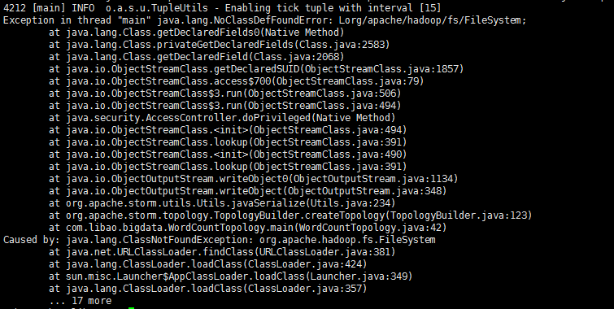
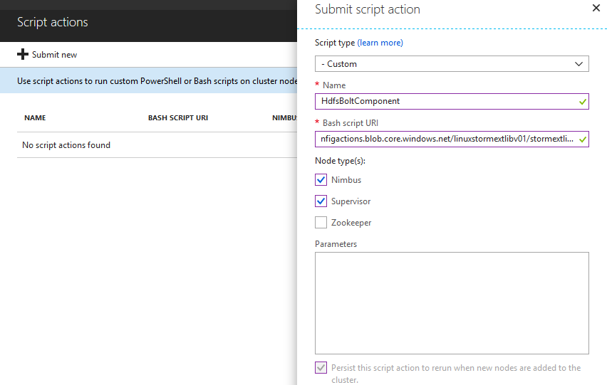

# Storm 集群处理后的数据存储到 Azure Storage 中报错

## 问题描述

当我们提交一个需要往 Azure Storage 中存储数据的 HDI Storm 集群的时候，会产生如下错误：

## 问题分析

当我们通过 Storm 集群往 Azure Storage 里面存储数据的时候，默认情况下 HDI Storm 集群没有将 HdfsBolt 跟 Azure Storage 交互的组件放在 HDI Storm 集群的环境变量中。

## 环境准备

- HDI Storm 集群
- 测试代码：[StormDemo](https://github.com/wacn/AOG-CodeSample/tree/master/HDInsight/aog-hdinsight-qa-save-storm-cluster-data-into-storage/StormDemo-master)

## 解决方法

我们需要通过脚本操作的形式将所需要的组件添加到 HDI Storm 集群的环境变量里。

- 脚本路径：[stormextlib.sh](https://github.com/wacn/AOG-CodeSample/blob/master/HDInsight/aog-hdinsight-qa-save-storm-cluster-data-into-storage/stormextlib.sh)
- 需要执行的节点：Nimbus, Supervisor
- 参数：无

对于将脚本操作应用到正在运行的群集，您可以参考文档：[将脚本操作应用到正在运行的群集](https://docs.azure.cn/zh-cn/hdinsight/hdinsight-hadoop-customize-cluster-linux?toc=%2Fzh-cn%2Fhdinsight%2Fstorm%2FTOC.json&bc=%2Fzh-cn%2Fbread%2Ftoc.json#apply-a-script-action-to-a-running-cluster)。

参考截图：

