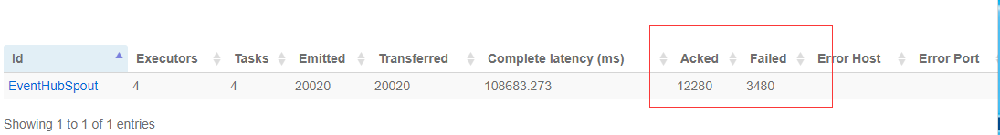

# Storm 集群 UI 上有大量 Failed 数据

## 问题描述

客户在拓扑中使用了 ACK 机制，在 Storm UI 上出现大量 Failed 数据，导致整体事件端到端的延迟很大。

## 问题分析

当 Spout 接收到大量数据，而后端 Bolt 处理较慢，如果 Spout 发送的事件在超时时间(`topology.message.timeout.secs` 默认为 `30s`)内没有最终 ACK 闭环，即在超时时间内最初的原始消息没有最终获得处理完成的 ACK 响应时，该事件成为 Fail 事件。当输入数据量大，且后端处理较为耗时，而无法在设定时间内处理完且 ACK 时，则会造成超时 Fail。

## 解决方法

请尝试以下方法：

1. 增加 `topology.message.timeout.secs` 默认超时时间，如 `60s`。
2. 观察系统 ACK 线程处理性能，如 UI 界面中的：

    如果该 ACK 线程处理性能较低可考虑增加 ACK 的线程数：`topology.acker.executors`（默认为 `null`，即与该任务的 Work 数一致），可设置为 worker 的倍数。

3. 减少 `topology.max.spout.pending`（默认为 `null`，即不做限制），该配置项可以对 Spout task 接收速度进行流控，例如可以从设置 `topology.max.spout.pending = 1024` 开始，即表示当 Spout 发送的数据已经将该 pending 队列占满，则在该队列满没有空间时，Spout 的 nextTuple() 方法不被调用，即进行了流控。

## 可能的影响

`topology.max.spout.pending` 设置后，会降低整个系统的吞吐量，可以先从 1024 开始，不断增加，最终达到系统稳定且吞吐量合适。
