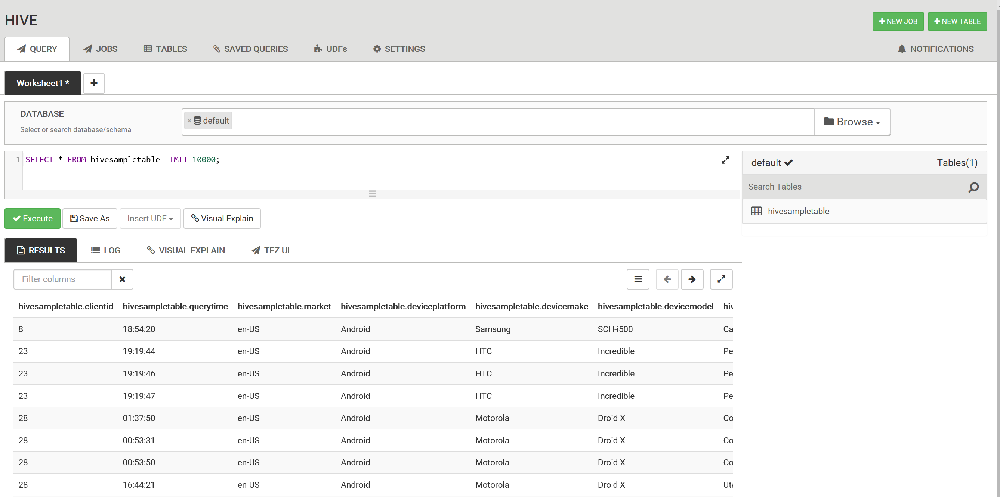
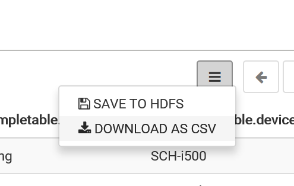
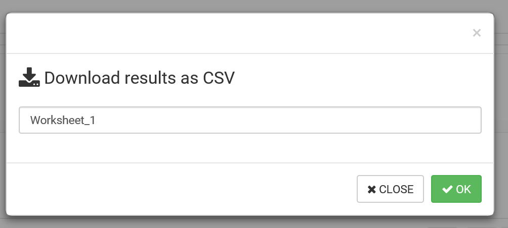
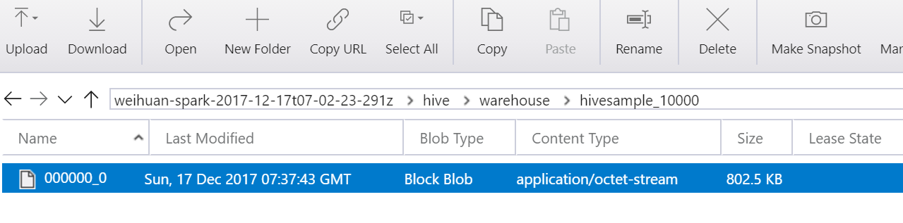
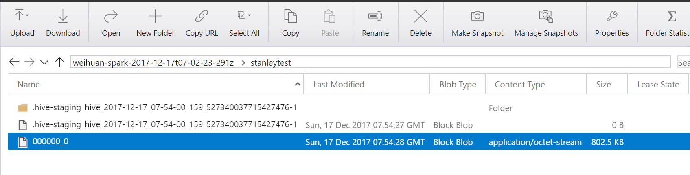
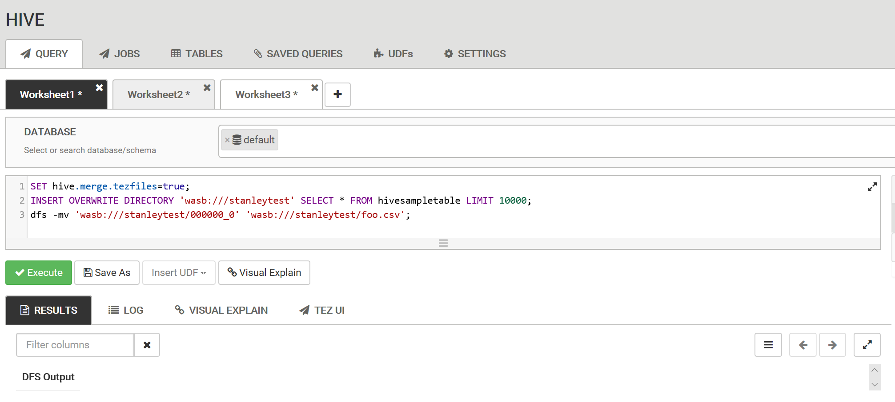

# Ambari 上执行 Hive 查询语句的两个最佳实践

Apache Ambari 通过提供 Web UI 的方法实现了对 Azure HDInsight 集群的创建，管理和监视等功能，详情请参见：[使用 Ambari Web UI 管理 HDInsight 群集](https://docs.azure.cn/zh-cn/hdinsight/hdinsight-hadoop-manage-ambari)。<br>
此外，也有客户通过 Ambari 上的 Hive View 2.0 执行简单的 Hive 查询，请参见：[将 Ambari Hive 视图与 HDInsight 中的 Hadoop 配合使用](https://docs.azure.cn/zh-cn/hdinsight/hdinsight-hadoop-use-hive-ambari-view)，如下图所示：



执行的结果可以通过点击 "**DOWNLOAD AS CSV**" 保存在本地：




在这个过程中，客户可能希望将每次执行的结果保存为 Blob Storage Account 中的 hive 表文件，可执行以下命令来实现：

```SQL
CREATE TABLE <TABLE_NAME>
AS <SELECT_QUERY>
```

例如在 Hive View 2.0 上执行 `CREATE TABLE hivesample_10000 AS SELECT * FROM hivesampletable LIMIT 10000`，则可在 `hive\Warehouse\hivesample_10000\` 路径下找到名为 **000000_0** 的文件：



对此，客户可能会有以下两个需求：

* **需求一**

    出于方便管理和安全的考量，可否将所创建的表文件存放在 Blob Storage Account 中指定的目录下而非 `hive/Warehouse/` 路径下？

    **解决方法：**
    
    可以尝试在 Hive 2.0 View 上执行类似以下语句：

    ```SQL
    INSERT OVERWRITE DIRECTORY 'wasb:///<table file path>' <Hive Query>;
    ```                                    
    例如执行 Hive 命令 `INSERT OVERWRITE DIRECTORY 'wasb:///stanleytest' SELECT * FROM hivesampletable LIMIT 10000` 成功之后，便可到 `/stanleytest` 路径下载所需的数据文件；
    
    

* **需求二**

    当返回结果较大时，会创建名为 **000000_0**，**000000_1**，**000000_2** …… 的多个表文件，可否进行修改使得只创建一个表文件并自行命名？

    **解决方法**

    1. 设置 merge 参数，使 Hive 语句仅输出 1 个数据文件：
    
        如果使用 tez 作为 Hive 的默认引擎，可执行以下语句：

        ```
        SET hive.merge.tezfiles=true;
        ```

        同理，如果使用 MapReduce 作为 Hive 的默认引擎，可执行以下语句：

        ```
        SET hive.merge.mapredfiles=true;
        ```

    2. 执行之前的 `INSERT OVERWRITE DIRECTORY` 语句，在指定的路径上生成数据文件：

        ```
        INSERT OVERWRITE DIRECTORY 'wasb:///<file_path>'
        SELECT * FROM hivesampletable LIMIT 5000
        ```

    3. 当 merge 成功后，所生成的数据文件名为 **000000_0**，可执行以下语句将其重命名为所需的文件名及格式(如下例便是将文件重命名为 **foo.csv**)；

        ```
        dfs -mv 'wasb:/// <file_path>/000000_0' 'wasb:///<file_path>/foo.csv'
        ```

    
    