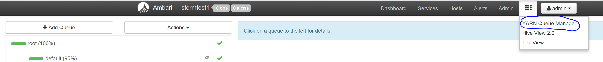
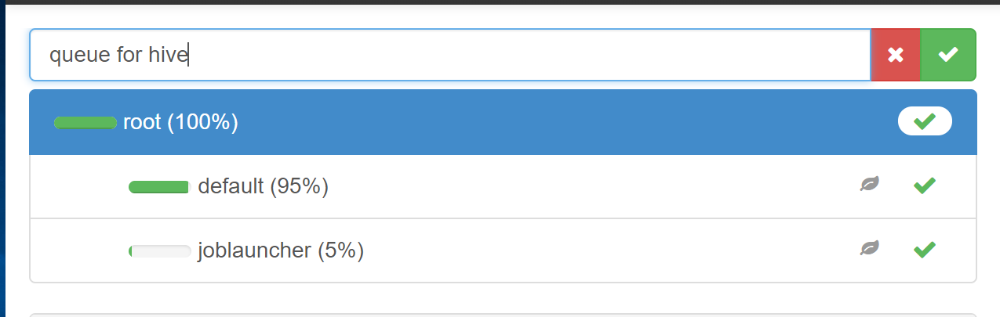

# 使用 Yarn 管理 HDInsight 任务资源分配

## 前言

在使用 HDInsight 的过程中往往会遇到一种问题，既打开了 Hive 又提交了个 Spark Job。但是你可能想让你的 Hive 可以在资源足够的时候多用一点资源，又想在 Spark 启动的时候尽量满足 Spark 的需要。

Yarn Queue 就是为了这种需求而设计的。

## Queue Configuration

首先关注下如何配置一个 Queue，点击 Ambari 界面右上角的图标，如下图所示：

1. 点击 “**Add Queue**”。

2. 点击 “**root**”，在上方输入新 Queue 的名字，点击**对号**。新的 Queue 属于 root 的子 Queue，与其他 2 个 Queue 共享 root 的所有资源。

    

3. 这样就创建了一个新的 Queue=>“**queueforhive**”：

    

创建了新 Queue 之后，需要对 Queue 的资源进行分配，如上图所示： 
**Capacity** 是指最少为该 Queue 保留多少资源。 
**Max Capacity** 是指该 Queue 最多可以用多少资源。

假设我们的集群有 3 个节点，每个节点 32G 内存，共 96G 内存可以分配给 Container。

根据上图的配置： 
**queueforhive** 占 50% 可以使用 48GB，最大可以使用 96G； 
**default** 占 45% 可以使用 43.2G，最大可以使用 58G； 
**joblauncher** 占 5%可以使用 4.8G，最大可以使用 48G。

通过对 Queue Capacity 和 Max Capacity 的合理配置，便可以实现对于不同类型的工作的资源调配。

但是上述的配置可能会带来一种问题，如果 Hive 首先使用了 96G 的内存，则 Default Queue 中的新任务必须要等到 Hive 释放了资源之后才能启动。

为了应对这种情况，Yarn 引进了一种模式 preemption。

## Preemption

Preemption 是基于 Job Priorities 的资源抢占模式。首先介绍如何启动 Preemption，如下图所示,首先在 Yarn 管理界面 **Enable Pre-emption**.

接下来如下图所示，在你的 Queue Manager 中配置 Queue 的 Priority。默认值为 0，数字越大则优先级越高。

下面是解释关于 Preemption 如何申请资源。

1. 例如，有一个 Default Queue 的 Job 正在使用 58G 的资源。此时如果有新的 Hive Queue 的任务开始运行，并申请 48G 的资源，而此时 Pool 中只有闲置的 96-58=38G 资源。
2. Hive Queue 会通知 Resource Manager，Resource Manager 会在 Priority 更低的 Queue 中寻找可以释放的资源。
3. 找到资源后通知 Application Manager。Application Manager 会找到当前使用 Container 的应用，并通知其释放资源。
4. Application Manager 会根据 `yarn.nodemanager.container-monitor.interval-ms` 的间隔来扫描 Container，寻找还可以加入 Queue 的 Container，默认为 3 秒。
    如果有，则会对当前 Job 的状态做 Checkpoint，并在下一次有资源时恢复该 Job。
5. Application Manager 有`yarn.resourcemanager.monitor.capacity.preemption.max_wait_before_kill` 的时间来做 Checkpoint 动作，默认为 15 秒。
6. 如果 Application Manager 没有按时完成，则 Resource Manager 会主动 kill 这个 Application。此时 Container 中的任务进度将无法恢复。

Preemption 还受到以下两个参数的影响：

`total_preemption_per_round`: 该参数为每轮从 Container 中回收的总内存数，通常推荐设置为 `nodemanager_mem/cluster_mem_size=32G/96G=0.33`。每轮回收请求的数字会被限制在这个数字范围之内。也正好等于一个节点上所有的内存。（每个 round 的间隔参考 `monitor_interval`）

`natural_termination_factor`: 该参数为另一种比较温和的回收方式，默认为 `0.1`，则会在每轮回收当前剩余需求的 10%。如果需要回收 10G 空间，则会第一轮回收 1G，第二轮剩余 9G 需求，就回收 0.9G。可以适当加大该参数。

关于 Queue 先介绍到这里，下一篇会介绍如何使用与用户关联的 Queue。