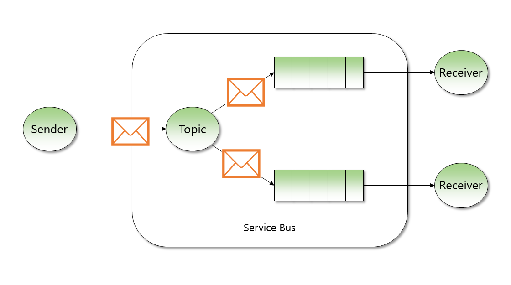

# Azure 消息 & 事件服务的选择 – 上篇

Microsoft Azure 平台提供了不同类型处理消息或事件的服务。用户可以将他们的应用数据（消息/事件）传递到这些服务中，也可以通过一定应用程序或者服务获取放在这些服务中的数据。对于刚开始或者准备开始使用 Azure 消息 & 事件服务的用户来讲，心里会存有以下疑问：这些消息 & 事件服务有什么区别，各有什么特征呢？或者这些服务分别适用于哪些应用场景呢？这篇文章就以上的问题展开做详细的介绍。

首先我们来看一下在 Azure 平台上有哪些可用的消息/事件服务，目前 Azure 平台提供 8 种不同类型的消息/事件服务它们分别是：

* Storage queue
* Service bus queue
* Service bus topic
* Event Hub
* IOT Hub
* Service bus Relay
* Notification Hub
* Event Grid

通过以下图表我们先直观清晰的对这些服务有一个大概的了解。

接下来我们就这些服务分别做相应的介绍：

1. Storage queue

    1. 什么是 Storage queue

        Storage queue 服务是 Azure 存储提供的存储服务之一，也是 Azure 平台最早出现的 messaging 服务，可以追溯到 2010 年。Storage queue 允许用户存储大量的消息，这里讲的量可达到甚至几百 TB 的数量级。

    2. 适用场景

        如果用户刚开始接触云端消息队列服务，并且有需求存储 TB 数量级别的消息时，可以考虑使用 Storage queue。

    3. 服务特性

        Storage queue 服务的主要优势在于：实现简单，节省费用(用多少付多少)，支持存储大量的消息。

        另外 Storage queue 支持在消费消息时 "at  least once" 的模式，换句话说一个客户端接收某条消息后，这条消息不会从服务端被删除掉，这样其他的客户端也可以再次接收该条消息。因此使用 Storage queue 服务时要注意接收端可能会受到重复消息。

        Storage queue 有一项很有意思的功能是其他 Azure 消息服务没有的，那就是 Storage queue 提供记录日志的功能，用户需要在 Storage 服务端开启日志记录功能，这样所有对 queue 的操作包括这些操作来源于那些IP地址都会被记录，方便用户去检索对应的操作行为。

    4. 一些限制和说明

        用户在使用 Storage queue 的时候，有些服务端的限制也需要考虑，比如在 Storage queue 里能够存储的消息大小最大为 64KB，消息最多可以在服务端存放 7 天（Max TTL = 7 days）。

2. Service bus queue

    1. 什么是 Service bus queue

        Azure Service bus queue 相比较 Storage queue 是 Microsoft Azure 提供的具备更强大功能、更复杂的消息传递服务，可以支持更加复杂的消息传递解决方案。

        当我们从 Service bus queue 中接收消息时支持 "First In, First Out(FIFO)" 的消息传递模式，这种模式下每条消息只能被一个消费端接收。

    2. 服务特性

        Service bus queue 有一个很特殊的功能，就是 “死信” 队列，简单讲，就是当客户端无法成功接收到某条消息或者消息在一定的期限中过期没有被接收时，该条消息会自动转移到第二个队列中，也就是 “死信” 队列。

        另外 Service bus queue 的一个很有意思的功能就是可以检测重复消息，一旦开启该功能，如果接收端重复接收一条已经接收过的消息，第二条重复的消息会被忽略。

        值得被提的一点是我们提供两种不同从 Service bus queue 中接收消息的方式，分别是 "Peek and Lock" 和 "Receive and Delete"，当用户采用第一种方式（也是默认方式）接收消息时，当接收端还在处理该条消息的时候，这条消息会被服务端锁定，从而其他接收端无法接收该条消息，直到接收端成功处理完这条消息后，这条消息才会从 queue 中删除掉。如果在一定的时间段(可以设置的 timeout 时间) 服务端还是没有收到接收端的成功接收的返回请求，那么该条消息会被服务端解除锁定重新释放掉，这个时候其他的接收端可以再次接收这条消息。

    3. 与 Storage queue 的区别

        首先 Service bus queue 与 Storage queue 底层的实现是完全不一样的。相比较 Storage queue,Service bus queue 存储的的消息大小最大可以达到 256KB，并且可以根据属性 TimeSpan.Max 调整消息存储在服务端的时间，满足用户需要长时间存储消息的需求，然而不同与 Storage queue 强大的存储功能，Service bus queue 最大能存放 80GB 的消息。

        其次 Service bus queue 服务支持使用 AMQP 1.0 协议进行数据传输，这一特点很好的适用于嵌入式设备。这意味着，用户可以使用 Service bus queue 构建 cross-platform 的混合应用，用户也可以在不同的操作平台上使用不同语言和开发框架去连接 Service bus queue。

        最后正如我们上一节“服务特性”中讲到的，相比较 Storage queue，Service bus queue 提供更丰富更强大的消息传递功能。

        更多关于 Storage queue 与 Service bus queue 的区别用户可以参考[官方对比文档](https://docs.microsoft.com/azure/service-bus-messaging/service-bus-azure-and-service-bus-queues-compared-contrasted)。

    4. 适用场景

        Service bus 服务主要提供给用户一种强大的企业级消息传递解决方案，在这种典型的云端消息方案体系下，Service bus 将服务端和应用程序进行分离。

        细心的读者在阅读 Service bus queue 的“服务特性”章节后不难发现，Service bus queue 更加适用于对消息敏感（即不允许重复消息、不允许消息丢失），需要长期存储消息的使用场景。

    5. 一些限制和说明

        Service bus 服务提供不同的等级 (SKU) 供用户选择，在标准和高级版本（目前高级版本还没有在中国上线）的服务中，Service bus queue 最大可以到达 80GB。

        另外在在同一个命名空间下 (namespace) 的所有服务（包括 Service bus queue 以及 Service bus topic）最大的并发连接数可以达到 5000 个，这里包括接收端的连接也包括发送端的连接。

3. Service bus topic

    1. 什么是 Service bus topic

        Service bus topic 与 Service bus queue 很类似，因此 Service bus queue 所具备的功能 topic 都有。但是 Service bus topic 还有一个非常重要也区别于 queue 的功能，就是一条消息发送到 topic 中，可以生成多个 copy 根据一定的规则分发到多个的接收端，这里我们称为订阅 (subscribers)。

        我们可以将每个订阅理解为一个 “queue”，而具体每个 queue 里接收的消息是由对应的规则定义的。

    2. 服务特性

        Service bus topic 是典型的支持 Publish / Subscribe 消息传输模式的服务。每个 topic 最多可以支持 2000 个订阅，这意味着每一条发到 topic 里的消息都可以被多达 2000 个订阅接收。我们可以在 topic 运行期间的任何时刻增加新的订阅，这不会影响其他已经存在的订阅接收消息，一旦新的订阅添加成功，新进入 topic 中的消息就会根据规则被新添加的订阅接收。

        上面我们提到“规则”，在 Service bus topic 的世界中，我们将其称为 “filter”，用户可以根据自己的需求为每个订阅定义不同的 “filter” 规则（每一条传递到service bus服务中的消息都会包含一组属性 properties，用户可以通过使用属性来自定义“filter”规则）所有满足 “filter” 规则的消息将会被相应的订阅接收。通过这样的方式，可以达到不同的订阅侦听或接收不同消息的目的。

        Service bus topic 的特性不止于此，我们不仅可以自定义不同的 “filter” 规则，我们还可以为每个订阅定义不同的 action，即当该订阅接收到相应的消息后就会执行对应的 action（比如我们可以修改某个属性的名称值等等），这对于某些场景非常有用。

    3. 与 Service bus queue 的区别

        根据前面的介绍，我们能得到 Service bus queue 与 topic 一个最大的区别在于：Service bus queue 是 "one to one" 的消息分发模式，而 Service bus topic 是 "one to many" 的消息分发模式。

        Queue 的消息分发模式可以参照下图：

        

        Topic 的消息分发模式可以参考下图：

        

    4. 适用场景

        从上面的特性描述中我们不难发现，如果用户有需要将同一份消息传递到不同的接收端或系统中做不同的后续分析或处理，并且接收端可能在动态变化，那么 Service bus topic 将会是非常好的解决方案。

本篇中主要对 Azure 平台提供的三种消息服务从几个不同的维度做介绍和对比，Azure 平台还提供了处理大量事件的服务，比如 IOT Hub 和 Event Hub，接下来我们会在中篇会对这两种事件服务继续做介绍和对比，如果您对这个话题感兴趣可以在[中篇](aog-internet-of-things-howto-select-message-event-service-part-2.md)中继续了解详细内容。

## 了解更多

* [Azure 消息 & 事件服务的选择 – 中篇](aog-internet-of-things-howto-select-message-event-service-part-2.md)
* [Azure 消息 & 事件服务的选择 – 下篇](aog-internet-of-things-howto-select-message-event-service-part-3.md)