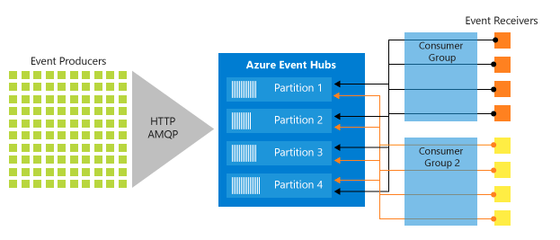
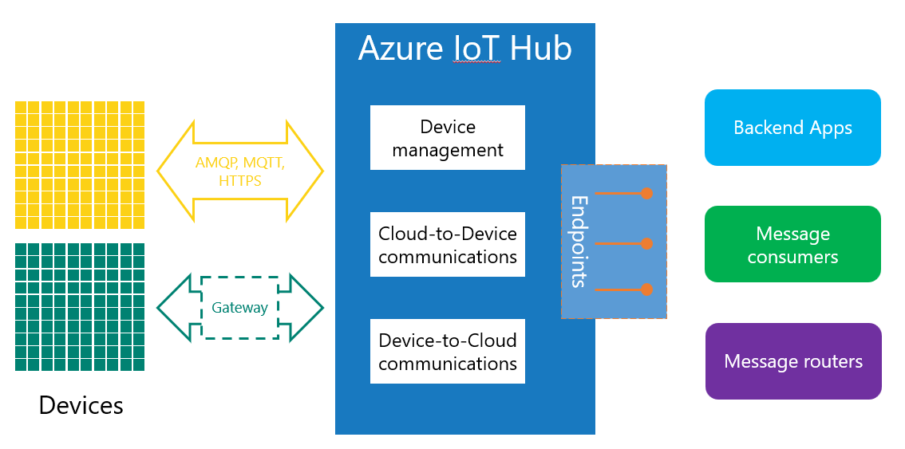

# Azure 消息 & 事件服务的选择 – 中篇

在[上篇](aog-internet-of-things-howto-select-message-event-service-part-1.md)中我们分别对了消息服务中三种类型服务做了介绍和对比，它们包括 Storage queue、Service bus queue、Service bus topic。这篇文章我们继续对事件服务中的 Event Hub 和 IOT Hub 分别做介绍。

1. Event Hub

    1. 什么是 Event Hub

        Event Hub 服务可以在短时间内接收由设备或服务生产大量数据流。

        这里的“短时间”和“大量”可以达到每秒钟接收百万级别的数量。传递到 Event Hub 的数据更准确来讲是数据流，即使流动到 Event Hub 的数据量非常大，也可以保证低延迟接收到所有的数据流，并且系统是可靠稳定的。

        在 Event Hub 的世界里，数据被称为 “事件” 而不再是 “消息” ，这里我们对这两个概念做进一步的介绍，这将帮助我们了解消息服务和时间服务的区别。“事件”和“消息”是不同的，简单来讲消息是有明确目的意图的，即它被发送到后端是用来 执行特定的操作，发送端需要知道对应的操作是否被执行，需要得到对应的响应；而“事件”则是反映一个事实，是发生在过去的一个事件记录，发送端发出这个“事件”后则不需要了解后续的操作，也不需要拿到接收端收到“事件”的响应。

    2. 服务特性

        Event Hub 做为处理高并发数据流的服务有丰富的产品特性：

        首先 Event Hub 支持用户使用 AMQP 协议发送事件到服务端，这方便不同的设备、应用传递事件到服务端。

        其次在 Event Hub 中，用户是通过 “consumer groups” 来接收发送到 Event Hub 中的事件的，用户可以创建多个 “consumer groups”，这样每个接收端可以根据自己的节奏并且依赖于特定的 “consumer groups” 来接收 Event Hub 中的数据，依赖于不同 “consumer groups” 的不同的接收端相互之间是完全独立互不干扰的。

        另外在 Event Hub 中有一项非常重要的功能，即 Event Hub 允许接收端从不同的位置开始接收消息，这依赖于 Event Hub 中一个非常重要的概念 offset（我们可以理解为游标），offset 就是用来记录接收端当前在 Event Hub 中读取事件的位置。在 Event Hub 中用户可以定义多个 partition，我们可以将每个 partition 理解为一个队列，接收端读取每个partition上的事件，因此每个 partition 上都会对应有一个 offset 用来记录当前的位置，而 “consumer groups” 则可以理解为一组 offset 记录，它包含了当前接收端在每个 partition 上读取消息的当前位置。通过这项功能，接收端不需要每次都从头开始获取消息，而是可以通过获取记录位置的 offset 值，从相应的位置开始获取数据。

        最后，作为处理高并发百万级别事件流的服务，Event Hub 有很好的扩容性，一方面用户可以定义多个 partition（目前我们最多可以自己创建 32 个 partition）分担并发数据流，另外一方面我们可以增加 TU (Throughput Units)，每个 TU 允许 1MB/S 的进入数据和 2MB/S 的输出数据。需要提的一点是 partition 和 TU 是两个不同方向上的扩容。我们可以将进入 Event Hub 的数据想象成一个水池中的水，这一水池（事件流）通过管道（partition）1 秒钟就进入 Event Hub 服务中。

        当我们增加 partition 时，相当于接到 Event Hub 中的管道增加，这样对于同样的数据流，增加 partition 则进入 Event Hub 的数据更快；当我们增加一个TU时，相当于允许再额外增加一水池的水，这样我们允许双倍的数据流1秒钟传入到 Event Hub 服务中。

        下面这张图表让我们能更直观的对 Event Hub 中 Partition，Consumer Group 有个了解：

        

    3. 与 Service bus queue 的区别

        Event Hub 不同于以上 的三种服务 Storage queue/Service bus queue & topic，这些服务都是每次处理一条消息，而 Event Hub 则可以理解为是一个接收事件流的 “管道” (pipeline)。

        Event Hub 的设计侧重于数据流的解决方案，它是一个 “事件摄取器” ，用来接受并存储事件数据，并可以快速将事件流推送到接收端，具备每秒接收和处理数百万个事件的能力。而 Service bus queue 则主要面向传统的企业应用程序，是典型的传递消息任务的解决方案，这些解决方案中对消息的顺序、监测重复消息、保证数据不能丢失有很高的要求。

        更多关于这两项服务的区别可以参考[官方链接](https://docs.microsoft.com/azure/event-grid/compare-messaging-services)。

    4. 适用场景

        基于 Event Hub 产品特性，它非常适用于大量的消息的传递处理，如遥测或物联网的使用场景。

    5. 一些限制和说明

        Event Hub 允许多个接收端根据不同的 consumer group 独立相互不影响的接收消息，这一点与 Service bus topic 很像， 但是目前每个 Event Hub 下最多能创建 32 个 consumer group，而 topic 的 subscription 可以多达 2000 个。

        另外传递到 Event Hub 中的事情大小最大不能超过 256KB，TU 最多可以增加到 20 个，partition 最多可以增加到 32 个（需要注意 partition 在创建 Event Hub 时指定，一旦指定之后就不能改变）。

        在 Service bus queue 中用户可以设定消息有 TTL（time to live）值，而在 Event Hub 中用户可以指定事件的 retention period （最长保留期）值，这是两个不同的概念，消息一旦过了 TTL 值，该条消息是一定会从 Service bus queue 中移出，然而事件过了 retention period ，有可能继续保留在 Event Hub 服务中（取决于一段时间内数据量的多少），而可以保证的是在指定的 retention period 期限内，该事件是一定会在 Event Hub 中保留，目前 Event Hub 事件的 retention period 最大值为 7 天。

2. IOT Hub

    1. 什么是 IOT Hub

        Event Hub 非常适合用来处理大量数据流，但是对于物联网的应用场景它不是最佳选择。正如 IOT Hub 它的名字， Azure 平台上的 IOT Hub 是专门为物联网的应用场景设计的产品。它基于 Event Hub 服务，并具有额外物联网所需的附加功能，比如管理和保护连接到 IOT Hub 上的成千上万的设备。

    2. 服务特性

        IOT Hub 可以与设备端交互，也就是支持双向通信（device to cloud 和 cloud to device），允许对设备执行同步或异步指令。

        IOT Hub 支持多种通信协议，比如，AMQP\ Http \MQTT 协议，而 MQTT 是非常流行的物联网协议。对于那些不支持以上三种通信协议的设备，Azure IOT Hub 提供给用户一套 Gateway 的 SDK，从而保证这些设备可以通过已有的能力（蓝牙）与 Gateway 通信，Gateway 将消息传递到 Hub 中，从而实现设备与云端的通信。

        IOT Hub 具备设备管理能力，从而可以对设备进行硬件升级、报告配置管理信息。

        Azure IOT 作为构建物联网解决方案的关键技术，实现将前端收集的数据传递到后端应用中，在 Azure IOT Hub 中，可以通过是 Azure 平台提供的应用对接收到 Hub 中的数据进行处理，比如（流分析、logic app、HDInsight 等等）；也可以通过 IOT Hub 提供的 SDK 构建接收数据程序对数据进行处理；另外还可以通过配置 message routers 将数据重新导向到其他的服务。这里我们对 message router 做进一步的解释，当 IOT Hub 接收到设备端的一条数据后，首先会监测用户是否配置了自定义的 router，如果有并且该条消息满足对应的规则，那么 IOT Hub 会将该条消息传递到 router 对应的服务中去，而不是存放在默认的 Event Hub 服务中（如果没有任何 router 的配置，默认一条消息进入 IoT Hub 中是会自动存放在默认的一个 Event Hub 中）。

        下图是 IOT Hub 架构和功能的概述：

        

    3. 与 Event Hub 的区别

        首先 IOT Hub 与 Event Hub 一个非常明显的区别在于，Event Hub 只能用来接收事件流，而 IOT Hub 支持双向通信（device to cloud 和 cloud to device）：不仅可以接收来自设备端成千上万的数据，还可以自己发送指令/消息到设备端。

        其次，Event Hub 无法区分发送数据到云端的不同的设备， Event Hub 无法感知到设备的存在，在 IOT Hub 中设备需要在云端注册，IOT Hub 对设备进行身份管理和验证，比如设备重启，设备状态监控等等。基于 IOT Hub 对设备身份验证管理， IOT Hub 可以对单个设备中断连接，而这一点 Event Hub 做不到（在 Event Hub 中所有的设备端都使用同一个连接字符串）。

        最后，Event Hub 只能允许并发 5000 个连接（基于 AMQP 协议），而 IOT 作为构建物联网的解决方案，允许上百万级别的设备连接数，从这个角度上来看，IOT Hub 也更适合物联网解决方案。

        更多关于 IOT Hub 和 Event Hub 的区别可以参考[官方链接](https://docs.microsoft.com/azure/iot-hub/iot-hub-compare-event-hubs)。

    4. 适用场景

        用户可以使用 IOT Hub 构建典型的物联网解决方案，从而保证数百万的物联网设备和云端托管的后端应用之间实现安全、可靠的通信。

    5. 一些限制和说明

        不同级别的 IOT Hub 限制说明是不一样的，这里我们以 S1 为例，设备的连接数每秒最多 100 个或者每 unit 最多为 12 这个，这两个标准都不可超。虽然 cloud to device 消息的限制为 100/分钟/unit，但是每个设备上最多可以存储 50 个 cloud to device 的消息（消息在设备上以 queue 的方式存储）。

        更多关于 IOT Hub 的一些限制说明可以参考[官方链接](https://docs.microsoft.com/azure/iot-hub/iot-hub-devguide-quotas-throttling)。

在[上篇](aog-internet-of-things-howto-select-message-event-service-part-1.md)和中篇我们分别对了消息/事件服务中五个服务做了介绍和对比，在[下篇](aog-internet-of-things-howto-select-message-event-service-part-3.md)中我们继续对剩下的三种服务做介绍，其中 Service bus Relay 和 Notification Hub 相比较之前的五种服务有比较大区别，而 Event Gird 则又是 Azure 平台最新推出的一种 Serverless 服务，如果您对这个话题感兴趣可以在下篇中继续了解详细内容。

## 了解更多

* [Azure 消息 & 事件服务的选择 – 上篇](aog-internet-of-things-howto-select-message-event-service-part-1.md)
* [Azure 消息 & 事件服务的选择 – 下篇](aog-internet-of-things-howto-select-message-event-service-part-3.md)