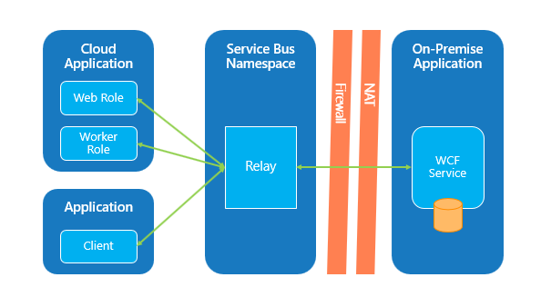
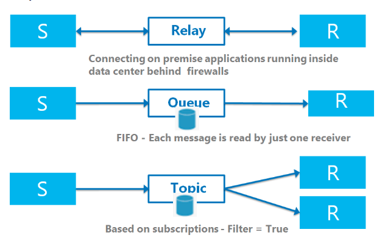
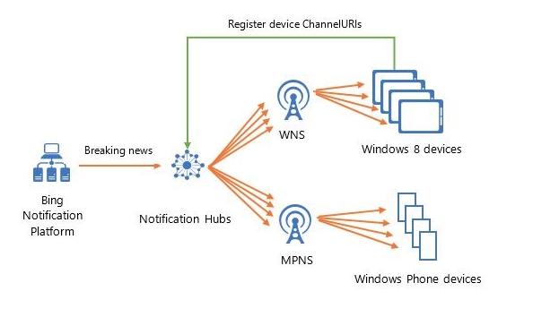

# Azure 消息 & 事件服务的选择 – 下篇

在[上篇](aog-internet-of-things-howto-select-message-event-service-part-1.md)和[中篇](aog-internet-of-things-howto-select-message-event-service-part-2.md)我们分别对了消息/事件服务中五种类型服务做了介绍和对比，它们包括 Storage queue、Service bus queue、Service bus topic、Event Hub 和 IOT。这篇文章我们继续对剩下的三种服务做介绍，其中 Service bus Relay 和 Notification Hub 相比较之前的五种消息服务，有比较大的区别，应用场景和功能也有比价突出的特点，而 Event Gird 则又是 Azure 平台最新推出的一种 Serverless 服务，接下来我们就这三种服务分别做介绍。

1. Service bus Relay

    1. 什么是 Service bus Relay

        在解释这个问题前，我们可以先想一个问题，假设用户需要去连接一个运行在防火墙后面的应用有哪些解决方案：

        * 开启防火墙的一个端口

        * 设置 VPN 从而连接到应用所在的网络

        对于解决方案一，通常我们到拿到本地 IT 服务的许可才可以。对于方案二，不仅有方案一的问题，还需要考虑基础设施服务的费用问题，而 Azure Service bus Relay 提供给用户更好的第三种选择。

        Azure Service bus Relay 是一项用来帮助用户构建混合集成解决方案的技术，用户可以通过使用 Relay 将组织外部的客户端与组织内部的资源进行连接，从而实现内外应用程序的相互访问和数据交互。

    2. 服务特征

        Relay 是如何工作的：

        Relay 可以理解为托管在云中的 "router"。用户的本地服务可以实现“联机”并打开 Service bus Relay 上的 "endpoint"，这样客户端服务就能访问该 "endpoint" 并发送 Web 调用，Relay 将该 Web 调用 "router" 到用户的本地服务中，从而实现客户端与本地服务的交互。

        下图显示了运行在组织外的客户端如何通过 Service bus Relay 与组织内的应用程序进行交互：

        

        Azure Relay 提供两种用于连接应用程序和客户端的方式：

        * Hybrid Connection: 它是基于标准的 Http/WebSocket 协议实现的。Hybrid Connection 可以在任何具有基本 WebSocket 功能的平台上使用任何语言来实现。

        * WCF Relay : 它是基于 Windows Communication Foundation (WCF) 的传统的中继产品，适用于完整的 .NET Framework 和 WCF 架构。用户通过使用一系列的 WCF 绑定实现本地和中继服务间的连接。

        下表是 Hybrid Connection 和 WCF Relay 间的区别：

        ||WCF Relay|Hybrid Connections|
        |----|:----:|:----:|
        |WCF|√||
        |.NET Framework|√|√|
        |.NET Core||√|
        |JavaScript/NodeJS||√|
        |Standards-based Open Protocol||√|
        |Multiple RPC Programming Models||√|

    3. Service bus queue\Service bus topic 和 Service bus Relay 的区别：

        下面的图表是对三种服务区别的总结：

        ||Queue|topic|Relay|
        |----|:----:|:----:|:----:|
        |通信|单向 一个接收者|单向 多个接收者|双向|
        |消息|消息存储在服务端，一旦被接收，消息会被删除|消息存储在服务端，一旦被接收，消息会被删除|服务端不会对消息进行存储|
        |适用场景|发送端和接收端不需要同时在线，消息可以暂时存放在某个地方等过段时间处理的应用场景|有多个应用/系统需要接收同样的消息|用于运行在防火墙下的本地应用与其他应用（运行在本地或云端）的连接。|

        下图展示了三种服务是如何进行消息传递：

        

    4. 适用场景

        基于 Service bus Relay 的特性，它主要适用于以下场景：

        * 云端和本地服务之间的通信

        * 本地的应用程序运行在组织内网，有防火墙隔离的环境中，需要与其他的应用程序（运行在本地或者云端）进行数据交互。

2. Notification Hub

    1. 什么是 Notification Hub

        使用移动应用程序的用户有需求被定期推送他们感兴趣的内容，而不是定期自己去检查。因此移动应用开发者在开发程序时需要考虑增加通知推送功能。然而在实际的开发过程中，开发者需要考虑推送到多个平台、定制化的推送消息、处理不同版本的应用程序以及扩展性等等问题。

        Azure Notification Hub 就是帮助开发者简化这一过程，通过使用 Azure Notification Hub 开发者可以专注于移动应用端的开发，而不需要开发者处理复杂的后端推送。

    2. 服务特征

        Notification Hub 为用户提供了一个可扩展的推送通知的基础架构，可以帮助用户有效的跨平台将消息推送到数百万的终端用户。

        Notification Hub 解决的最主要的一个问题是 “如何将推送通知通过各种各样的特定平台的服务传递给相应的设备” （例如，Windows Store 应用程序只能通过 Windows Notification Service (WNS) 被推送得到通知，而 IOS 设备只能通过 Apple Push Notification service (APNs) 被推送通知，同样的，Android 设备只能通过 Google Cloud Messaging (GCM) 被推送通知）。另外 Notification Hub 还提供给用户以下功能：

        1. 设备管理：Notification Hub 减轻了后端要存储管理 Channel URL 以及 device token (用于各大推送服务推送消息)的压力。Notification Hub 会安全可靠的帮用户存储处理 PNS feedback、 device token 等信息。

        2. 基于 tag 的多播和 pub/sub 分发模式：一台设备在 Notification Hub 中注册时可以指定一个或多个 tag，用来表示该用户对某类的通知感兴趣。这个功能提供给用户一个非常简单的方式，可以通过调用单个 API 向百万级别的目标设备端发送推送通知，而不需要用户自己考虑如何实现向每台设备发送通知的问题。

        3. Notification Hub 提供给用户基于 template 发送推送通知的功能，这样用户可以自定义通知的格式、内容等信息，同时也与后端代码保持独立。

        4. 高度的可扩展性：Notification Hub 支持用户注册百万级别的设备，用户只需要触发一条推送消息到 Notification Hub，它会自动将推送消息通过推送服务以低延迟的性能发送到百万级别的设备端。

        下图显示了通过 Notification Hub 推送通知的过程：

        

    3. 适用场景

        Azure Notification Hub 是一种不同类型的消息传递服务。它不像上面我们介绍到的消息服务，用于应用程序之间或使用微服务架构来发送消息，Azure 通知中心可以从任何服务（在 Azure，本地或其他地方）向在移动设备（Windows，iOS 或 Android）上运行的移动端应用程序发送推送通知。

        基于 Notification Hub 的特性，它的使用场景非常明确，它非常适用于移动应用程序跨手机、平板和 PG 的消息推送场景。

3. Event Grid (目前暂时在中国没有上线)

    1. 什么是 Event Grid

        Event Grid 于 2018 年 1 月正式上线，是一项比较新的事件传递服务，在它使得基于事件的应用架构（如微服务和 Event-Driven 系统）的构建更容易。

        Event Grid 提供给用户一种实时、可靠、可扩展且基于事件的应用架构，可用于管理事件路由且可以处理每秒百万级别的数据吞吐量。

    2. 服务特征

        使用 Event Grid 时用户需要指定 Source 和 Event Handdlers/WebHook，Source 用于推送事件而 Handler 用于接收事件，Event Grid 支持 Azure 平台中服务如 Storage blob 或 Event Hub 作为 Source（数据来源），同时也支持第三方的资源或者用户使用自定义 topic 作为 Source。用户可以通过 Source 将时间发送到某个 topic 中，而每个 topic 则可以有多个 subscriber/ handler。用户可以在 Event Grid 上使用 filters 将特定的 event 数据安全的路由到一个或者多个 endpoint 中。

        除了以上基本功能之外，Event Grid 还提供给用户以下功能：

        1. Event Domains，它允许用户通过 Azure Active Directory 对多达数千个 topic 进行授权和身份管理，此外，Domain 还支持 partition 的处理，换句话说，用户不需要单独向每个 topic 发布事件，而是将事件发布给 domain，它可以确保将事件发送到正确的 topic。

        2. 高级 Filter，Event Grid 也提供给用户更强大与 Service bus topic 的 Filter 功能，这体现在用户创建多个类型的 Filter，例如数字、字符串、布尔值。这使得用户对事件的路由控有更好的控制和发挥空间。

        3. 管理：用户可以为 Event Grid 启用重试策略和死信队列功能，也可以检测匹配和不匹配事件以及每个 subscriber 上出现的错误和延迟。

        下图显示了 Event Grid 如何连接 Source 和 Handlers:

        

    3. 与 Service bus topic 的区别

        虽然 Azure Event Grid 也是采用 pub-sub 的模式分发消息并且也有 topic 的概念，但是这两个服务是不同的，有如下区别：

        1. 消息接收模式：Event Grid 是 push 的模式，而 Service bus topic 是 pull 的模式。也就是说当用户使用 Service bus topic 接收消息时需要管理并控制何时或者接收多少的消息，而使用 Event Gird 只要 handlers 保持与 Event Gird 的连接，事件就会被实时推送到对应的 handlers 中。也正是因为这点差异，用户使用 Service bus topic 更具有灵活性和可控性，如果当接收端接收的速度跟不上发送端的速度时，可以先将消息积存在 topic 服务中，而使用 Event Grid 用户需要保证 Handler 有足够的能力处理来事件的负载。

        2. 吞吐量：Event Grid 可以保证每秒钟千万级别的的事件量，而这一点是 Service bus topic 远远达不到的。

        更多关于 Service bus topic \Event Grid 的区别，可以参考：[官方链接](https://docs.microsoft.com/azure/event-grid/compare-messaging-services)。

    4. 适用场景

        1. Serverless 架构

            作为正真意义上的 ServerLess 服务，Event Grid 可以很好的应用到各种 ServerLess 架构中，通过使用 ServerLess 类型的 Handler 服务（如 logic app/function），用户可以充分利用 ServerLess 架构的强大功能对事件处理进行高度的扩展。

        2. Enterprise integration

            Event Grid 提供可靠的事件消息传递，包括重试和死信队列，因此可以保证用户事件不丢失，这非常好的满足企业集成方案的需求。

        3. Cloud Events

            作为支持 CloudEvents 标准的首批服务之一，CloudEvents 提供了一种允许跨平台处理事件的标准。随着 Azure，AWS，Google，IBM 等各大厂商支持此标准，通过这种方式我们可以使用任何平台或应用程序来处理事件，实现格式统一，从而轻松实现应用集成和相互操作。

虽然这篇文章尽可能详细的介绍这几种不同的消息&事件服务的区别和选择，然而在实际的应用场景中，我们经常会将这几种服务结合在一起使用并且在不同的应用环境下，根据用户的考虑因素，产品的选择也会有不同。如果您通过以上的解释还是无法抉择选择哪种服务，欢迎您联系 Microsoft 技术支持团队，我们会就您的特定的需求和环境帮助您做进一步的分析和抉择。

## 了解更多

* [Azure 消息 & 事件服务的选择 – 上篇](aog-internet-of-things-howto-select-message-event-service-part-1.md)
* [Azure 消息 & 事件服务的选择 – 中篇](aog-internet-of-things-howto-select-message-event-service-part-2.md)