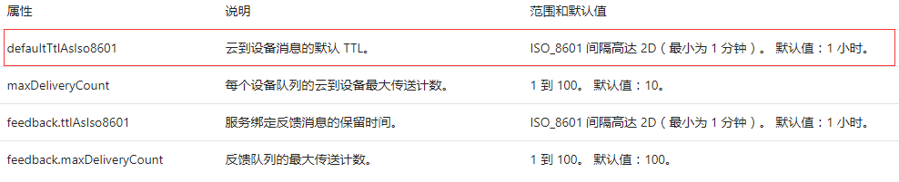
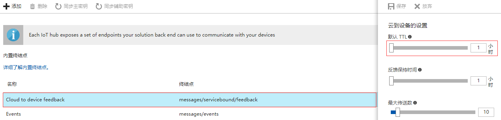

# 如何设置 IoT 中心云到设备消息的默认 TTL 为分钟级别

## 问题描述

在文档[使用 IoT 中心发送和接收消息](/iot-hub/iot-hub-devguide-messaging)中，描述云到设备（CloudToDevice, 以下简称 C2D）消息的默认 TTL 最小可以设置为 1 分钟：



然而 Azure 门户预览上，默认值为 1 小时，无法设置为分钟级别：



## 实现方案

C2D 消息的默认 TTL 确实可以设置为最小 1 mins，但是目前只能通过代码实现，而无法通过 Azure 门户预览来操作。目前，使用代码可以通过两种方式操作:

- 发送 C2D 消息的时候，可以指定某条 / 某几条消息里的 `ExpiryTimeUtc` 属性为您需要过期的时间，例如：

    ```
    var commandMessage = new Message(
        Encoding.ASCII.GetBytes("Cloud to device message."));
    commandMessage.ExpiryTimeUtc = System.DateTime.UtcNow.AddMinutes(1);
    messageToSend.setExpiryTimeUtc(expireDate);
    ```

- 可以通过设置 CloudToDevice 里的 `DefaultTtlAsIso8601` 属性来设置默认 TTL，这种方法是为整个 IoT 中心下所有设备的 C2D 的消息设置为同一默认 TTL。

    ```
    var iothubClient = new IotHubClient(
    new Uri("https://management.chinacloudapi.cn/"), 
    tokenCredential, 
    new RetryDelegatingHandler());
    iothubClient.SubscriptionId = subscriptionId;

    var iothubResource = iothubClient.IotHubResource;

    // get iothub description
    var resourceDescription = iothubResource.Get(rgName, resourceName);
    Console.WriteLine(resourceDescription.Name);

    // set C2D message default ttl to 1 minute
    resourceDescription.Properties.CloudToDevice.DefaultTtlAsIso8601 = TimeSpan.FromMinutes(1);

    try
    { 
        // commit the change                 
        iothubResource.CreateOrUpdate(rgName, resourceName, resourceDescription);
        Console.WriteLine("Update successfully!");
    }
    catch (Exception ex)
    {
        Console.WriteLine(ex.Message);
    }
    Console.WriteLine("Press ENTER to exit!");
    Console.ReadLine();            

    ```
