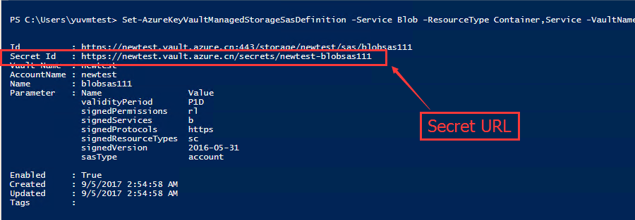

# Azure Key Vault 管理存储帐户密钥

在 Azure Key Vault 存储帐户密钥推出之前，开发人员必须管理其自己的 Azure 存储帐户 (ASA) 密钥，并手动或通过外部自动化功能轮换这些密钥。 现在，Key Vault 存储帐户密钥已实现为 Key Vault 机密，可用于通过 Azure 存储帐户进行身份验证。本文主要介绍如何使用 Azure Powershell 创建基于 Key Vault 的存储账户 SAS 信息，然后结合 C# 基于 AD Application 认证的方式使用 Key Vault 获取存储对应的 SAS，进而创建 StorageClient。

## Powershell code

```PowerShell
# 参数设置
$subscriptionId = 'e0fbea86-6cf2-4b2d-81e2-9c59f4f96bcb'
$keyVaultName = 'newtest'
$resourceGroupName = 'yuvmtest'
$keyVaultObjectId = '3be6a1e9-8a8a-4613-8e4e-b974593d011e'
$location = 'china north'
$adApplicationId = '16a94c84-c6ba-4f19-aa48-3353f8ffe18e' # 通过后面：获取 Key Vault 的 ObjectId 脚本获取
$storageAccountName = 'yunewstoragetest'
# Scope 参数获取：Protal -> 对应的存储账户 -> 设置 -> 属性 -> 资源 ID
$scope = '/subscriptions/e0fbea86-6cf2-4b2d-81e2-9c59f4f96bcb/resourceGroups/yuvmtest/providers/Microsoft.Storage/storageAccounts/yunewstoragetest' 
# 使用用户名和密码登录到订阅
$cred = New-Object System.Management.Automation.PSCredential("cietest03@microsoftinternal.partner.onmschina.cn",(ConvertTo-SecureString "DEV@!321" -AsPlainText -Force))

Add-AzureRmAccount -EnvironmentName AzureChinaCloud -Credential $cred

Get-AzureRmSubscription | select SubscriptionName,SubscriptionID | sort SubscriptionName,SubscriptionID

Set-AzureRmContext -SubscriptionId  $subscriptionId

Get-AzureRmStorageAccount -Name yutest

# 获取 Key Vault 的 ObjectId：

Get-AzureRmADServicePrincipal -SearchString "Azure Key Vault"

# 创建密钥保管库

New-AzureRmKeyVault -VaultName $keyVaultName -ResourceGroupName $resourceGroupName -Location $location

Get-AzureRmKeyVault -VaultName $keyVaultName

# 根据获取的 ObjectId 将存储密钥操作员角色分配给 Azure Key Vault 标识        

New-AzureRmRoleAssignment -ObjectId $keyVaultObjectId -RoleDefinitionName Owner -Scope $scope

# 为 key-vault 分配操作 storage 的权限范围

Set-AzureRmKeyVaultAccessPolicy -VaultName $keyVaultName -ObjectId $keyVaultObjectId -PermissionsToStorage all

# 授权 AD 应用程序使用密钥或机密，关于 AD 应用程序的创建请参考链接：http://arui.me/index.php/archives/114/
Set-AzureRmKeyVaultAccessPolicy -VaultName $keyVaultName -ServicePrincipalName $adApplicationId -PermissionsToSecrets all -PermissionsToStorage all -PermissionsToCertificates all

# 添加 storage Account

$regenerationPeriod = [System.Timespan]::FromDays(90)
Add-AzureKeyVaultManagedStorageAccount -AccountName $keyVaultName -VaultName $keyVaultName -AccountResourceId $scope -ActiveKeyName 'key1' -RegenerationPeriod $regenerationPeriod

# 获取 Secret URL 对应 secret id

Set-AzureKeyVaultManagedStorageSasDefinition -Service Blob -ResourceType Container,Service -VaultName $keyVaultName -AccountName $keyVaultName -Name blobsas111 -Protocol HttpsOnly -ValidityPeriod ([System.Timespan]::FromDays(1)) -Permission Read,List,Write,Delete
```

**获取的 Secret URL**：



## C# Code

```C#
using Microsoft.Azure.KeyVault;
using Microsoft.IdentityModel.Clients.ActiveDirectory;
using Microsoft.WindowsAzure.Storage;
using Microsoft.WindowsAzure.Storage.Auth;
using Microsoft.WindowsAzure.Storage.Blob;
using System;
using System.Net.Http;
using System.Threading;
using System.Threading.Tasks;

namespace storagekeyvault
{
    class Program
    {
        static KeyVaultClient kv;
        static void Main(string[] args)
        {
            AsyncMethod();
            Console.WriteLine("success!");
            Console.ReadKey(true);
        }

        static async void AsyncMethod()
        {
            kv = new KeyVaultClient(new KeyVaultClient.AuthenticationCallback((authority, resource, scope) => GetToken(authority, resource, scope)), new InjectHostHeaderHttpMessageHandler());

            var secret1 = await kv.GetSecretAsync("https://newtest.vault.azure.cn/secrets/newtest-blobsas111");
            var accountSasCredential = new StorageCredentials(secret1.Value);

            // Use credentials and the Blob storage endpoint to create a new Blob service client.
            var accountWithSas = new CloudStorageAccount(accountSasCredential, new Uri("https://yutest.blob.core.chinacloudapi.cn/"), null, null, null);
            var blobClientWithSas = accountWithSas.CreateCloudBlobClient();

            // Retrieve a reference to a container.
            CloudBlobContainer container1 = blobClientWithSas.GetContainerReference("aaa111");

            // Create the container if it doesn't already exist.
            container1.CreateIfNotExists();
            Console.WriteLine(container1.Properties);
            Console.WriteLine("----------------------------------------------------------------");
            Console.ReadKey(true);
        }

        /// <summary>
        /// 获取认证 token
        /// </summary>
        /// <param name="authority"></param>
        /// <param name="resource"></param>
        /// <param name="scope"></param>
        /// <returns></returns>
        private static async Task<string> GetToken(string authority, string resource, string scope)
        {
            var authContext = new AuthenticationContext(authority);
            //对应 AD Application 的信息
            ClientCredential clientCred = new ClientCredential("16a94c84-c6ba-4f19-aa48-3353f8ffe18e", "123456");
            var result = await authContext.AcquireTokenAsync(resource, clientCred);

            if (result == null)
                throw new InvalidOperationException("Failed to obtain the JWT token");

            return result.AccessToken;
        }
    }
    public class InjectHostHeaderHttpMessageHandler : DelegatingHandler
    {
        protected override Task<HttpResponseMessage> SendAsync(HttpRequestMessage request,
            CancellationToken cancellationToken)
        {
            var requestUri = request.RequestUri;
            var authority = string.Empty;
            var targetUri = requestUri;
            string networkUrl = "";

            if (!string.IsNullOrEmpty(networkUrl))
            {
                authority = targetUri.Authority;
                targetUri = new Uri(new Uri(networkUrl), targetUri.PathAndQuery);

                request.Headers.Add("Host", authority);
                request.RequestUri = targetUri;
            }

            return base.SendAsync(request, cancellationToken).ContinueWith<HttpResponseMessage>(response =>
            {
                return response.Result;
            });
        }
    }
}
```

## 更多信息参考链接

- [Azure Key Vault 存储帐户密钥](https://docs.azure.cn/zh-cn/key-vault/key-vault-ovw-storage-keys)

- [Azure 密钥保管库入门](https://docs.azure.cn/zh-cn/key-vault/key-vault-get-started#authorize)

- [AzureRM.KeyVault](https://docs.microsoft.com/zh-cn/powershell/module/azurerm.keyvault/?view=azurermps-4.3.1)